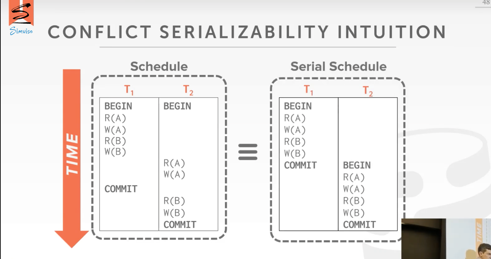
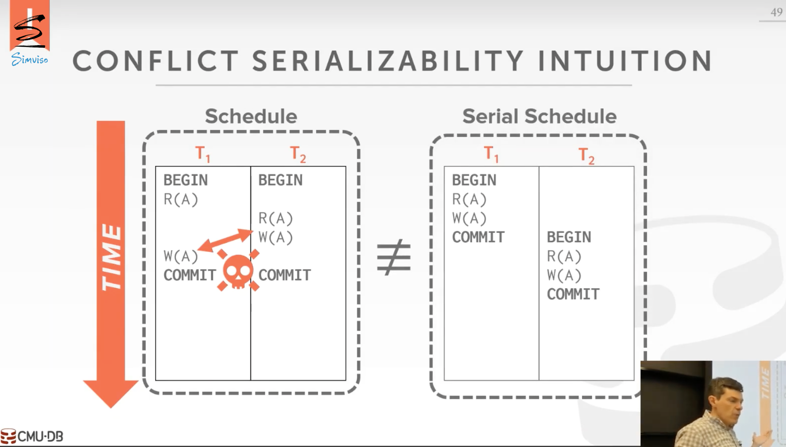
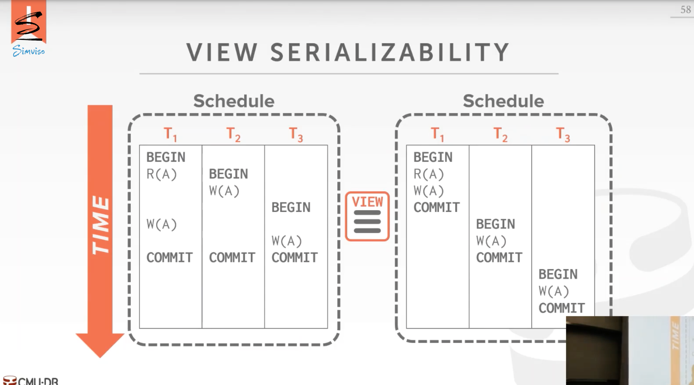
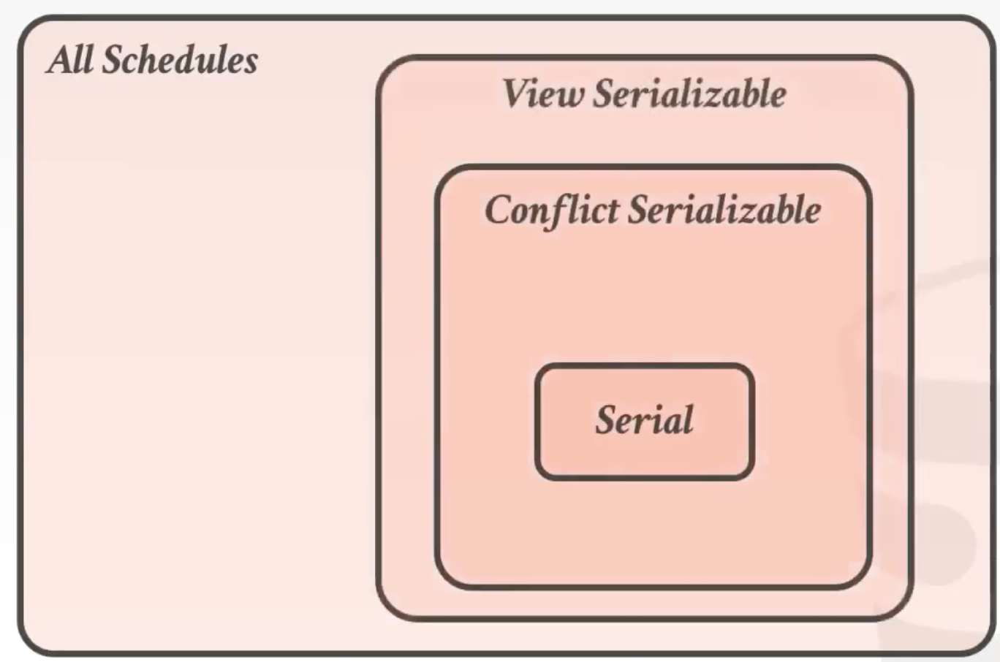

# Concurrency Control Theory

## 1. Transactions

concurrency control和recovery基于TX ACID特性的概念。

**事务（transaction）**是通过在数据库中执行一系列操作来执行某种更高级的功能。它是DBMS中基本的变化单元。

操作交错执行导致的：

- 暂时性地不一致（不可避免）
- 永久性地不一致（不可以）

## 2. 定义

## 3. 事务的正确标准：ACID

### 3.1. 原子性（Atomicity）

事务中的操作要么都执行，要么都不执行。

#### 3.1.1 Logging

- DBMS记录所有的修改在log中，在事务abort的时候通过该log undo这些修改
- 在mem和disk中都维护undo records
- 通过logging可以将随机写入变成循序写入
- log还可以用来跟踪审计应用程序所做的每一件事

#### 3.1.2. Shadow Paging(RCU)

- DBMS在事务执行前拷贝pages，事务在这些副本上执行。事务commit后再讲指针指向这个副本，并表示这个副本时数据的主版本
- 很少有数据库使用这种方法

### 3.2. 一致性（Consistency）

如果数据库是一致性的且事务是一致性的，当事务执行的时候，数据库的状态也是一致的。

一致性在这里指逻辑上的正确性。

数据库实际上是对现实世界中的某些概念进行建模。假设数据库的逻辑是正确的，即无需在意物理存储是什么样的，只要数据完整性和引用完整性等是正确的就行了，在此前提下当向数据库询问任何问题的时候，都会生成正确的结果。

对于单节点系统，一致性没有太多意义，对于分布式系统很重要。

[如何理解数据库事务中的一致性的概念](https://www.zhihu.com/question/31346392/answer/569142076)

#### 3.2.1. Database Consistency

- 数据库准确地表示它所建模的真实世界实体，并遵循完整性约束（Integrity Constraint）
- 如一张学生表，约束年龄不能小于0
- 未来的事务会看到db中之前commit的事务的修改结果

#### 3.2.2. Transaction Consistency

- 如果数据库在执行事务前是一致的，那么事务执行后也是一致的
- 确保transaction consistency是应用的责任

### 3.3. 隔离性（Isolation）

DBMS为事务提供了一种错觉，即它们是在系统中单独运行。他们看不到并发事务的影响。这相当于一个事务以串行顺序执行的系统（即，一次一个）。但是为了达到更好的性能，DBMS必须在保持隔离的假象的同时，将并发事务的操作交错进行。

同一时间有多个事务在执行时，事务间是彼此隔离开的。

#### 3.3.1. Concurrency Control

并发控制协议是DBMS如何决定正确交错执行多个Tx中的操作。我们希望db的最终状态与在单线程中按照顺序执行这些事务所得到的结果相同。

**两种协议类型**：

- **悲观协议**：不让并发冲突出现，即事务执行前加lock（两阶段锁协议）
- **乐观协议**：假设冲突很少发生，事务执行前不加lock，冲突后再解决（时间戳顺序协议）

##### 3.3.1.1. Schedule

DBMS执行操作的顺序称为 **execution schedule**。<u>并发控制协议的目标是生成等价于一些序列执行的execution schedule</u>：

- **Serial Schedule**：不使不同tx的操作交错的schedule
- **Equivalent Schedule**：对于任何数据库状态，执行第一个schedule的效果等价于执行第二个schedule
- **Serializable Schedule**：等价于tx的某些串行执行的schedule

>严格一致性: If each transaction preserves consistency, every serializable schedule preserves consistency.

**如何判断一个schedule是不是正确的**：如果schedule等价于某个顺序执行，则是correct的。

##### 3.3.1.2. Conflict

两个操作是**conflict**的，如果满足：

- 它们是不同Tx的操作
- 它们访问同一个object，且其中至少一个操作为write

conflict类型：

- **Read-Write Conflict (R-W)** — **Unrepeatable Reads (不可重复读)**：一个tx在读一个对象多次时不能得到相同的value

  

- **Write-Read Conflict (W-R)** — **Dirty Reads (脏读、读未提交数据)**：一个Tx看到了另一个Tx在commit前对一个对象的修改

  

- **Write-Write Conflict (W-W)** — **Lost Updates、Overwriting Uncommitted Data (覆盖写掉未提交的数据)**：一个Tx覆盖掉了另一个Tx未commit的修改

  

##### 3.3.1.3. 序列化

有两种类型的可序列化。(1)冲突(conflict serializability)和(2)视图(view serializability)。在实践中，DBMS支持conflict serializability，因为它可以被有效地执行。

- 可冲突序列化 conflict serializability

如果两个schedule涉及相同事务的相同操作，并且每一对冲突的操作在两个schedule中都以相同的方式排序，那么它们就是冲突等价(conflict equivalent)的。如果一个schedule S与某个串行schedule冲突等价，那么它就是可冲突串行(conflict serializable)的。

我们可以通过交换不冲突的操作来验证一个schedule是可冲突序列化(conflict serializability)的，直到形成一个序列时间表(serial schedule)。

>下面两图分别展示了可冲突序列化和不可冲突序列化的例子, 简单的说, 可冲突序列化的schedule就是可以通过交换不冲突的操作转换为下图右侧的串行化schedule

对于有许多事务的schedule来说，这变得太昂贵了。一个更好的验证时间表的方法是使用一个dependency graph (precedence graph)。

在一个dependency graph中，每个事务是图中的一个节点。如果 Ti的一个操作**Oi** 与 Tj的一个操作**Oj** 冲突，并且Oi在时间表中出现在Oj之前，那么就存在一条从节点Ti到Tj的有向边。那么，如果依赖图是**无环**的，那么时间表是可冲突序列化的。

不可序列化的例子（有环）

可序列化的例子（无环）

- 视图可序列化 view serializability

视图可序列化是一个较弱的可序列化概念，它允许所有可冲突序列化的schedule和 "盲写"（即在不首先读取值的情况下执行写操作）。因此，它比冲突可序列化允许更多的schedule，但很难有效执行。这是因为DBMS不知道应用程序将如何 "解释 "数值。

view serializability是一种比conflict serializability更加宽泛的情况（限制更少），就像上图左边所示的，这种schedule对于上层应用程序"看起来"是正确的, 这种不符合conflict serializability但符合view serializability；但是现在view serializability仅存在于理论中，下面是这几者之间的关系图

### 3.4. 持久性（Durability）

如果所有的tx commit，所有的修改都会被永久保存。

DBMS使用logging或shadow paging确保所有的改动都是durable。

## 4. 总结

- 并发控制是自动的，DBMS自动地插入lock / unlock的请求和不同tx的schedule action
- 确保执行结果是等价于以某种顺序一个接一个地执行txs
- 事务可以帮助解释程序执行的正确性，即是否以正确的顺序执行写操作

