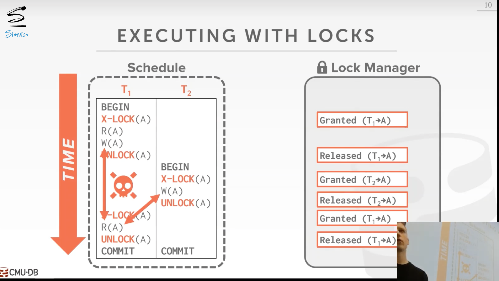

# Two-Phase Locking Concurrency Control

## 1. high level上锁的使用

DBMS使用锁来动态地生成事务的执行计划，该计划可以在不提前知道每个事务的读/写集的情况下进行序列化。这些锁在有多个读者和写者的并发访问中保护数据库对象。DBMS包含一个集中的锁管理器，决定一个事务是否可以获得一个锁。它还提供了一个关于系统内部发生的事情的全局视图。

## 2. Locks VS Latches

Locks用于DB、table、tuple等，旨在防止事务间彼此冲突。

## 3. Lock Type

DBMS包含一个Lock Manager，用于决定一个事务是否可以获得一个lock。

- **Shared Lock (S-LOCK)**：允许多个事务同时读相同对象的锁。如果一个事物持有shared lock，别的事务也可以同时获得这个读锁。
- **Exclusive Lock (X-LOCK)**：允许一个事务修改一个对象。这种锁和别的锁都不兼容。一个互斥锁同时只能被一个事务持有。

**lock执行过程**：

- Txn从lock manager申请lock
- 基于lock被分配的情况，l**ock manager决定**授予该lock还是阻塞请求
- txn在不需要lock后将其释放
- lock manager更新**internal lock-table**然后将lock分配给等待的txn

但如果仅通过锁我们无法保证事务的ACID特性，如下图所示，这个事务出现了不可重复读的情况。所以我们需要两阶段锁协议。

## 4. Two-Phase Locking

2PL是一种**悲观并发控制协议**，它允许DBMS保证以conflict serializable schedule来分发lock。这个协议不需要提前知道一个txn的所有queries。

**2PL 过程**：

**Phase 1: Growing**

- 每个Txn向lock manager 申请需要的所有lock
- lock manager授予或延迟请求

**Phase 2: Shrinking**

- txn在释放第一个lock后进入该阶段
- 在本阶段，txn只可以释放之前申请到的lock，**不可以再申请新的lock**

2PL本身保证conflict serializable，它会生成precedence graph无环的schedules。但是它存在**cascading aborts** 的问题，当一个txn abort的时候，另一个txn也必须随之rollback。

### 2PL的缺点

- 2PL仅解决了事务的不可重复读问题（事务不可能再次读已经释放了锁的变量），没有解决脏读问题（2PL不保证释放锁后事务一定会提交）。

- 有的schedule是serializable的，但在两阶段锁协议中不被允许, 因为锁限制了concurrency。

- 可能会导致死锁，需要使用死锁检测或死锁预防机制。

## 5. Strong Strict Two-Phase Locking

**SS2PL (Rigorous 2PL)** 是2PL的一种变种，只当事务执行结束后才释放lock。

如果一个txn对对象的修改直到该txn结束后才可以被别的txn读或写，则这个txn是**strict**的。

SS2PL不会有**cascading aborts** 的情况。会让系统吞吐率降低。

## 6. 2PL Deadlock Handling

**死锁** 是两个txn申请对方正在持有的lock。

### 6.1. 死锁检测 (Deadlock Detection)

DBMS会使用一个后台线程来进行死锁检测，创建一个 **wait-for gragh**：

- 当DBMS检测到死锁，它会选择一个回退一个牺牲者事务取接触死锁
- 牺牲者事务会重启或abort
- 选择牺牲者事务可考虑的因素：
  - age （选择最新或最旧的timestamp）
  - 过程（选择执行了最少query的）
  - 已经加lock的对象的数量
  - 需要cascading aborts的txn的数量
  - txn已经重启或abort的次数，防止”饥饿“现象

### 6.2. 死锁预防

当一个txn请求一个lock，如果该lock被另一个txn持有，DBMS做一些操作来预防死锁。不需要wait-for graph或检测算法。

按照时间戳来给txn分配优先级，老的优先级高。当一个txn重启时，优先级依然是之前的时间戳（防止饥饿情况）。

两种策略（它们能够保证无死锁，是因为只允许按照一个方向等待lock）：

- **Wait-Die（老的等待新的）**
  - 如果正在请求的txn有更高的优先级，它等待正在持有lock的txn释放lock
  - 否则正在请求的txn abort
- **Wound-Wait（老的打断新的）**
  - 如果正在请求的txn有更高的优先级，则正在持有lock的txn abort并释放lock
  - 否则正在请求的txn等待

## 7. Lock Granularities

如果一个txn更新一亿个tuples，它需要向lock manager请求一亿个lock，这样会不断获取lock manager内部数据结构的latch，导致性能低下。

为了减少lock的请求次数，DBMS使用层级结构的lock。lock可以加在db、table、page、tuple等上。

**意向锁 (Intention locks)**：如果一个节点有意向锁，则它的子孙节点会有对应类型的显式lock。

- **Intention-Shared (IS)**：指示低层级有S Lock
- **Intention-Execlusive (IX)**：指示低层次有X或S Lock
- **Shared+Intention-Exclusive (SIX)**：以该节点为根节点的子树加显式的S Lock，在更低层次的节点中有显式的X Lock

**一些规则**：

- 若在一个节点上获取S或IS，则txn必须获取父节点上的IS
- 若在一个节点上获取X或IX或SIX，则txn必须获取父节点上的IX

可以在不释放锁的情况下对锁进行升级。

DBMS在query访问或修改obj前自动获取合适类型的lock，不需要APP指定。但APP可以提供提示去提升并发度。

