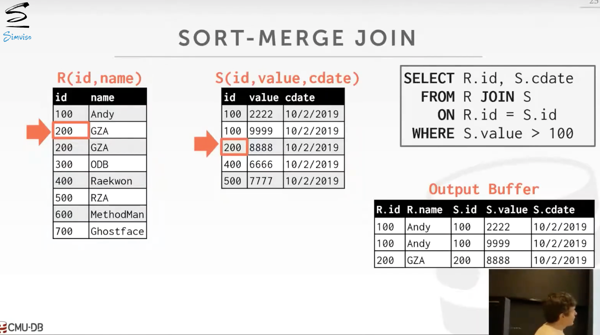
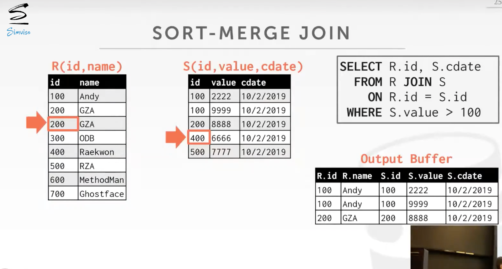
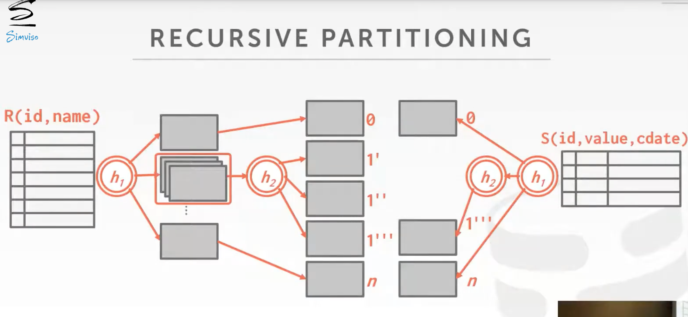
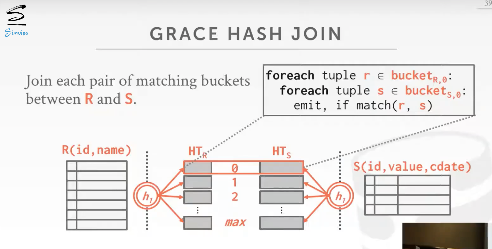
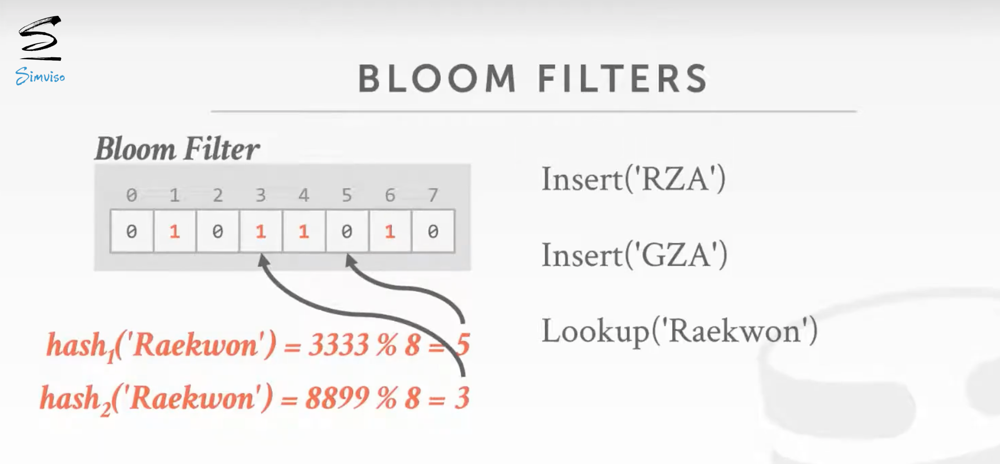

# Join Algorithm

本节内容专注于两个table的 **inner equijoin** 算法，这些算法也支持别的类型的join。

在query plan中，会希望更小的表是left table（outer table， loop join中的概念）

## 1. Output

对于R表中的tuple r 和S表中的tuple s在join属性上匹配0时，join操作会组合r和s到一个新的output tuple中。

### Data

将outer table和inner table中属性的值直接复制到output tuple中。

这种方法的优点是查询计划中的未来操作永远不需要回到原表来获取更多数据。缺点是需要更多mem来存放整个元祖。

### Record IDs 

DBMS只复制匹配到的tuple的join key属性以及record id。这种方式适用于列存，因为DBMS不需要赋值query不需要的数据。称为**late materialization**

## 2. Cost分析

分析不同join算法的不同主要基于disk IO次数。包括从disk读取数据的IO以及将中间结果写入disk的IO。

符号定义
> M pages in table R(Outer Table), m tuples total
>
> N pages in table S(Inner Table), n tuples total

## 3. Nested Loop Join

### 3.1. Simple Nested Loop Join

- **outer table** 是在外层for循环中的table，**inner table**是在内层for循环中的table。
- **join** 符号左侧侧表为outer table，右侧为inner table。
- 
- 应该把更小的表当做outer table
- 尽可能将outer table缓存在mem中，如果可以的话，给inner table应用index

### 3.2. Block Nested Loop Join

- 对于outer table中的每个block，取inner table中的每个block并比较两个block中的tuples
- 让outer table和inner table中的每个page上的tuple进行join
- 这种算法降低了disk IO，因为是对每个outer table的block遍历inner table，而不是对每个outer table的tuple遍历inner table。
- 
- 如果有B个buffer可以使用
  - 则使用B-2个buffer进行outer table的扫描（对于outer table，用尽可能多的buffer保存它）
  - 1个buffer用于inner table
  - 1个buffer用于存储output 
  - 

### 3.3. Index Nested Loop Join

以前的嵌套循环连接算法表现很差，因为DBMS必须进行顺序扫描来检查内表的匹配情况。然而，如果数据库已经有一个join键的索引，它可以使用这个索引来加快比较的速度。DBMS可以使用现有的索引，或者为连接操作建立一个临时索引。

- inner table使用索引，outer table不使用
- 可以是原有的索引，也可以是临时索引
- 

### 3.4. 注意事项

- 更小的表作为outer table - Simple Nested Loop Join
- 尽可能将outer table缓存在mem中，以减少disk IO - Block Nested Loop Join
- inner table使用index - Index Nested Loop Join

## 4. Sort-Merge Join

**阶段一：Sort**

- 在join keys上排序两个table
- 若mem够用，则使用快排；否则使用external merge sort

**阶段二：Merge**

- 每个table一个cursor，通过不断的向下移动值较小的cursor，遍历两个有序表，将join key一样的tuples作为output

- 可能需要进行回溯，只有inner table需要回溯（在outer table的join key重复，且和inner table的join key匹配时，由于当两个游标的值重复时优先移动inner table的cursor，因此在如下图一样，outer table再次出现重复值时就需要回溯）

**Cost**：

**Worst case**：outer table和inner table在join key上都相等。但在现实数据库中这不会发生。

**适用场景**：这个算法适用于在一个或两个table都在join attributes上有序的情况。

## 5. Hash Join

**核心思想**

- 使用hash table把tuples基于join attributes分成更小的桶，这样会减少比较计算（不需要逐个tuple进行比较）。Hash Join只可以用于在complete join key上的equi-join。
- 如果R表中tuple r和S表中tuple s满足join条件，它们在join attribute上是相等的。使用一个hash function将r哈希到桶*ri*、将s哈希到桶*si*，之后只需要比较 *ri* 和 *si* 当中的tuples。

### 5.1. Basic Hash Join

**阶段一：Build**

- 在outer table上的join attributes上使用hash function *h1* 建立hash table（如果DBMS知道outer table的大小，则可以使用static hash table，否则使用dynamic hash table或者使用overflow page，如果hash table溢出到磁盘上，就需要进行大量随机IO）。key为join attribute，value形式包括
  - **Full Tuple**：将完整的kv存储在内存中，避免在比较value时查询outer table的tuple；但是使用更多存储空间
  - **Tuple Identifier**：仅存储tuple的标识符，适用于列存，因为DBMS不需要从disk取不需要的数据

**阶段二：Probe**

- 遍历inner table，使用 *h1* 将每个tuple映射到对应bucket里，并通过值比较寻找匹配的outer table的tuple。

**Probe Phase Optimization**

- 在build phase，填充hash table时，建立Bloom Filter，它占用空间小，可以存储在内存中。
- 在probe phase，将bloom filter传到join里面。对hash table检测前，先检测bloom filter
  - 若检测为F，则表示outer table不含该key，无需查hash table，从而减少了磁盘IO
  - 若检测为T，去hash table中检测
- 有时称为 **旁路信息传递**

### 5.2. Grace Hash Join / Hybrid Hash Join

为了处理不能再内存中进行的hash join（数据无法放在内存中）

**阶段一：Build**

- （普通Hash Join中，只为outer table构建hash table，然后对inner table检测是否有符合join条件的tuple，然后join）
- Grace Hash Join: 对outer table和inner table都使用相同的hash function *h1* 创建hash table。hash table的buckets可以写到disk中
  - 如果一个bucket不能放在mem中，使用 **recursive partition**，即使用另一个hash function *h2* 将这个bucket分为子bucket, 相当于缩小了page的大小，便于其在Probe阶段可以移动到内存中。不过内表和外表其中无论那一边需要**recursive partition**，另外一边也需要同步的使用hash function *h2* 来对齐。

**阶段二：Probe**

- 检查两个hash table的对应bucket，将内表和外表中的hash值相同的bucket移动到内存, 在两个pages中使用嵌套循环将join attr对应的tuple进行匹配。这些page在mem中，所以减少了随机disk IO。

**Cost**：

## Summery

## Extra: Bloom Filters

概率型数据结构（bitmap），用于回答近似成员查询（判断key是否存在于集合中），可插入和查找，但不能删除。

- False negatives 不会出现（即判断为F，实际为T，如果判断该key不存在就一定不存在）
- False positive 可能出现（即判断为T，但实际为F，如果判断该key存在有可能不存在）

**步骤**：

- **Insert**：使用k个hash function，将hash结果对应的filter中bit置为1
- **Lookup**：检查k个hash function 哈希后的bit位是不是都是1：若都是1，则判断为T，否则为F

