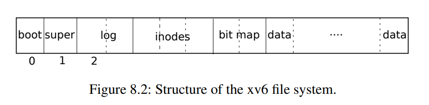

# 8 文件系统
文件系统的目的是组织和存储数据。文件系统通常支持用户和应用程序之间的数据共享，以及持久性，以便在重新启动后数据仍然可用。

xv6文件系统提供类似于Unix的文件、目录和路径名（参见第1章），并将其数据存储在virtio磁盘上以便持久化（参见第4章）。文件系统解决了几个难题：

注：完整计算机中的CPU被支撑硬件包围，其中大部分是以I/O接口的形式。Xv6是以qemu的“-machine virt”选项模拟的支撑硬件编写的。这包括RAM、包含引导代码的ROM、一个到用户键盘/屏幕的串行连接，以及一个用于存储的磁盘。

- 文件系统需要磁盘上的数据结构来表示目录和文件名称树，记录保存每个文件内容的块的标识，以及记录磁盘的哪些区域是空闲的。
- 文件系统必须支持崩溃恢复（crash recovery）。也就是说，如果发生崩溃（例如，电源故障），文件系统必须在重新启动后仍能正常工作。风险在于崩溃可能会中断一系列更新，并使磁盘上的数据结构不一致（例如，一个块在某个文件中使用但同时仍被标记为空闲）。
- 不同的进程可能同时在文件系统上运行，因此文件系统代码必须协调以保持不变量。
- 访问磁盘的速度比访问内存慢几个数量级，因此文件系统必须保持常用块的内存缓存。

本章的其余部分将解释xv6如何应对这些挑战。

## 8.1 概述

xv6文件系统实现分为七层，如图8.1所示。磁盘层读取和写入virtio硬盘上的块。缓冲区高速缓存层缓存磁盘块并同步对它们的访问，确保每次只有一个内核进程可以修改存储在任何特定块中的数据。日志记录层允许更高层在一次事务（transaction）中将更新包装到多个块，并确保在遇到崩溃时自动更新这些块（即，所有块都已更新或无更新）。索引结点层提供单独的文件，每个文件表示为一个索引结点，其中包含唯一的索引号（i-number）和一些保存文件数据的块。目录层将每个目录实现为一种特殊的索引结点，其内容是一系列目录项，每个目录项包含一个文件名和索引号。路径名层提供了分层路径名，如/usr/rtm/xv6/fs.c，并通过递归查找来解析它们。文件描述符层使用文件系统接口抽象了许多Unix资源（例如，管道、设备、文件等），简化了应用程序员的工作。

```
文件描述符（File descriptor）
|_路径名（Pathname）
|_目录（Directory）
|_索引结点（Inode）
|_日志（Logging）
|_缓冲区高速缓存（Buffer cache）
|_磁盘（Disk）
```

文件系统必须有将索引节点和内容块存储在磁盘上哪些位置的方案。为此，xv6将磁盘划分为几个部分，如图8.2所示。文件系统不使用块0（它保存引导扇区）。块1称为超级块：它包含有关文件系统的元数据（文件系统大小（以块为单位）、数据块数、索引节点数和日志中的块数）。从2开始的块保存日志。日志之后是索引节点，每个块有多个索引节点。然后是位图块，跟踪正在使用的数据块。其余的块是数据块：每个都要么在位图块中标记为空闲，要么保存文件或目录的内容。超级块由一个名为mkfs的单独的程序填充，该程序构建初始文件系统。



本章的其余部分将从缓冲区高速缓存层开始讨论每一层。注意那些在较低层次上精心选择的抽象可以简化较高层次的设计的情况。

## 8.2 Buffer cache层
Buffer cache有两个任务：

1. 同步对磁盘块的访问，以确保磁盘块在内存中只有一个副本，并且一次只有一个内核线程使用该副本
2. 缓存常用块，以便不需要从慢速磁盘重新读取它们。代码在bio.c中。

Buffer cache层导出的主接口主要是bread和bwrite；前者获取一个buf，其中包含一个可以在内存中读取或修改的块的副本，后者将修改后的缓冲区写入磁盘上的相应块。内核线程必须通过调用brelse释放缓冲区。Buffer cache每个缓冲区使用一个睡眠锁，以确保每个缓冲区（因此也是每个磁盘块）每次只被一个线程使用；bread返回一个上锁的缓冲区，brelse释放该锁。

让我们回到Buffer cache。Buffer cache中保存磁盘块的缓冲区数量固定，这意味着如果文件系统请求还未存放在缓存中的块，Buffer cache必须回收当前保存其他块内容的缓冲区。Buffer cache为新块回收最近使用最少的缓冲区。这样做的原因是认为最近使用最少的缓冲区是最不可能近期再次使用的缓冲区。

## 8.3 代码：Buffer cache

Buffer cache是以双链表表示的缓冲区。main（kernel/main.c:27）调用的函数binit使用静态数组buf（kernel/bio.c:43-52）中的NBUF个缓冲区初始化列表。对Buffer cache的所有其他访问都通过bcache.head引用链表，而不是buf数组。

```C
  // Create linked list of buffers
  bcache.head.prev = &bcache.head;
  bcache.head.next = &bcache.head;
  for(b = bcache.buf; b < bcache.buf+NBUF; b++) {
    b->next = bcache.head.next;
    b->prev = &bcache.head;
    initsleeplock(&b->lock, "buffer");
    bcache.head.next->prev = b;
    bcache.head.next = b;
  }
```

缓冲区有两个与之关联的状态字段。字段valid表示缓冲区是否包含块的副本。字段disk表示缓冲区内容是否已交给磁盘，这可能会更改缓冲区（例如，将数据从磁盘写入data）。

Bread（kernel/bio.c:93）调用bget为给定扇区（kernel/bio.c:97）获取缓冲区。如果缓冲区需要从磁盘进行读取，bread会在返回缓冲区之前调用virtio_disk_rw来执行此操作。

```C
// Return a locked buf with the contents of the indicated block.
struct buf*
bread(uint dev, uint blockno)
{
  struct buf *b;

  b = bget(dev, blockno);   //97
  if(!b->valid) {
    virtio_disk_rw(b, 0);
    b->valid = 1;
  }
  return b;
}
```

Bget（kernel/bio.c:59）扫描缓冲区列表，查找具有给定设备和扇区号（kernel/bio.c:65-73）的缓冲区。如果存在这样的缓冲区，bget将获取缓冲区的睡眠锁。然后Bget返回锁定的缓冲区。

```C
// Look through buffer cache for block on device dev.
// If not found, allocate a buffer.
// In either case, return locked buffer.
static struct buf*
bget(uint dev, uint blockno)
{
  struct buf *b;

  acquire(&bcache.lock);

  // Is the block already cached?
  for(b = bcache.head.next; b != &bcache.head; b = b->next){
    if(b->dev == dev && b->blockno == blockno){
      b->refcnt++;
      release(&bcache.lock);
      acquiresleep(&b->lock);
      return b;
    }
  }

```

如果对于给定的扇区没有缓冲区，bget必须创建一个，这可能会重用包含其他扇区的缓冲区。它再次扫描缓冲区列表，查找未在使用中的缓冲区（b->refcnt = 0）：任何这样的缓冲区都可以使用。Bget编辑缓冲区元数据以记录新设备和扇区号，并获取其睡眠锁。注意，b->valid = 0的布置确保了bread将从磁盘读取块数据，而不是错误地使用缓冲区以前的内容。

每个磁盘扇区最多有一个缓存缓冲区是非常重要的，并且因为文件系统使用缓冲区上的锁进行同步，可以确保读者看到写操作。Bget的从第一个检查块是否缓存的循环到第二个声明块现在已缓存（通过设置dev、blockno和refcnt）的循环，一直持有bcache.lock来确保此不变量。这会导致检查块是否存在以及（如果不存在）指定一个缓冲区来存储块具有原子性。

bget在bcache.lock临界区域之外获取缓冲区的睡眠锁是安全的，因为非零b->refcnt防止缓冲区被重新用于不同的磁盘块。睡眠锁保护块缓冲内容的读写，而bcache.lock保护有关缓存哪些块的信息。

如果所有缓冲区都处于忙碌，那么太多进程同时执行文件系统调用；bget将会panic。一个更优雅的响应可能是在缓冲区空闲之前休眠，尽管这样可能会出现死锁。

一旦bread读取了磁盘（如果需要）并将缓冲区返回给其调用者，调用者就可以独占使用缓冲区，并可以读取或写入数据字节。如果调用者确实修改了缓冲区，则必须在释放缓冲区之前调用bwrite将更改的数据写入磁盘。Bwrite（kernel/bio.c:107）调用virtio_disk_rw与磁盘硬件对话。

当调用方使用完缓冲区后，它必须调用brelse来释放缓冲区(brelse是b-release的缩写，这个名字很隐晦，但值得学习：它起源于Unix，也用于BSD、Linux和Solaris）。brelse（kernel/bio.c:117）释放睡眠锁并将缓冲区移动到链表的前面（kernel/bio.c:128-133）。移动缓冲区会使列表按缓冲区的使用频率排序（意思是释放）：列表中的第一个缓冲区是最近使用的，最后一个是最近使用最少的。bget中的两个循环利用了这一点：在最坏的情况下，对现有缓冲区的扫描必须处理整个列表，但首先检查最新使用的缓冲区（从bcache.head开始，然后是下一个指针），在引用局部性良好的情况下将减少扫描时间。选择要重用的缓冲区时，通过自后向前扫描（跟随prev指针）选择最近使用最少的缓冲区。

```C
// Release a locked buffer.
// Move to the head of the most-recently-used list.
void
brelse(struct buf *b)
{
  if(!holdingsleep(&b->lock))
    panic("brelse");

  releasesleep(&b->lock);

  acquire(&bcache.lock);
  b->refcnt--;
  if (b->refcnt == 0) {
    // no one is waiting for it.
    b->next->prev = b->prev;    //128
    b->prev->next = b->next;
    b->next = bcache.head.next;
    b->prev = &bcache.head;
    bcache.head.next->prev = b;
    bcache.head.next = b;   //133
  }
  
  release(&bcache.lock);
}
```

## 8.4 日志层

文件系统设计中最有趣的问题之一是崩溃恢复。出现此问题的原因是，许多文件系统操作都涉及到对磁盘的多次写入，并且在完成写操作的部分子集后崩溃可能会使磁盘上的文件系统处于不一致的状态。例如，假设在文件截断（将文件长度设置为零并释放其内容块）期间发生崩溃。根据磁盘写入的顺序，崩溃可能会留下对标记为空闲的内容块的引用的inode，也可能留下已分配但未引用的内容块。

后者相对来说是良性的，但引用已释放块的inode在重新启动后可能会导致严重问题。重新启动后，内核可能会将该块分配给另一个文件，现在我们有两个不同的文件无意中指向同一块。如果xv6支持多个用户，这种情况可能是一个安全问题，因为旧文件的所有者将能够读取和写入新文件中的块，而新文件的所有者是另一个用户。

Xv6通过简单的日志记录形式解决了文件系统操作期间的崩溃问题。xv6系统调用不会直接写入磁盘上的文件系统数据结构。相反，它会在磁盘上的log（日志）中放置它希望进行的所有磁盘写入的描述。一旦系统调用记录了它的所有写入操作，它就会向磁盘写入一条特殊的commit（提交）记录，表明日志包含一个完整的操作。此时，系统调用将写操作复制到磁盘上的文件系统数据结构。完成这些写入后，系统调用将擦除磁盘上的日志。

如果系统崩溃并重新启动，则在运行任何进程之前，文件系统代码将按如下方式从崩溃中恢复。如果日志标记为包含完整操作，则恢复代码会将写操作复制到磁盘文件系统中它们所属的位置。如果日志没有标记为包含完整操作，则恢复代码将忽略该日志。恢复代码通过擦除日志完成。

为什么xv6的日志解决了文件系统操作期间的崩溃问题？如果崩溃发生在操作提交之前，那么磁盘上的登录将不会被标记为已完成，恢复代码将忽略它，并且磁盘的状态将如同操作尚未启动一样。如果崩溃发生在操作提交之后，则恢复将重播操作的所有写入操作，如果操作已开始将它们写入磁盘数据结构，则可能会重复这些操作。在任何一种情况下，日志都会使操作在崩溃时成为原子操作：恢复后，要么操作的所有写入都显示在磁盘上，要么都不显示。

## 8.5 日志设计

日志驻留在超级块中指定的已知固定位置。它由一个头块（header block）和一系列更新块的副本（logged block）组成。头块包含一个扇区号数组（每个logged block对应一个扇区号）以及日志块的计数。磁盘上的头块中的计数或者为零，表示日志中没有事务；或者为非零，表示日志包含一个完整的已提交事务，并具有指定数量的logged block。在事务提交（commit）时Xv6才向头块写入数据，在此之前不会写入，并在将logged blocks复制到文件系统后将计数设置为零。因此，事务中途崩溃将导致日志头块中的计数为零；提交后的崩溃将导致非零计数。

> 注：logged block表示已经记录了操作信息的日志块，而log block仅表示日志块

每个系统调用的代码都指示写入序列的起止，考虑到崩溃，写入序列必须具有原子性。为了允许不同进程并发执行文件系统操作，日志系统可以将多个系统调用的写入累积到一个事务中。因此，单个提交可能涉及多个完整系统调用的写入。为了避免在事务之间拆分系统调用，日志系统仅在没有文件系统调用进行时提交。

同时提交多个事务的想法称为组提交（group commit）。组提交减少了磁盘操作的数量，因为成本固定的一次提交分摊了多个操作。组提交还同时为磁盘系统提供更多并发写操作，可能允许磁盘在一个磁盘旋转时间内写入所有这些操作。Xv6的virtio驱动程序不支持这种批处理，但是Xv6的文件系统设计允许这样做。

Xv6在磁盘上留出固定的空间来保存日志。事务中系统调用写入的块总数必须可容纳于该空间。这导致两个后果：任何单个系统调用都不允许写入超过日志空间的不同块。这对于大多数系统调用来说都不是问题，但其中两个可能会写入许多块：write和unlink。一个大文件的write可以写入多个数据块和多个位图块以及一个inode块；unlink大文件可能会写入许多位图块和inode。Xv6的write系统调用将大的写入分解为适合日志的多个较小的写入，unlink不会导致此问题，因为实际上Xv6文件系统只使用一个位图块。日志空间有限的另一个后果是，除非确定系统调用的写入将可容纳于日志中剩余的空间，否则日志系统无法允许启动系统调用。

## 8.6 代码：日志

在系统调用中一个典型的日志使用就像这样：

```C
 begin_op();
 ...
 bp = bread(...);
 bp->data[...] = ...;
 log_write(bp);
 ...
 end_op();
```
begin_op（kernel/log.c:126）等待, 直到日志系统当前未处于提交中，并且直到有足够的未被占用的日志空间来保存此调用的写入。log.outstanding统计预定了日志空间的系统调用数；为此保留的总空间为log.outstanding乘以MAXOPBLOCKS。递增log.outstanding会预定空间并防止在此系统调用期间发生提交。代码保守地假设每个系统调用最多可以写入MAXOPBLOCKS个不同的块。

```C
// called at the start of each FS system call.
void
begin_op(void)
{
  acquire(&log.lock);
  while(1){
    if(log.committing){
      sleep(&log, &log.lock);
    } else if(log.lh.n + (log.outstanding+1)*MAXOPBLOCKS > LOGSIZE){
      // this op might exhaust log space; wait for commit.
      sleep(&log, &log.lock);
    } else {
      log.outstanding += 1;
      release(&log.lock);
      break;
    }
  }
}
```

log_write（kernel/log.c:214）充当bwrite的代理。它将块的扇区号记录在内存中，在磁盘上的日志中预定一个槽位，并调用bpin将缓存固定在block cache中，以防止block cache将其逐出。
```C
// Caller has modified b->data and is done with the buffer.
// Record the block number and pin in the cache by increasing refcnt.
// commit()/write_log() will do the disk write.
//
// log_write() replaces bwrite(); a typical use is:
//   bp = bread(...)
//   modify bp->data[]
//   log_write(bp)
//   brelse(bp)
void
log_write(struct buf *b)
{
  int i;

  if (log.lh.n >= LOGSIZE || log.lh.n >= log.size - 1)
    panic("too big a transaction");
  if (log.outstanding < 1)
    panic("log_write outside of trans");

  acquire(&log.lock);
  for (i = 0; i < log.lh.n; i++) {
    if (log.lh.block[i] == b->blockno)   // log absorbtion
      break;
  }
  log.lh.block[i] = b->blockno;
  if (i == log.lh.n) {  // Add new block to log?
    bpin(b);
    log.lh.n++;
  }
  release(&log.lock);
}
```
>注：固定在block cache是指在缓存不足需要考虑替换时，不会将这个block换出，因为事务具有原子性：假设块45被写入，将其换出的话需要写入磁盘中文件系统对应的位置，而日志系统要求所有内存必须都存入日志，最后才能写入文件系统。
>
>bpin是通过增加引用计数防止块被换出的，之后需要再调用bunpin

在提交之前，块必须留在缓存中：在提交之前，缓存的副本是修改的唯一记录；只有在提交后才能将其写入磁盘上的位置；同一事务中的其他读取必须看到修改。log_write会注意到在单个事务中多次写入一个块的情况，并在日志中为该块分配相同的槽位。这种优化通常称为合并（absorption）。例如，包含多个文件inode的磁盘块在一个事务中被多次写入是很常见的。通过将多个磁盘写入合并到一个磁盘中，文件系统可以节省日志空间并实现更好的性能，因为只有一个磁盘块副本必须写入磁盘。

>注：日志需要写入磁盘，以便重启后读取，但日志头块和日志数据块也会在block cache中有一个副本

end_op（kernel/log.c:146）首先减少未完成系统调用的计数。如果计数现在为零，则通过调用commit()提交当前事务。这一过程分为四个阶段。write_log()（kernel/log.c:178）将事务中修改的每个块从缓冲区缓存复制到磁盘上日志槽位中。write_head()（kernel/log.c:102）将头块写入磁盘：这是提交点，写入后的崩溃将导致从日志恢复重演事务的写入操作。install_trans（kernel/log.c:69）从日志中读取每个块，并将其写入文件系统中的适当位置。最后，end_op写入计数为零的日志头；这必须在下一个事务开始写入日志块之前发生，以便崩溃不会导致使用一个事务的头块和后续事务的日志块进行恢复。

recover_from_log（kernel/log.c:116）是由initlog（kernel/log.c:55）调用的，而它又是在第一个用户进程运行（kernel/proc.c:539）之前的引导期间由fsinit（kernel/fs.c:42）调用的。它读取日志头，如果头中指示日志包含已提交的事务，则模拟end_op的操作。

```C
static void
recover_from_log(void)
{
  read_head();
  install_trans(); // if committed, copy from log to disk
  log.lh.n = 0;
  write_head(); // clear the log
}
```

日志的一个示例使用发生在filewrite（kernel/file.c:135）中。事务如下所示：
```C
 begin_op(); 
 ilock(f->ip); 
 r = writei(f->ip, ...); 
 iunlock(f->ip); 
 end_op();
 ```
这段代码被包装在一个循环中，该循环一次将大的写操作分解为几个扇区的单个事务，以避免日志溢出。作为此事务的一部分，对writei的调用写入许多块：文件的inode、一个或多个位图块以及一些数据块。

## 8.7 代码：块分配器

文件和目录内容存储在磁盘块中，磁盘块必须从空闲池中分配。xv6的块分配器在磁盘上维护一个空闲位图，每一位代表一个块。0表示对应的块是空闲的；1表示它正在使用中。程序mkfs设置对应于引导扇区、超级块、日志块、inode块和位图块的比特位。

块分配器提供两个功能：balloc分配一个新的磁盘块，bfree释放一个块。Balloc中位于kernel/fs.c:71的循环从块0到sb.size（文件系统中的块数）遍历每个块。它查找位图中位为零的空闲块。如果balloc找到这样一个块，它将更新位图并返回该块。为了提高效率，循环被分成两部分。外部循环读取位图中的每个块。内部循环检查单个位图块中的所有BPB位。由于任何一个位图块在buffer cache中一次只允许一个进程使用，因此，如果两个进程同时尝试分配一个块，可能会发生争用。

```C
// Allocate a zeroed disk block.
static uint
balloc(uint dev)
{
  int b, bi, m;
  struct buf *bp;

  bp = 0;
  for(b = 0; b < sb.size; b += BPB){
    bp = bread(dev, BBLOCK(b, sb));
    for(bi = 0; bi < BPB && b + bi < sb.size; bi++){
      m = 1 << (bi % 8);
      if((bp->data[bi/8] & m) == 0){  // Is block free?
        bp->data[bi/8] |= m;  // Mark block in use.
        log_write(bp);
        brelse(bp);
        bzero(dev, b + bi);
        return b + bi;
      }
    }
    brelse(bp);
  }
  panic("balloc: out of blocks");
}

// Free a disk block.
static void
bfree(int dev, uint b)
{
  struct buf *bp;
  int bi, m;

  bp = bread(dev, BBLOCK(b, sb));
  bi = b % BPB;
  m = 1 << (bi % 8);
  if((bp->data[bi/8] & m) == 0)
    panic("freeing free block");
  bp->data[bi/8] &= ~m;
  log_write(bp);
  brelse(bp);
}
```

Bfree（kernel/fs.c:90）找到正确的位图块并清除正确的位。同样，bread和brelse隐含的独占使用避免了显式锁定的需要。

与本章其余部分描述的大部分代码一样，必须在事务内部调用balloc和bfree。

## 8.8 索引结点层

术语inode（即索引结点）可以具有两种相关含义之一。它可能是指包含文件大小和数据块编号列表的磁盘上的数据结构。或者“inode”可能指内存中的inode，它包含磁盘上inode的副本以及内核中所需的额外信息。

磁盘上的inode都被打包到一个称为inode块的连续磁盘区域中。每个inode的大小都相同，因此在给定数字n的情况下，很容易在磁盘上找到第n个inode。事实上，这个编号n，称为inode number或i-number，是在具体实现中标识inode的方式。

```C
// On-disk inode structure
struct dinode {
  short type;           // File type
  short major;          // Major device number (T_DEVICE only)
  short minor;          // Minor device number (T_DEVICE only)
  short nlink;          // Number of links to inode in file system
  uint size;            // Size of file (bytes)
  uint addrs[NDIRECT+1];   // Data block addresses
};
```

磁盘上的inode由struct dinode（kernel/fs.h:32）定义。字段type区分文件、目录和特殊文件（设备）。type为零表示磁盘inode是空闲的。字段nlink统计引用此inode的目录条目数，以便识别何时应释放磁盘上的inode及其数据块。字段size记录文件中内容的字节数。addrs数组记录保存文件内容的磁盘块的块号。

```C
// in-memory copy of an inode
struct inode {
  uint dev;           // Device number
  uint inum;          // Inode number
  int ref;            // Reference count
  struct sleeplock lock; // protects everything below here
  int valid;          // inode has been read from disk?

  short type;         // copy of disk inode
  short major;
  short minor;
  short nlink;
  uint size;
  uint addrs[NDIRECT+1];
};
```

内核将活动的inode集合保存在内存中；struct inode（kernel/file.h:17）是磁盘上struct dinode的内存副本。只有当有C指针引用某个inode时，内核才会在内存中存储该inode。ref字段统计引用内存中inode的C指针的数量，如果引用计数降至零，内核将从内存中丢弃该inode。iget和iput函数分别获取和释放指向inode的指针，修改引用计数。指向inode的指针可以来自文件描述符、当前工作目录和如exec的瞬态内核代码。

xv6的inode代码中有四种锁或类似锁的机制。icache.lock保护以下两个不变量：inode最多在缓存中出现一次；缓存inode的ref字段记录指向缓存inode的内存指针数量。每个内存中的inode都有一个包含睡眠锁的lock字段，它确保以独占方式访问inode的字段（如文件长度）以及inode的文件或目录内容块。如果inode的ref大于零，则会导致系统在cache中维护inode，而不会对其他inode重用此缓存项。最后，每个inode都包含一个nlink字段（在磁盘上，如果已缓存则复制到内存中），该字段统计引用文件的目录项的数量；如果inode的链接计数大于零，xv6将不会释放inode。

iget()返回的struct inode指针在相应的iput()调用之前保证有效：inode不会被删除，指针引用的内存也不会被其他inode重用。iget()提供对inode的非独占访问，因此可以有许多指向同一inode的指针。文件系统代码的许多部分都依赖于iget()的这种行为，既可以保存对inode的长期引用（如打开的文件和当前目录），也可以防止争用，同时避免操纵多个inode（如路径名查找）的代码产生死锁。

iget返回的struct inode可能没有任何有用的内容。为了确保它保存磁盘inode的副本，代码必须调用ilock。这将锁定inode（以便没有其他进程可以对其进行ilock），并从磁盘读取尚未读取的inode。iunlock释放inode上的锁。将inode指针的获取与锁定分离有助于在某些情况下避免死锁，例如在目录查找期间。多个进程可以持有指向iget返回的inode的C指针，但一次只能有一个进程锁定inode。

inode缓存只缓存内核代码或数据结构持有C指针的inode。它的主要工作实际上是同步多个进程的访问；缓存是次要的。如果经常使用inode，在inode缓存不保留它的情况下buffer cache可能会将其保留在内存中。inode缓存是直写的，这意味着修改已缓存inode的代码必须立即使用iupdate将其写入磁盘。

## 8.9 代码：Inodes

为了分配新的inode（例如，在创建文件时），xv6调用ialloc（kernel/fs.c:196）。Ialloc类似于balloc：它一次一个块地遍历磁盘上的索引节点结构体，查找标记为空闲的一个。当它找到一个时，它通过将新type写入磁盘来声明它，然后末尾通过调用iget（kernel/fs.c:210）从inode缓存返回一个条目。ialloc的正确操作取决于这样一个事实：一次只有一个进程可以保存对bp的引用：ialloc可以确保其他进程不会同时看到inode可用并尝试声明它。

```C
struct inode*
ialloc(uint dev, short type)
{
  int inum;
  struct buf *bp;
  struct dinode *dip;

  for(inum = 1; inum < sb.ninodes; inum++){
    bp = bread(dev, IBLOCK(inum, sb));
    dip = (struct dinode*)bp->data + inum%IPB;
    if(dip->type == 0){  // a free inode
      memset(dip, 0, sizeof(*dip));
      dip->type = type;
      log_write(bp);   // mark it allocated on the disk
      brelse(bp);
      return iget(dev, inum);
    }
    brelse(bp);
  }
  panic("ialloc: no inodes");
}
```

Iget（kernel/fs.c:243）在inode缓存中查找具有所需设备和inode编号的活动条目（ip->ref > 0）。如果找到一个，它将返回对该incode的新引用（kernel/fs.c:252-256）。在iget扫描时，它会记录第一个空槽（kernel/fs.c:257-258）的位置，如果需要分配缓存项，它会使用这个槽。

```C
// Find the inode with number inum on device dev
// and return the in-memory copy. Does not lock
// the inode and does not read it from disk.
static struct inode*
iget(uint dev, uint inum)
{
  struct inode *ip, *empty;

  acquire(&icache.lock);

  // Is the inode already cached?
  empty = 0;
  for(ip = &icache.inode[0]; ip < &icache.inode[NINODE]; ip++){
    if(ip->ref > 0 && ip->dev == dev && ip->inum == inum){  //252
      ip->ref++;
      release(&icache.lock);
      return ip;
    }   //256
    if(empty == 0 && ip->ref == 0)    // Remember empty slot.
      empty = ip;
  }

  // Recycle an inode cache entry.
  if(empty == 0)
    panic("iget: no inodes");

  ip = empty;
  ip->dev = dev;
  ip->inum = inum;
  ip->ref = 1;
  ip->valid = 0;
  release(&icache.lock);

  return ip;
}
```

在读取或写入inode的元数据或内容之前，代码必须使用ilock锁定inode。Ilock（kernel/fs.c:289）为此使用睡眠锁。一旦ilock以独占方式访问inode，它将根据需要从磁盘（更可能是buffer cache）读取inode。函数iunlock（kernel/fs.c:317）释放睡眠锁，这可能会导致任何睡眠进程被唤醒。

Iput（kernel/fs.c:333）通过减少引用计数（kernel/fs.c:356）释放指向inode的C指针。如果这是最后一次引用，inode缓存中该inode的槽现在将是空闲的，可以重用于其他inode。

```C
// Drop a reference to an in-memory inode.
// If that was the last reference, the inode cache entry can
// be recycled.
// If that was the last reference and the inode has no links
// to it, free the inode (and its content) on disk.
// All calls to iput() must be inside a transaction in
// case it has to free the inode.
void
iput(struct inode *ip)
{
  acquire(&icache.lock);

  if(ip->ref == 1 && ip->valid && ip->nlink == 0){  //338
    // inode has no links and no other references: truncate and free.

    // ip->ref == 1 means no other process can have ip locked,
    // so this acquiresleep() won't block (or deadlock).
    acquiresleep(&ip->lock);

    release(&icache.lock);

    itrunc(ip);
    ip->type = 0;
    iupdate(ip);
    ip->valid = 0;

    releasesleep(&ip->lock);

    acquire(&icache.lock);
  }

  ip->ref--;    //356
  release(&icache.lock);
}

```

如果iput发现没有指向inode的C指针引用，并且inode没有指向它的链接（发生于无目录），则必须释放inode及其数据块。Iput调用itrunc将文件截断为零字节，释放数据块；将索引节点类型设置为0（未分配）；并将inode写入磁盘（kernel/fs.c:338）。

iput中释放inode的锁定协议值得仔细研究。一个危险是并发线程可能正在ilock中等待使用该inode（例如，读取文件或列出目录），并且不会做好该inode已不再被分配的准备。这不可能发生，因为如果缓存的inode没有链接，并且ip->ref为1，那么系统调用就无法获取指向该inode的指针。那一个引用是调用iput的线程所拥有的引用。的确，iput在icache.lock的临界区域之外检查引用计数是否为1，但此时已知链接计数为零，因此没有线程会尝试获取新引用。另一个主要危险是，对ialloc的并发调用可能会选择iput正在释放的同一个inode。这只能在iupdate写入磁盘以使inode的type为零后发生。这个争用是良性的：分配线程将客气地等待获取inode的睡眠锁，然后再读取或写入inode，此时iput已完成。

iput()可以写入磁盘。这意味着任何使用文件系统的系统调用都可能写入磁盘，因为系统调用可能是最后一个引用该文件的系统调用。即使像read()这样看起来是只读的调用，也可能最终调用iput()。这反过来意味着，即使是只读系统调用，如果它们使用文件系统，也必须在事务中进行包装。

iput()和崩溃之间存在一种具有挑战性的交互。iput()不会在文件的链接计数降至零时立即截断文件，因为某些进程可能仍在内存中保留对inode的引用：进程可能仍在读取和写入该文件，因为它已成功打开该文件。但是，如果在最后一个进程关闭该文件的文件描述符之前发生崩溃，则该文件将被标记为已在磁盘上分配，但没有目录项指向它。

文件系统以两种方式之一处理这种情况。简单的解决方案用于恢复时：重新启动后，文件系统会扫描整个文件系统，以查找标记为已分配但没有指向它们的目录项的文件。如果存在任何此类文件，接下来可以将其释放。

第二种解决方案不需要扫描文件系统。在此解决方案中，文件系统在磁盘（例如在超级块中）上记录链接计数降至零但引用计数不为零的文件的i-number。如果文件系统在其引用计数达到0时删除该文件，则会通过从列表中删除该inode来更新磁盘列表。恢复时，文件系统将释放列表中的任何文件。

Xv6没有实现这两种解决方案，这意味着inode可能被标记为已在磁盘上分配，即使它们不再使用。这意味着随着时间的推移，xv6可能会面临磁盘空间不足的风险。

## 8.10 代码： Inode包含内容
磁盘上的inode结构体struct dinode包含一个size和一个块号数组（见图8.3）。inode数据可以在dinode的addrs数组列出的块中找到。前面的NDIRECT个数据块被列在数组中的前NDIRECT个元素中；这些块称为直接块（direct blocks）。接下来的NINDIRECT个数据块不在inode中列出，而是在称为间接块（indirect block）的数据块中列出。addrs数组中的最后一个元素给出了间接块的地址。因此，可以从inode中列出的块加载文件的前12 kB（NDIRECT x BSIZE）字节，而只有在查阅间接块后才能加载下一个256 kB（NINDIRECT x BSIZE）字节。这是一个很好的磁盘表示，但对于客户端来说较复杂。函数bmap管理这种表示，以便实现我们将很快看到的如readi和writei这样的更高级例程。bmap(struct inode *ip, uint bn)返回索引结点ip的第bn个数据块的磁盘块号。如果ip还没有这样的块，bmap会分配一个。


函数bmap（kernel/fs.c:378）从简单的情况开始：前面的NDIRECT个块在inode本身中列出（kernel/fs.c:383-387）中。下面NINDIRECT个块在ip->addrs[NDIRECT]的间接块中列出。Bmap读取间接块（kernel/fs.c:394），然后从块内的正确位置（kernel/fs.c:395）读取块号。如果块号超过NDIRECT+NINDIRECT，则bmap调用panic崩溃；writei包含防止这种情况发生的检查（kernel/fs.c:490）。

```C
// Inode content
//
// The content (data) associated with each inode is stored
// in blocks on the disk. The first NDIRECT block numbers
// are listed in ip->addrs[].  The next NINDIRECT blocks are
// listed in block ip->addrs[NDIRECT].

// Return the disk block address of the nth block in inode ip.
// If there is no such block, bmap allocates one.
static uint
bmap(struct inode *ip, uint bn)
{
  uint addr, *a;
  struct buf *bp;

  if(bn < NDIRECT){ //383
    if((addr = ip->addrs[bn]) == 0)
      ip->addrs[bn] = addr = balloc(ip->dev);
    return addr;
  }
  bn -= NDIRECT;

  if(bn < NINDIRECT){
    // Load indirect block, allocating if necessary.
    if((addr = ip->addrs[NDIRECT]) == 0)
      ip->addrs[NDIRECT] = addr = balloc(ip->dev);
    bp = bread(ip->dev, addr);  //394
    a = (uint*)bp->data;
    if((addr = a[bn]) == 0){
      a[bn] = addr = balloc(ip->dev);
      log_write(bp);
    }
    brelse(bp);
    return addr;
  }

  panic("bmap: out of range");
}
```

Bmap根据需要分配块。ip->addrs[]或间接块中条目为零表示未分配块。当bmap遇到零时，它会用按需分配的新块（kernel/fs.c:384-385）（kernel/fs.c:392-393）替换它们。

itrunc释放文件的块，将inode的size重置为零。Itrunc（kernel/fs.c:410）首先释放直接块（kernel/fs.c:416-421），然后释放间接块中列出的块（kernel/fs.c:426-429），最后释放间接块本身（kernel/fs.c:431-432）。

```C
// Truncate inode (discard contents).
// Caller must hold ip->lock.
void
itrunc(struct inode *ip)
{
  int i, j;
  struct buf *bp;
  uint *a;

  for(i = 0; i < NDIRECT; i++){ //416
    if(ip->addrs[i]){
      bfree(ip->dev, ip->addrs[i]);
      ip->addrs[i] = 0;
    }
  }

  if(ip->addrs[NDIRECT]){
    bp = bread(ip->dev, ip->addrs[NDIRECT]);
    a = (uint*)bp->data;
    for(j = 0; j < NINDIRECT; j++){ // 426
      if(a[j])
        bfree(ip->dev, a[j]);
    }
    brelse(bp);
    bfree(ip->dev, ip->addrs[NDIRECT]);
    ip->addrs[NDIRECT] = 0;
  }

  ip->size = 0;
  iupdate(ip);
}
```

Bmap使readi和writei很容易获取inode的数据。Readi（kernel/fs.c:456）首先确保偏移量和计数不超过文件的末尾。开始于超过文件末尾的地方读取将返回错误（kernel/fs.c:461-462），而从文件末尾开始或穿过文件末尾的读取返回的字节数少于请求的字节数（kernel/fs.c:463-464）。主循环处理文件的每个块，将数据从缓冲区复制到dst（kernel/fs.c:466-474）。writei（kernel/fs.c:483）与readi相同，但有三个例外：从文件末尾开始或穿过文件末尾的写操作会使文件增长到最大文件大小（kernel/fs.c:490-491）；循环将数据复制到缓冲区而不是输出（kernel/fs.c:36）；如果写入扩展了文件，writei必须更新其大小（kernel/fs.c:504-511）。

readi和writei都是从检查ip->type == T_DEV开始的。这种情况处理的是数据不在文件系统中的特殊设备；我们将在文件描述符层返回到这种情况。

函数stati（kernel/fs.c:442）将inode元数据复制到stat结构体中，该结构通过stat系统调用向用户程序公开。

## 8.11 代码：目录层
目录的内部实现很像文件。其inode的type为T_DIR，其数据是一系列目录条目（directory entries）。每个条目（entry）都是一个struct dirent（kernel/fs.h:56），其中包含一个名称name和一个inode编号inum。名称最多为DIRSIZ（14）个字符；如果较短，则以NUL（0）字节终止。inode编号为零的条目是空的。

```C
struct dirent {
  ushort inum;
  char name[DIRSIZ];
};
```

函数dirlookup（kernel/fs.c:527）在目录中搜索具有给定名称的条目。如果找到一个，它将返回一个指向相应inode的指针，解开锁定，并将\*poff设置为目录中条目的字节偏移量，以满足调用方希望对其进行编辑的情形。如果dirlookup找到具有正确名称的条目，它将更新\*poff并返回通过iget获得的未锁定的inode。Dirlookup是iget返回未锁定indoe的原因。调用者已锁定dp，因此，如果对.，当前目录的别名，进行查找，则在返回之前尝试锁定indoe将导致重新锁定dp并产生死锁(还有更复杂的死锁场景，涉及多个进程和..，父目录的别名。.不是唯一的问题。）调用者可以解锁dp，然后锁定ip，确保它一次只持有一个锁。

```C
// Look for a directory entry in a directory.
// If found, set *poff to byte offset of entry.
struct inode*
dirlookup(struct inode *dp, char *name, uint *poff)
{
  uint off, inum;
  struct dirent de;

  if(dp->type != T_DIR)
    panic("dirlookup not DIR");

  for(off = 0; off < dp->size; off += sizeof(de)){
    if(readi(dp, 0, (uint64)&de, off, sizeof(de)) != sizeof(de))
      panic("dirlookup read");
    if(de.inum == 0)
      continue;
    if(namecmp(name, de.name) == 0){
      // entry matches path element
      if(poff)
        *poff = off;
      inum = de.inum;
      return iget(dp->dev, inum);
    }
  }

  return 0;
}
```

函数dirlink（kernel/fs.c:554）将给定名称和inode编号的新目录条目写入目录dp。如果名称已经存在，dirlink将返回一个错误（kernel/fs.c:560-564）。主循环读取目录条目，查找未分配的条目。当找到一个时，它会提前停止循环（kernel/fs.c:538-539），并将off设置为可用条目的偏移量。否则，循环结束时会将off设置为dp->size。无论哪种方式，dirlink都会通过在偏移off处写入（kernel/fs.c:574-577）来向目录添加一个新条目。

