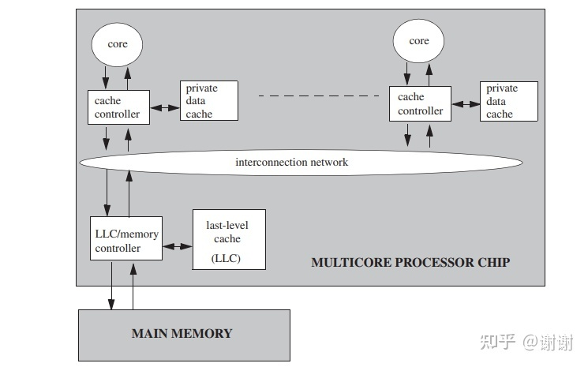
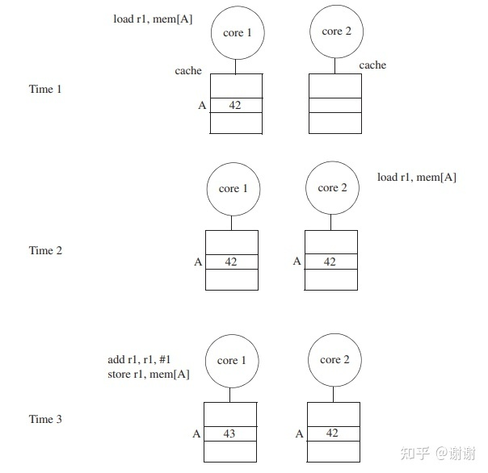
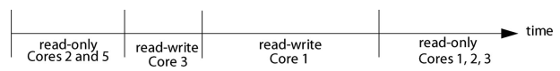

本章会介绍足够用来理解consistency模型和cache是如何交互的关于cache coherence的信息。2.1节会展示贯穿于整本入门的系统模型。为简化本章及后续章节里的问题阐述，我们选择了最简单的同时足以说明重要问题的系统模型。到第九章的时候再讨论更复杂的系统模型。2.2小节说明了必须要解决的cache一致性问题以及不一致问题可能的发生点。2.3小节精确定义了cache一致性。

## 2.1 基础系统模型
本入门中，我们会考虑一个带有多处理器核，共享内存的系统。所有核都能够对所有（物理）地址进行load和store。基础系统模型包含一个多核处理器芯片以及片外主存，见图2.1。这个多核处理器芯片包含多个单线程的核心，每个核心（core）有自己独立的私有数据cache，**还有一个“最后一级”cache（last-level cache, LLC）被所有核所共享**。贯穿整本入门内容，当我们使用cache这个词的时候，指的是每个core私有的数据cache而非LLC。每个核的数据cache通过物理地址访存并且策略是写回（write-back）。core和LLC之间在一个互连网络上进行通信。LLC尽管在处理器芯片上，逻辑上是一个“内存侧”cache，因此不会引入另外一级coherence问题。LLC逻辑上仅在内存前端，用以降低内存访问的平均延时，增加内存有效带宽。LLC也作为片上内存控制器。

这个基础系统模型去除了很多常见功能特性，但这些特性并不会对本入门大部分问题的阐述造成影响。这些特性包括指令cache，多级cache，多核之间共享的cache，虚拟寻址cache，TLB以及一致性的DMA。基础系统模型也去除了多个多核芯片的场景。这些功能特性会延后讨论，但现在引入它们只会增加不必要的复杂性。

图2.1 整本入门中使用的基础系统模型

## 2.2 问题：不一致在什么时候会出现
不一致发生的可能性只和一种基础问题场景有关：存在多个actor对cache和内存进行访问。现代的系统中，这些actor可以**是处理器核(processor core)， DMA引擎以及一些能够读写cache核内存的外部设备**。本入门的余下内容中，我们大体上会聚焦在处理器核形式的actor上，但在认知上知晓其它actor也存在是值得引起注意的。

图2.2展示了一个简单的不一致例子。起初，内存位置A在内存中的存的值是42，core 1和core 2都从内存中加载了这个值到各自的cache中。在time 3的时候，core 1在自己的cache中将这个值从42增加到了43，使得core 2里cache中A的值变得过时或不一致了。为了避免不一致，系统必须实现一个cache一致性协议来调整这些行为，使得core 1观察到值为43的同时core 2不能观察到旧值42。设计和实现这些cache一致性协议是第七章到第九章的主题。

图2.2 不一致的例子

## 2.3 定义一致性（coherence）
2.2小节中描述的不一致的场景实例是很直观的“不正确”场景，其中两个actor在同一时间对给定数据项观察到了不同值。本小节中，我们会从对不一致性的直观感受转化成对一致性的精确定义。在教科书以及发布的论文中存在多种关于coherence的定义，我们不希望去展示所有的定义。相反，我们会展示我们觉得能够对coherence协议起到启发的观点来呈现这个定义。在sidebar里，我们讨论了一些可选的定义以及它们是如何关联到我们所倾向使用的定义的。

图2.3 划分给定内存位置的生命周期为不同时期（epoch）

我们偏好的coherence的定义的准则是单写者多读者（single-writer–multiple-reader， SWMR）不变性。<u>对于任意给定的内存位置，任意给定的时刻【1】，只会存在一个单独的core可以改写它（这个core也可以读取它）或多个核可以对它进行读取。</u>因此，永远不会存在一个时间点，一个给定的内存位置既可以被一个core写入又可以同时被其它core读取或写入。另外一种理解这个定义的方式是：<u>对每个内存位置，这个内存位置的生命周期被划分为了不同的时期(epoch)。每个时期内，要么是一个单独的core有read-write访问，要么是一些core（可能为0）有read-only访问。</u>图2.3展示了一个样例内存位置的生命周期，划分成了4个时期来维持SWMR不变性。

除了SWMR不变性，一致性还要求给定内存地址的值能够被正确地传播。为解释清楚为何值很重要，让我们重新考虑图2.3的例子。尽管SWMR不变性保持住了，但如果在第一个只读时期里，core 2和core 5能够读到不同的值，那么这个系统也不是一致的。类似地，如果core1无法读到core 3在其读写时期中写入的最终值，或者core1，2，3中任意核无法读到core 1在其读写时期中更新的最终值，系统也是不一致的。

因此，一致性的定义必须对SWMR不变性增加**数值不变性**，数值不变性用来确定值是如何从一个时期（epoch）传播到下一个时期的。<u>数值不变性指明了一个epoch开始时，一个内存位置的值和上一个对这个内存位置进行读写的epoch结束的时候的值相同。</u>

这些不变性也有其它等价的解释方法。一种重要的解读SMWR的例子是用token来表达。对于每个内存位置，存在固定数量的token，token数量至少和core的数量一样大。如果core持有全部数量的token，则它可以对此内存位置进行写入。如果core有一个或多个token，它可以对此内存位置进行读取。因此，任意给定时间，不可能存在一个core要写一个内存位置，同时其它core正在读或写这个位置的情况。(类似RWMutex)

1. 单写者，多读者（SWMR）不变性。对任意的内存位置A，在任意给定（逻辑）时间点，只能存在一个core对A进行写入（也能读取A）或一部分core只能读取A。
2. 数值不变性。一个epoch开始时，一个内存位置的值和上一个对这个内存位置进行读写的epoch结束的时候的值相同。

【1】SWMR不变性只需要在逻辑时间里维护，而非物理时间。这个细节使得许多优化方案看起来（但实际上并没有）违反了这个不变性。我们会延后到后面章节讨论这些优化方案，对于逻辑时间不熟悉的读者可以不用关心。

### 2.3.1 coherence不变性的管理维护
前面介绍的coherence不变性提供了一致性协议是如何工作的一些直觉性认知。大量的一致性协议，叫做"invalidate protocol"，被明确地设计用于维护这些不变性。<u>如果core想过要读取一个内存位置，它会发送消息给其它core来获取内存位置的当前值，以此保证没有其它core保存着此位置上读写状态中的缓存拷贝。这些消息会结束任意活动状态的读写epoch，并且启动一个只读epoch。如果core想要写入一个内存位置，如果它还没有拥有一个合法的只读缓存拷贝，它会发送消息给其它core来获得内存位置的当前值，以此来保证没有其它core保存着此内存位置上只读或读写状态中的缓存拷贝。这些消息会结束任意活动的读写或只读epoch，并且启动一个新的读写epoch。</u>本入门针对cache一致性的章节（第六章到第九章）在invalidate协议的抽象描述上做了很大的扩展，但基本的东西是不变的。

### 2.3.2 coherence的粒度
一个core能够执行不同粒度的加载(load)和存储(store) 操作，通常在1到64字节之间。理论上讲，coherence能够按照最小的load/store粒度来进行。但在实际中，coherence通常是按照cache block为粒度来管理。也就是说，硬件按照cache block为基础强制coherence发生在cache block上。在实践中，SWMR不变性基本就是：对任意的内存block，要么只有一个单独的写者，要么有多个读者。典型的系统中，不可能发生这种情况：一个core在写block的第一个字节，同时另外的core在写相同block里其它字节。尽管cache-block粒度很常见，并且在本入门中余下部分都假定如此，但也要知道存在一些一致性协议，它们是按照更细的或更粗的粒度来进行cohrence管理的。

### Sidebar: Coherence的Consistency-Like定义
<u>我们所偏好的coherence的定义指定了不变性，关注不同core对一个内存位置的访问权限，以及拥有特定权限的core之间的数值传递。</u>实际上还有另外一种类型的定义，此定义聚焦在load和store上，和内存一致性模型（memory consistency model）如何指定load和store的顺序在体系架构上的可见顺序的概念类似。 

一种指定coherence的consistency-like的方法和顺序一致性(sequential consistency)的定义有关。顺序一致性（Sequential consistency，SC）是第三章会深入讨论的一种内存一致性模型，**SC规定系统执行所有线程对全部内存位置的load和store操作必须看起来是按照一个总的顺序(total order)进行的**，这个总的顺序会考虑每个线程的程序顺序。每个load操作会获取到总顺序中最近一次store操作的值。coherence的定义如果用SC的定义来类比，就是一个一致性系统执行所有线程对单个内存位置的load和store操作必须看起来是按照一个总的顺序进行的，这个总的顺序会考虑每个线程的程序顺序。这个定义突出了coherence和consistency的一个重要的区别：**coherence是基于单个内存位置的，而consistency是指定全部内存位置的**。

另外一种coherence的定义方法通过两个不变性来定义coherence：1. 每个store操作最终会对所有core所见；2.相同内存位置的写入操作是串行的（即所有核观察到相同的顺序）。

还有一种coherence的定义，由Hennessy和Patterson规定，包含了三个不变性：
- 一个core对内存位置A的load操作所获取的值是前一次该core进行store的结果，除非另外一个core在其间进行了A的store操作；
- 对A的load操作所获取的值是另外一个core对A的store操作S的结果，如果S和这个load操作在时间上分开的足够多并且如果在S和load之间没有其它store操作的话；
- 对相同内存位置的store操作时串行的。这几个不变性集合是较为直观的，但在“时间上分开的足够多”这点上有点问题，不够精确。

这些类似consistency的定义方法和2.3节种展示的定义是一样合理的，并且它们能轻松地作为规范来使用，以便验证一个给定的协议是否实施了coherence。一个正确的一致性协议会满足这些定义的任意一个。但是，类似consistency的定义对于一致性协议的架构师来说不太直观。架构师设计协议来调整如何以及什么时候core可以访问内存位置，因此我们相信2.3节里的定义对于架构师而言更加有启发性。

### 2.3.3 Coherence的范围
coherence的定义(不管选择哪种定义)有一个特定的范围，架构师必须清楚它什么时候适用，什么时候不适用。我们讨论两个重要的范围议题：

coherence适用于所有存储结构，这些存储结构保存了来自共享地址空间的数据block。这些结构包括L1数据cache，L2 cache，共享的最后一级cache（LLC），以及主存，也包含L1指令cache和TLB【1】。

coherence不适用于体系架构（即coherence不是体系架构级可见的）。严格来讲，系统可以是不一致但仍然是正确的，只要它遵守特定的内存一致性模型（memory consistency model）。虽然这个问题可能看起来只是单纯的好奇心引发的（即很难想象有一个实际的系统是consistent但不是coherent的），它却有一个很重要的推论：内存一致性模型没有强加任何显式的约束给coherence，或是实现coherence的协议。尽管如此，从第三章到第五章会讨论到，许多consistency模型实现依赖于某些通用的coherence属性来实现正确性，这是为什么我们在讨论consistency模型前在本章介绍coherence的原因。

【1】在某些体系架构中，TLB能够保存一些映射关系，这些映射并不是严格的共享内存中的block的拷贝。

## 2.4 参考资料
[1] K. Gharachorloo. Memory Consistency Models for Shared-Memory Multiprocessors. PhD thesis, Computer System Laboratory, Stanford University, Dec. 1995.

[2] K. Gharachorloo, D. Lenoski, J. Laudon, P. Gibbons, A. Gupta, and J. Hennessy. Memory Consistency and Event Ordering in Scalable Shared-Memory. In Proceedings of the 17th Annual International Symposium on Computer Architecture, pp. 15–26, May 1990.

[3] J. L. Hennessy and D. A. Patterson. Computer Architecture: A Quantitative Approach.Morgan Kaufmann, fourth edition, 2007.

[4] IBM. Power ISA Version 2.06 Revision B. http://www.power.org/resources/downloads/ PowerISA_V2.06B_V2_PUBLIC.pdf, July 2010.

[5] M. M. K. Martin, M. D. Hill, and D. A. Wood. Token Coherence: Decoupling Performance and Correctness. In Proceedings of the 30th Annual International Symposium on Computer Architecture, June 2003. doi:10.1109/ISCA.2003.1206999