本章进入内存一致性模型（memory consistency models也叫内存模型）的讨论，内存模型定义了编程者和实现者所使用的共享内存系统的相关行为。这些模型定义了正确性，因此编程者会清楚系统预期的行为，实现者会清楚需要提供哪些东西来满足正确性。首先我们会介绍定义内存行为的需求的驱动因素（3.1节），说明一个内存一致性模型应该要做什么（3.2节），并对consistency和coherence进行对比（3.3节）。

我们接着会探讨顺序一致性（sequential consistency，SC）的（相对）直观的模型。SC很重要，因为它是许多编程者所期望的共享内存的行为，它为后续两个章节里要介绍的更加松散(relaxed/weak)的内存一致性模型打下了基础。首先我们介绍SC的基本概念（3.4节），提供了它的形式化描述，这个描述在后续章节中也会用到（3.5节）。然后会讨论SC的实现，从简陋的可运作的实现方案开始介绍（3.6节），接着会介绍一个带有cache coherence的SC的基本实现（3.7节），然后会介绍带有cache coherence的SC系统的更加优化的实现方案（3.8节），最后会介绍原子操作的实现（3.9节）。 通过MIPS R10000的案例学习来结束讨论（3.10节），最后给出一些更多的参考资料（3.11节）。


## 3.1 共享内存行为问题
为了看明白为何共享内存的行为需要被严格定义，来看表格3.1中描述的两个core的执行例子（这个例子和本章中所有例子的情况，都假定所有变量的初始值为0）。大部分程序员都会期望core C2的寄存器r2应该获得NEW值。不过，**r2在如今的一些计算机系统中可以是0**。

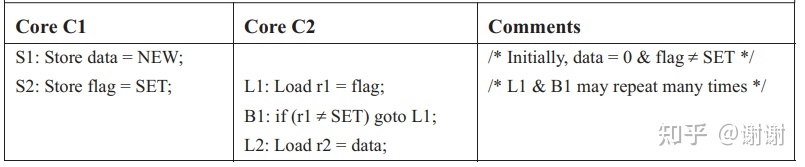

表格3.1 r2是否总是应该为NEW？


硬件通过对core C1的store操作S1和S2重排序，可以让r2的值为0。局部来看（即如果只看C1的执行过程，不考虑和其它线程的交互），这种重排序看起来是正确的，因为S1和S2访问了不同的地址。本章中一个sidebar补充内容“core如何重排内存访问”会介绍硬件可能的重排序内存访问的几种方式。非硬件专家可以认为此类重排序会发生即可（例如，用了一个非FIFO的write buffer）。
当重排S1和S2时，执行顺序可以是S2,L1,L2,S1，如表格3.2所示

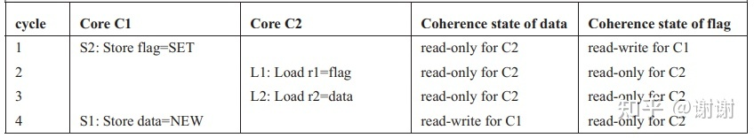

表格3.2 一种可能的程序执行顺序，程序原始情况参考表格3.1


这种场景满足coherence要求，因为SWMR属性没有被破坏，因此不一致（incoherence）并不是这种看似错误的执行结果的底层原因。

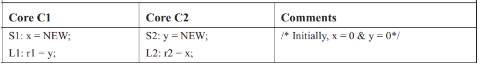

表格3.3 r1和r2都能被设置为0吗？


让我们来看另一个重要的例子，这个例子受到Dekker算法的启发。如表格3.3描述，运行结束后，r1和r2的允许的值是什么？直观上看，可能想到的三种可能：

```
(r1, r2) = (0, NEW)，执行顺序为 S1, L1, S2, L2
(r1, r2) = (NEW, 0)，执行顺序为 S2, L2, S1, L1
(r1, r2) = (NEW, NEW), 执行顺序为 S1, S2, L1, L2
```

但令人意外的是，大部分真实的硬件，如Intel和AMD的x86系统，也允许(r1,r2) = (0, 0)，因为它使用了FIFO write buffer来提升性能。如表格3.1的例子所示，这些执行顺序全部都满足cache coherence，甚至对(r1,r2) = (0,0)的情况也适用。

某些读者可能会反感这个例子，因为它是不确定的（多种结果都是被允许的）而且它可能是一种令人困惑的编程习语（没有掌握对应编程语言前就不会理解）。但首先要明确的是，目前所有多处理器默认行为都是不确定的；我们知道的所有体系架构都允许并发线程执行的多种可能的交织行为。确定性的假象，有时候是被带有适当同步惯用语的软件所创造的，但并非总是如此。因此，我们必须在定义共享内存行为时考虑不确定性。

此外，内存行为通常是针对所有程序的所有执行过程定义的，甚至是那些错误的或故意而为之的（例如非阻塞同步算法）。在第五章中，我们会看到一些允许部分执行过程有未定义的行为的一些高级语言模型，例如带有数据竞争的程序的执行过程。

### Sidebar：core是如何进行内存访问重排序的

这个sidebar描述了现代处理器核对不同地址的内存访问进行重排序的一些方法。对于不熟悉这些硬件概念的读者可以在首次阅读时跳过本sidebar。现代的处理器核可以重排许多内存访问，但讨论两个内存操作的重排序已经足够了。**大多数情况下，我们只需要讨论一个核重排序两个不同地址的两个内存操作，因为顺序执行（即冯诺依曼）模型通常要求对相同地址的操作按照原始的程序顺序执行。**根据重排序的内存操作是load还是store，我们将可能的重排序分解成三种场景。

Store-store 重排序。如果一个核使用一个非FIFO的write buffer，此buffer使得store操作的原始入队顺序分离成不同的顺序，那么两个store操作可能会被重排序。这种情况可能发生在：如果第一个store在cache中miss但是第二个store在cache中hit的时候；或者如果第二个store能够和更早的store（即在第一个store前）进行合并的时候。注意这些重排序即便是在core按照程序顺序执行所有指令的情况下也是可能的。在一个单线程执行过程中，重排序到不同内存地址的store操作不会造成任何影响。但在表格3.1所示的多线程例子中，重排序core C1的store操作允许core C2会在看到对data的store前先看到flag被设置为SET。注意这个问题甚至在write buffer操作流向一个完美实现的一致性内存层次体系中去的时候也无法修复。coherence会让所有cache变得不可见，但store操作本身已经被重新排序了。

Load-load 重排序。现代动态调度的处理器核可以乱序执行指令。在表格3.1的例子中，core C2可以乱序执行load L1和 L2。仅考虑单线程执行的情况，这种重排序看起来是安全的，因为L1和L2是到不同地址的。然而，重排序core C2的load操作和core C1的store操作重排序行为一样，如果内存引用的执行顺序是L2,S1,S2,L1，则r2被赋值为0.这种场景在分支表达式B1被省略掉后会更加合理，这样L1和L2就没有控制依赖来隔开了

Load-store 以及 store-load 重排序。乱序处理器核也可以重排相同线程里的load和store（到不同的地址）。重排一个原来靠前的load和一个靠后的store(load-store重排序)会引发很多不正确的行为，如在释放锁之后去加载一个被锁保护的值（假设store是解锁操作）。表格3.3展示了对一个靠前的store和一个靠后的load进行重排序（store-load重排序）。重新排序core C1的S1和L1以及core C2的S2和L2会允许r1和r2都为0的违反直觉的结果出现。 读者可能会认为硬件不应该允许这些行为中的一部分或全部，但在没有更加透彻地理解什么行为被允许的情况下，确定硬件能做什么，不能做什么非常困难。

## 3.2 什么是内存一致性模型

上一小节中的例子说明了共享内存的微妙行为，为精确定义“**（a）编程者能够期望什么行为 (b)系统实现者可以使用哪些优化**”提供了有价值的信息。内存一致性模型目的就是消除这些问题的歧义。

内存一致性模型(MC)，或简称内存模型，是一个规范，规范指明了使用共享内存执行的多线程程序所被允许的行为。对一个带有特定输入数据的运行的多线程程序，模型规定了动态load操作可以返回什么值，内存的最终状态是什么。不像一个单线程的执行过程，多种正确的行为通常都被允许，我们会在顺序一致性（sequential consistency，SC）中看到这些行为（3.4节及之后）。

通常来讲，内存一致性模型MC给定了一些规则，这些规则划分执行过程为遵守MC的执行（MC execution）和违背MC的执行（non-MC execution）。这种对执行的划分反过来也划分了具体硬件实现。一个MC的实现是一个只允许MC execution的系统，一个非MC的实现有时允许non-MC execution。

最后，我们一直对编程对应的层级含糊其辞。我们假定程序是对应硬件指令集架构体系的可执行文件，并且我们假设内存访问是针对物理地址标识的内存位置进行的（即我们不考虑虚拟地址和地址转换的影响）。在第五章中，我们会讨论高级语言（high-level languages, HLLs）带来的问题。那时我们可以看到，编译器分配一个寄存器变量能影响到HLL内存模型，这种影响和硬件重排序内存引用是类似的。

## 3.3 Consistency 对比 Coherence

第二章定义了cache一致性（coherence），涉及两个不变性，我们在这里复习一下。单写者-多读者（SWMR）不变性保证了对于任意给定的内存地址，任意（逻辑上的）时间点上，**要么(a)只有一个core可以写（和读）这个地址，要么（b）一个或多个core只可以读这个地址**。数值不变性保证了内存地址的数值更新都被正确地传递，因此内存地址的缓存拷贝总是最新的值。

看起来cache一致性（coherence）定义了共享内存的行为。但其实并没有，理由有三：

- cache coherence的目的是让多核系统中的cache如单核系统中的cache一样变得对外不可见。然而，一旦cache变得不可见，还有哪些行为仍然存在？

- coherence典型来说一次处理一个cache block，并且对于访问多个cache block的交互上没有任何干预。真实的程序会访问跨越多个cache block的变量。

- 实现一个不带coherence，甚至是不带cache的内存系统是可能的。

尽管coherence不是必需的，大多数共享内存系统实现内存一致性模型（memory consistency model）时都带有一致性cache（coherent cache）。即便如此，也有可能做到consistency实现和coherence实现上进行解耦（我们也认为这样做极具价值）。出于此目的，我们在本章和后面两章中讨论的内存一致性模型时coherence会被当成一个子函数调用来使用。例如，这些章节会利用SWMR不变性，但并不关注它是如何实现的。

总结：

- cache coherence不等于memory consistency。
- 一个内存一致性（memory consistency）在实现上可以把cache coherence当成黑盒子使用。

## 3.4 顺序一致性的基本概念(SC)

按理来说，最直观的内存一致性模型是顺序一致性（sequential consistency）。顺序一致性首先是由Lamport形式化定义。Lamport最初称一个单核处理器是“顺序的”（sequential），只要满足：执行的结果看起来是按照程序指定的操作顺序执行的结果即可。接着，他称一个多核处理器是“顺序一致的”(sequentially consistent)，只要满足：<u>执行的结果看起来就是全部处理器（核）按照某种顺序执行，并且每个独立的处理器（核）的操作按照程序指定的顺序出现即可</u>。这个总的操作顺序称为**内存顺序（memory order）**。在SC中，内存顺序不违背每个core的程序顺序，但其它一致性模型允许内存顺序不用总是遵循程序顺序。

```
图3.1 说明了表格3.1中例子程序的一种执行情况。中间的黑线箭头内存顺序（<m），每个core的箭头代表了每个core的执行顺序(<p)。我们使用操作符<m代表内存顺序，因此 op1 <m op2暗指在内存顺序中op1先于op2。同样，我们使用操作符<p代表一个给定core的程序顺序，因此 op1 <p op2暗指在当前core中的程序顺序中op1先于op2。在SC下，内存顺序会“关心”每个core的程序顺序。“关心”意思是op1 <p op2暗指op1 <m op2。在注释(/* ... */)中的值表示加载或存储的值。执行过程以r2的值为NEW这里终止。更加一般的说法，表格3.1的程序的全部执行在r2为NEW时终止。唯一不确定的一个点---在L1读到flags为SET前，L1读出flags为0的次数是多少---并不重要。
```

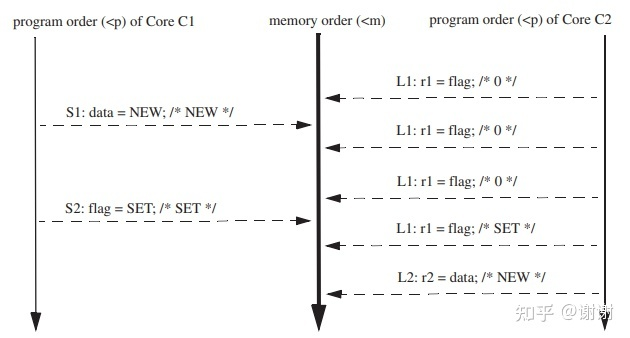

图3.1 表格3.1的程序的一种顺序一致性执行过程


这个例子展示了SC的值。在3.1节，如果你认为r2的值必须是NEW，那么你可能自己在独立地发明SC，虽然不如Lamport的SC精确。
SC的值会在图3.2中进一步展示，此图展示了表格3.3中的程序的四种执行过程。图3.2（a-c）描绘了对应三种直观输出的SC执行过程，这三种直观的输出是： (r1, r2) = (0, NEW), (NEW, 0), or (NEW, NEW)。注意图3.2(c)仅描绘了结果为(r1, r2) = (NEW, NEW)的四种可能的SC执行过程中的一种，图中的顺序是{S1, S2, L1, L2}, 其它几种是{S1, S2, L2, L1}, {S2, S1, L1, L2}, and {S2, S1, L2, L1}。因此图3.2（a-c）横跨了六种合法的SC执行顺序。

**图3.2（d）展示了一个非SC的执行过程，对应结果是(r1, r2) = (0, 0)。**没有任何方法能够创建一个内存顺序，这个内存顺序遵循程序顺序，并且产生这种输出结果。程序顺序是：
```
S1 <p L1
S2 <p L2
```
但是内存顺序是：
```
L1 <m S2 (因此r1 = 0)
L2 <m S1 (因此r2 = 0)
```
要满足所有这些约束，会产生一个环，这个环和总的顺序不一致。图3.2(d)中多余的弧展示了这个环。

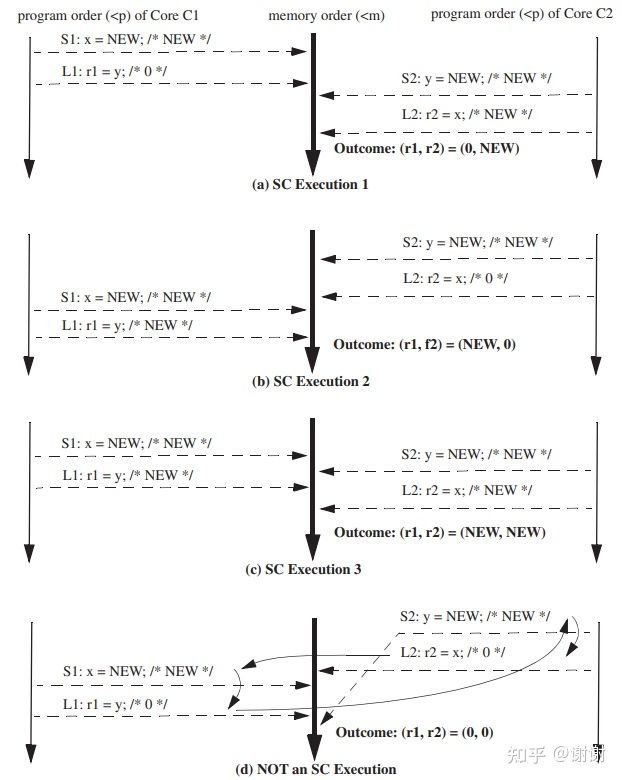

图3.2 表格3.3的程序四种可选的执行顺序

我们看到了六种SC执行顺序和一种非SC执行顺序。这能够帮助我们理解SC实现：一个SC的实现必须允许前六种的一种或多种执行顺序，但不能允许第七种执行顺序。

我们也观察到了consistency和coherence的一个关键区别。coherence应用在单block基础上，而consistency是跨越所有block被定义的(第七章预告，我们会看到snooping系统会确保coherence的总顺序是跨越所有block的，尽管coherence仅要求对单个独立的block的coherence请求形成一个总顺序。这种看似做过了的情况是snooping协议用来支持一致性模型（consistency model），如SC所要求的)。


## 3.5 一个小型SC形式化描述

本节中，我们更加精确地定义SC，这样可以让我们去对比SC和后两章更弱的一致性模型。我们采用了Weaver和Germond的形式化语言，使用如下符号：L(a)和S(a)表示一次load和一次store操作，这两个操作作用到一个地址a。顺序 <p 和 <m 定义了程序和全局内存顺序。程序顺序<p是一个单核总顺序，此顺序和每个核逻辑（顺序）执行的内存操作顺序是一致的。全局内存顺序<m是所有核的内存操作的总顺序。

SC execution需要满足：

所有核遵循自身的程序顺序，插入它们的load和store操作到顺序<m中，不管这些操作的目的地址是相同的还是不同的（即a = b或 a ≠ b ）。有四种情况：

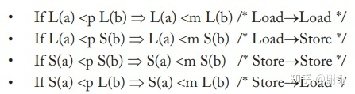

每个load操作获取的值来自其前面最后一次对相同地址的store操作结果（在全局内存顺序中）：

**L(a)的值 = MAX<m{S(a)|S(a) <m L(a)}的值**，其中**MAX<m**指的是“在内存顺序中最近的一次”。
原子读-改-写(RMW)指令，在3.9节会更深入地讨论，这些指令进一步约束了允许的执行过程。例如，每次test-and-set指令执行都要求test所需load操作以及set所需的store操作在内存顺序中看起来是连续的（即它们中间不能有针对相同或不同地址的内存操作被插入）。

我们在表格3.4中总结了SC的顺序需求。这个表格指定了哪些程序顺序被一致性模型所强制要求。例如，如果一个给定的线程的程序顺序中有一个load在一个store前（即load是Operation 1，store是Operation 2），那么表中这种情况相交的值是“X”，就代表这些操作必须按照程序顺序来执行。对于SC来讲，所有内存操作必须按照程序顺序执行，对其它一致性模型来讲，也就是后面两章中要学习的，这些顺序约束中的一部分是松散的（即它们的顺序表格里的一些项不含有“X”）。

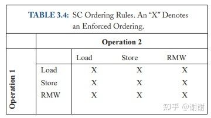

SC的实现只会允许SC execution。严格来讲，这是SC实现上的safety属性（无害）。SC实现上也应该有一些liveness属性（有益）。最小化的一个SC实现应该允许对每个程序有至少一个SC execution。一般来说，饥饿避免和一些公平策略也是有价值的，但这些事情超出了本文的范围。

>safety - 某些“坏"事绝对不会发生
>
>liveness - 某些“好”事最终必然会发生（但我们并不知道是什么时候）


## 3.6 朴素的SC实现方案
SC允许两种朴素的实现方案，这些方案使得理解哪些是SC所允许的执行过程变得更容易。

### 多任务的单处理器（The Multitasking Uniprocessor）

首先，实现者能够为多线程用户级软件实现SC，通过在一个单独的顺序核上执行所有线程（单处理器）来实现。线程T1的指令执行在core C1上，直到进行上下文切换到线程T1，以此类推。在上下文切换时，任意的待决（pending）的内存操作在切换到新的线程之前必须做完。一个检视动作显示出所有SC规则都被遵守了。

### 开关（The Switch）

其次，实现者能够使用图3.3中的一组core Ci，一个单独的switch以及内存来实现SC。假定每个core都按照自身的程序顺序在一个时间点发送一个内存操作给switch。每个core能够使用任何的优化手段，这些优化不影响它给switch所呈现的顺序。例如，带分支预测的简单的5级顺序流水线能够被使用。

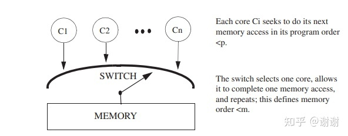

图3.3 一个使用内存开关(memory switch)的简单SC实现

接下来假定switch选择了一个core，允许内存完全满足load或store操作的要求，只要请求一直存在，这个过程就一直被重复。switch可以通过任意的方法（例如随机）来选择core，此方法不能饿死带有ready的请求的core。这种方案通过结构可操作地实现了SC。

### 评估

对于这两种实现方案，好消息是，它们提供了可运作的的模型，模型定义了 (1)允许的SC execution以及(2)SC实现方案的“黄金标准”。switch方式的实现也可作为一个有利的证明，证明SC可以不用cache或coherence也能实现。

当然坏消息是，**这两种实现的性能不会随着core的增加而提升**，因为在第一种场景里，存在单核的顺序执行瓶颈，第二个场景里受到单个switch/memory的影响，性能也无法提高。这些瓶颈误导了一些人错误地认为SC阻止了真正的并发执行，但其实并没有，我们后面会看到原因。

## 3.7 一种带cache一致性(coherence)的基础SC实现

cache一致性使得能够完全并发执行非冲突（non-confilicting）的load和store操作的SC实现变得更加便利（两个操作冲突是指：如果它们操作相同地址并且至少有一个操作是store）。还有就是，创建这样的系统在概念上很简单。

在这里，我们将coherence基本看作一个黑盒子，这个黑盒子实现了第二章提到的单写者-多读者不变性（SWMR）。通过稍微打开coherence的黑盒子来揭示简单的L1 cache，我们提供出一些实现的直觉，L1 cache:

- 使用状态modified（M）来表示一个core能读和写的一个L1 block。
- 使用状态shared（S）来表示一个或多个core只能读的一个L1 block。
- 使用GetM和GetS分别表示获取一个需要处于M和S的block的coherence请求。

我们目前不需要深入了解coherence具体是如何实现的，第六章及后续章节会讨论。

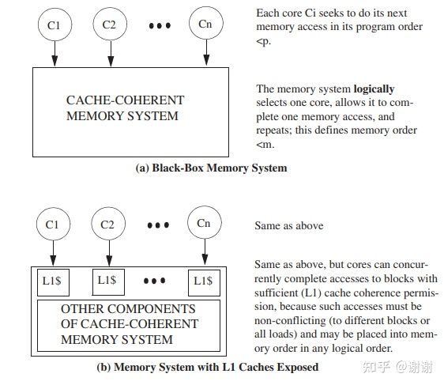

图3.4 实现带cache一致性的SC

图3.4(a)在图3.3的模型基础上替换了switch/memory为一个cache一致的（cache-coherent）内存系统黑盒子。每个core都按照自己的程序顺序一次发送一个内存请求到这个cache一致的内存系统。这个内存系统在开始针对相同core的下一个请求前会先处理掉系统种的每一个请求。

图3.4(b)“打开”了一点点这个内存系统黑盒子来揭示每个core连接到了自己的L1 cache（我们会在后面谈到多线程）。这个内存系统在block B处于适当的coherence权限时，能够响应对block B的load和store操作（load: 状态M或S; store: 状态M）。**而且，这个内存系统能够并发地响应来自不同core的请求，只要对应的L1 cache有适当的权限**。例如，图3.5(a)中描绘了四个core在做内存操作前的cache状态。这四个操作没有冲突，能够被各自的L1 cache所满足，因此能够被并发地完成。在图3.5(b)中，我们能够任意排序这些操作来获得一个合法的SC执行模型。一般来说，只要是L1 cache所能满足的操作总是能够被并发完成，因为coherence的单写者-多读者不变性保证了这些操作不会冲突。

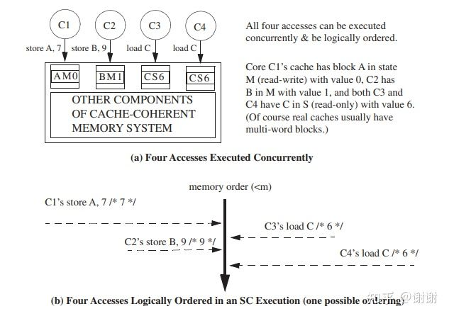

图3.5 带cache一致性的SC的并发执行


### 评估
我们已经创建了一个SC的实现：

- 完全利用了cache的延迟和带宽优点
- 和它所使用的cache coherence协议有相同的可伸缩性
- 解耦了实现coherence和实现core的复杂性

## 3.8 带cache coherence的SC的优化实现(hard to understand)

大部分真实的core在实现上比前面介绍的基础的带cache coherence的SC实现方案要更加复杂。为了改进性能以及容忍内存访问延迟，**core会带有一些特性如预取，预测执行以及多线程**。这些特性会和内存接口交互，我们来讨论一下这些特性是如何影响到SC的实现的。

### Non-Binding Prefetching

>modified(M), owned(O), exclusive(E),shared(S), invalid(I)

对于**block B**来讲，一个**non-Binding Prefetch**是一个到 一致内存系统（coherent memory system）的一个请求，这个请求用于改变在一个或多个cache中B的一致性状态。通常，预取动作是由软件、core的硬件或cache硬件发起，用来改变L1 cache中B的状态，以便允许load操作（例如B的状态是M或S）或load+store(B的状态是M)操作，这些操作通过coherence请求如GetS和GetM来发起。比较重要地，一个non-binding预取在任何情况下都不会改变寄存器或block B中的数据状态。non-binding预取的影响被限制在图3.4中“cache-coherent memory system”块内部，使得non-binding预取对内存一致性模型（memory consistency model）的影响在功能上等同于一个空操作（no-op）。只要load和store操作按照程序顺序进行，coherence权限按照什么顺序被获取是无关紧要的。

实现上可以进行non-binding预取，同时不会对内存一致性模型造成影响。这对于内部cache预取（例如stream buffer）和采用更加激进方式的core来说都很有用。

### Speculative Cores

来看一个按照程序顺序执行指令的core，带有分支预测功能，此功能可能会使后续的指令,包括load和store开始执行，但在分支预测失误时可以被停止（即它们的执行效果会消失）。这些被停止的load和store能够被实现为看起来就像non-binding预取，使得这种推测执行是正确的，因为它对SC没有任何影响。在一个分支预测之后的一个load操作能够被呈现给L1 cache，load操作无论是在cache miss（触发一个non-binding GetS预取）还是cache hit，最后都会返回一个值到一个寄存器里。如果load被停止了，core会丢弃寄存器的更新，擦除掉来自load操作的任何功能性影响--就像它从未发生过一样。cache不会反操作non-binding预取动作，这样做没有必要并且如果这个load操作重新执行时，预取这个block还能提升性能。对于store操作，core可以提前发起一个non-binding GetM预取，但它并不会将store操作呈现给cache，直到确定store操作确定要被提交时才会这样做。

```
第一章的问题1： 在维护了顺序一致性的系统中，一个核必须按照程序顺序发起coherence请求。对还是错？
答案：错！core可以按照任意顺序发起coherence请求。
```

### Dynamically Scheduled Cores

许多现代的处理器core会动态地调度指令执行，不按照程序顺序来执行，相比于必须严格按照程序顺序来执行的静态调度的core，有着更佳的性能。一个采用动态（dynamic）或乱序（out-of-(program-)order）调度的单核处理器必须强制处理程序内的数据依赖(true data dependence)。然而，在一个多核处理器的环境中，动态调度引起了一个新问题：内存一致性投机( memory consistency speculation)。假设一个core想要动态地重排两个load操作，L1和L2（例如是因为L2用到的地址比L1用到的地址计算提前完成）。多个core都会投机地先执行L2，然后再执行L1，并且它们预测这种重排序对其它core不可见，这样会破坏SC。

基于SC的投机执行要求core去验证预测行为是正确的。Gharachorloo等人展示了两种执行这种检查的技术。第一种方法是，<b>在core投机执行了L2之后，提交L2之前，core检查投机执行访问的block没有离开过cache</b>。只要block还在cache中，它的值就不会在load执行到load被提交这段时间内改变。为了执行这个检查，core跟踪L2加载的地址，并且对比被逐出的block以及进入的coherence请求。 进入的GetM请求指示了另一个core可能乱序观察到了L2，这个GetM暗示了一个错误的推测事件并且会终止投机执行。

第二种检查技术是<u>在core准备好提交load的时候，重放投机load</u>。如果提交时加载的值和之前投机执行加载的值不相等，则预测是错误的。在这个例子中，如果重放的L2加载的值和原始L2加载的值不一样，那么load-load重排序就造成了一个明显的不同的执行过程并且投机执行必须被终止。

### Non-Binding Prefetching in Dynamically Scheduled Cores

一个动态调度的core很可能会碰到乱序的load和store miss。举个例子，假设程序顺序是Load A， Store B， Store C。core可以“乱序”发起non-binding预取，例如，先是GetM C，然后是GetS A和GetM B。SC不会受到non-binding预取顺序的影响。SC只要求一个core的load和store操作（看起来）按照程序顺序访问它的L1 cache。cocherence要求L1 cache block处于适当的状态，以便接收load和store操作。

重要地，SC（或其它任何的内存一致性模型）：

规定了load和store操作（看起来）应用到一致的内存上的顺序，但不会强行规定coherence活动的顺序。

```
第一章问题2：内存一致性模型（memory consistency model）指定了coherence事务的合法顺序。对还是错？
答案：错！
```

### Multithreading

多线程（粗粒度的，细粒度的或两者兼有的）能够被SC实现方案所容纳。每个多线程的在逻辑上等同于多个（虚拟的）core，这些core通过一个switch来共享每个L1 cache，通过这个switch，cache选择下一次来服务哪个虚拟core。还有，每个cache实际上能够并发地服务多个不冲突的请求，因为它能够假定这些请求按某种顺序来被服务的。有一个挑战是，thread T1和thread T2是同一个core上的两个线程，T1想要读一个值，这个值在T2中要写入，在这个store操作被其它core上的线程“可见”之前，T1不能读取该值。因此，虽然T1可以在T2在内存顺序中插入了store（例如写值到一个状态为M的cache block）的同时进行值的读取，但它不能从处理器core里的共享的load-store队列中读取值。

## 3.9 带SC的原子操作(关于CAS的实现)

为了编写多线程代码，程序员需要有能力去同步多个线程，同步一般涉及原子地执行成对的操作。这个功能通过原子地执行“读-改-写”(**RMW**)的指令来提供，例如大家熟知的"test-and-set",“fetch-and-increment”以及"compare-and-swap"。这些原子指令对于正确的同步来讲至关重要，并且被用来实现spin-lock和其它同步原语。对于一个spin-lock，程序员可以使用一个RMW来原子地读锁的值，来确定锁是否是unlocked（例如等于0），以及用RMW来原子地写入locked值（例如等于1）。要让RMW原子地进行，RMW的读(load)和写(write)操作必须在SC要求的总的操作顺序中按顺序出现。

在微架构中实现原子指令在概念上直截了当，但缺少经验的设计会让原子指令的性能很差。一种正确但简单的方案是，实现的原子指令通过core去有效地锁定内存系统（即阻止其它core发起内存访问），并且执行它的读，改，写操作到内存。这种实现方案，尽管是正确及直观的，会牺牲性能。

RMW的更加激进的实现方案基于一个洞察，就是SC只要求所有请求的总顺序的出现。因此，一个原子的RMW能够被实现为，<u>先让一个core在它的cache中以M状态获取这个block，如果这个block还没有在这个cache里处于这种状态的话。这个core接着只需要在它的cache里对这个block进行load和store（不需要发送任何coherence消息或做总线锁定）直到store完成之前，对于任何进入的针对这个block的coherence请求，这个core会等待</u>。这种等待不会有死锁风险，因为store是保证一定会被完成的。

```
第一章问题3：为了执行一个原子读-改-写操作（例如 test-and-set），一个核总是必须和其它核进行通信。对还是错？
答案：错！
```

一种更加优化的RMW实现允许load部分执行的时候和store部分执行的时候这两者之间的可利用时间更长，同步不破坏原子性。考虑这种场景：block在cache中处于read-only状态。RMW的load部分能够立即地投机执行，同时cache控制器发出一个coherence请求来更新block的状态到read-write。当block随后进入了read-write状态时，RMW的store部分开始执行。只要core能够维护原子性的错觉，这种实现方案就是正确的。为了检查这种原子性的错觉是否被正确维护，core**必须检查这个加载的block在load部分和store部分之间，是否被驱逐出了cache**；这种预测行为的支持和SC里检测错误的推测事件所需要的东西是一样的（3.8节）。

## 3.10 将所有内容联系到一起：MIPS R10000实例分析

MIPS R10000提供了一个令人尊重的、干净的、商用的投机执行微处理器的例子，这个微处理器实现了SC，并且和一个cache-coherent内存层级协同工作。这里，我们集中R10000的关于实现内存一致性的面来讨论。

R10000是一个四路超标量RISC处理器core，带有分支预测和乱序执行功能。芯片支持L1指令writeback缓存和L1数据writeback缓存，以及一个私有的连接统一的（片外）L2cache的接口。

芯片的主系统接口总线（system interface bus）支持最多4个处理器的cache coherence，如图3.6所示。为了构建一个R10000为基础的带更多处理器的系统，如SGI Origin 2000（8.8.1小节讨论），架构师实现了一个directory coherence protocol，这个协议通过系统接口总线和一个特殊的Hub芯片连接多个R10000处理器。两种情况下，R10000处理器core看到的都是一个一致的内存系统，部分在片上，部分在片外。

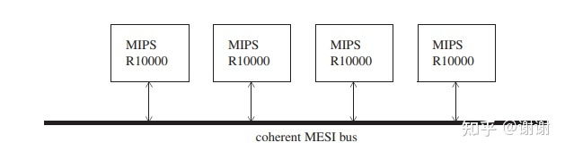

图3.6 连接最多4个MIPS R10000处理器的一致性MESI总线


在执行过程中，一个R10000 core按照程序顺序发起（投机）load和store操作到一个地址队列。一个load操作获取到的值是在它前面的最后一个对相同地址或数据cache进行的store操作所产生的。load和store按照程序顺序提交，并且随后移除它们的地址队列上的对应项。为了提交一个store操作，L1 cache必须保持block处于M状态，store的值必须被原子地写入。

重要地，一个cache block的驱逐动作eviction(由于coherence invalidation或为了给其它block挪出空间)包含了地址队列中的一个load操作的地址，它会终止这个load和所有后续指令，这些指令会在后面再次执行。因此当一个load最终提交时，被加载的block在load执行时和load提交时这两个时间段里，都持续地保持在cache中，因此load操作肯定会得到相同的值，表现得就像它在commit的时候去执行了。因为store操作实际上就是在commit的时候写入cache，R10000逻辑上呈现了load和store操作是按照程序顺序到一致的内存系统去的，因此也就实现了SC。

## 3.11 更多的SC相关阅读

下面我们从海量的SC文献中挑出一些重要的内容。
Lamport定义了SC。据我们所知，Meixner和Sorin是第一个证明了一个系统，其中core按照程序顺序呈现load和store操作到一个cache一致的内存系统中去，这个系统对于实现SC来说就已经足够了，尽管这个结果在一段时间内都仅是出于直觉来被认可的。

SC能够和数据库的可串行化进行类比。这两个概念类似的点是它们都强调来自所有实体的操作看起来会影响串行顺序中的共享状态。两个概念的不同点是对操作和共享状态的本质和预期。SC里，每个操作是一个单独的内存访问到易失性状态（内存），操作预期不会失败。在可串行化中，每个操作是一个针对某个数据库的一个事务，操作能够读写多个数据库实体，并且预期遵循ACID属性：Atomic - 全部执行或没有执行，甚至是对失败的情况也是如此；Consistent - 事务前后保持数据库一致，Isolated - 并发的事务之间互不影响，Durable - 事务的结果在崩溃或掉电情况下仍存在。

我们按照Lamport和SPARC的内容来定义了所有内存访问的总顺序。虽然这样能简化一些直观认知，但并不是必要的。两个访问产生了冲突（conflict）是指，它们来自不同线程，访问相同位置并且其中至少有一个是store操作（或者是read-modify-write）。不使用总顺序的话，能够只去定义冲突访问的约束，对于不冲突的访问保持无序即可，这是由Shasha和Snir最早提出的。这种观点对第五章的松散模型很有价值。

有很多关于SC激进实现方式的论文。Gharachorloo 等人展示了non-binding预取和投机执行在实现SC和其它内存模型时是被允许的。Ranganathan等人和 Gniady等人试图投机地退役（提交）指令（释放资源）并且使用次要机制来处理违反SC的情况。最近的一些工作则是通过隐式事务和相关机制来实现了SC。

最后提一个醒。我们前面（3.7节）提到一种用来检查预测执行的load操作是否被观察到是乱序的方法，该方法是记住laod预测读取的值A，load如果要被正式提交，在提交时这个内存位置的值也是同一个值A。Martin 等人展示了在执行值预测（value prediction）的core上，这种情况不适用。带有值预测时，当load操作执行时，core能够预测它的值。假设一个core预测一个对block X的load操作取到了值A，但实际上值是B。在这个core预测block X的load操作的时间点到core提交时的重放这个load操作期间，另外一个core修改了block X的值到A。这个core重放load操作时，比较两个值，会发现两者相等，并且错误地认为预测正确。如果发生这种情况，则系统会违背SC。这种情况类似于所谓的[ABA问题](http://en.wikipedia.org/wiki/ABA_problem)，Martin等人展示了几种在值预测存在时的检查预测行为的方法，用来避免一致性规则的违反（例如对初次预测load操作也重放所有的load依赖）。讨论这个问题并不是为了深入到这个特定的边缘case或其解决方案的细节，而是为了让说服你一定要去证明你的实现是正确的，而非依赖直觉。


## 3.12 参考资料

[1] C. Blundell, M. M. K. Martin, and T. F. Wenisch. InvisiFence: Performance-Transparent Memory Ordering in Conventional Multiprocessors. In Proceedings of the 36th Annual International Symposium on Computer Architecture, June 2009.

[2] H. W. Cain and M. H. Lipasti. Memory Ordering: A Value-Based Approach. In Proceedings of the 31st Annual International Symposium on Computer Architecture, June 2004. doi:10.1109/ISCA.2004.1310766

[3] L. Ceze, J. Tuck, P. Montesinos, and J. Torrellas. BulkSC: Bulk Enforcement of Sequential Consistency. In Proceedings of the 34th Annual International Symposium on Computer Architecture, June 2007.

[4] K. Gharachorloo, A. Gupta, and J. Hennessy. Two Techniques to Enhance the Performance of Memory Consistency Models. In Proceedings of the International Conference on Parallel Processing, volume I, pp. 355–64, Aug. 1991.

[5] C. Gniady, B. Falsafi, and T. Vijaykumar. Is SC + ILP = RC? In Proceedings of the 26th Annual International Symposium on Computer Architecture, pp. 162–71, May 1999.

[6] J. Gray and A. Reuter. Transaction Processing: Concepts and Techniques. Morgan Kaufmann Publishers, 1993.

[7] L. Hammond et al. Transactional Memory Coherence and Consistency. In Proceedings of the 31st Annual International Symposium on Computer Architecture, June 2004.

[8] L. Lamport. How to Make a Multiprocessor Computer that Correctly Executes Multiprocess Programs. IEEE Transactions on Computers, C-28(9):690–91, Sept. 1979. doi:10.1109/ TC.1979.1675439

[9] M. H. Lipasti and J. P. Shen. Exceeding the Dataflow Limit via Value Prediction. In Proceedings of the 29th Annual IEEE/ACM International Symposium on Microarchitecture, pp. 226–37, Dec 1996. doi:10.1109/MICRO.1996.566464

[10] M. M. K. Martin, D. J. Sorin, H. W. Cain, M. D. Hill, and M. H. Lipasti. Correctly Implementing Value Prediction in Microprocessors that Support Multithreading or Multiprocessing. In Proceedings of the 34th Annual IEEE/ACM International Symposium on Microarchitecture, pp. 328–37, Dec. 2001. doi:10.1109/MICRO.2001.991130

[11] A. Meixner and D. J. Sorin. Dynamic Verification of Memory Consistency in CacheCoherent Multithreaded Computer Architectures. In Proceedings of the International Conference on Dependable Systems and Networks, pp. 73–82, June 2006. doi:10.1109/DSN.2006.29

[12] A. Meixner and D. J. Sorin. Dynamic Verification of Memory Consistency in CacheCoherent Multithreaded Computer Architectures. IEEE Transactions on Dependable and Secure Computing, 6(1):282–312, 2009.

[13] P. Ranganathan, V. S. Pai, and S. V. Adve. Using Speculative Retirement and Larger Instruction Windows to Narrow the Performance Gap between Memory Consistency Models. In Proceedings of the Ninth ACM Symposium on Parallel Algorithms and Architectures, pp. 199–210, June 1997. doi:10.1145/258492.258512

[14] A. Roth. Store Vulnerability Window (SVW): Re-Execution Filtering for Enhanced Load Optimization. In Proceedings of the 32nd Annual International Symposium on Computer Architecture, June 2005. doi:10.1109/ISCA.2005.48

[15] D. Shasha and M. Snir. Efficient and Correct Execution of Parallel Programs that Share Memory. ACM Transactions on Programming Languages and Systems, 10(2):282–312, Apr. 1988. doi:10.1145/42190.42277

[16] . F. Wenisch, A. Ailamaki, A. Moshovos . Mechanisms for Store-waitfree Multiprocessors. In Proceedings of the 34th Annual International Symposium on Computer Architecture, June 2007. [17] D. L. Weaver and T. Germond, editors. SPARC Architecture Manual (Version 9). PTR Prentice Hall, 1994. [18] K. C. Yeager. The MIPS R10000 Superscalar Microprocessor. IEEE Micro, 16(2):28–40, Apr. 1996. doi:10.1109/40.491460