一个被广泛实现的内存一致性模型是TSO（total store order）。TSO被用在SPARC的实现中，更重要的是TSO看起来和广泛使用的x86架构的内存模型是匹配的。本章会呈现这种重要的一致性模型，使用和前一章SC类似的模式阐述。首先我们通过指出SC的限制来引出TSO/x86的原始驱动力（4.1节）。接着我们会在直观层面上去呈现TSO/x86（4.2节），后面会更加正式地讨论（4.3节），我们会解释系统如何实现TSO/x86（4.4节），并且讨论带有TSO/x86的系统如何实现原子指令和用于强制指令间顺序的指令(4.5节)。我们以讨论其它的用于学习更多TSO/x86的资源来结束（4.6节）并且对比TSO/x86和SC（4.7节）。


## 4.1 TSO/x86的原始驱动力
处理器核长期以来使用write(store) buffer来保存已提交的（committed, retired）store操作，直到内存系统的剩余部分能够处理这些store为止。当store操作提交时，store进入到write buffer；当要被写入的block在cache中处于read-write coherence状态时，store离开write buffer。我们能明显地看到，一个store操作能够在cache取得待写入block的read-write coherence权限前进入到write buffer；write buffer因此隐藏了服务store miss的延迟。因为store操作很常见，有能力去避免它们中绝大部分的拖延是很有益处的。另外，不去拖延core看起来是很合理的，因为core不需要关注操作内存本身的过程，store操作试图更新内存而不是更新core状态。

对一个单核处理器而言，write buffer能够被做成体系架构上不可见的，通过保证一个对地址A的load操作返回最近一次对A的store操作的值来实现，即便是有一个或多个对A的store操作都在write buffer中。典型的做法是：要么通过旁路(bypassing)方式获取最近一次的（most recent）对A的store操作的值，这里的“最近”是由程序顺序确定；要么是通过拖延A的load操作来实现，前提是write buffer中有对A的store操作。

当创建一个多核处理器时，很自然会想到它会使用多个core，每个core有自己的bypassing write buffer (独立写缓冲区，bypass在这里的含义是指每个core拥有属于自己的缓存区) 并且假设这些write buffer仍是体系架构上不可见的。

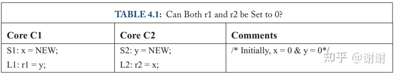

这种假设是错误的。来看表格4.1的实例代码（和上一章表格3.3的一样）。假设一个多核处理器的core是按序执行的(in-order)，每个core有一个单表项的write buffer，并且按照下面的顺序来执行代码：

- Core C1执行store S1，但是缓存了这个新的NEW值到它的write buffer
- Core C2执行store S2，并且保持新的NEW值到它的write buffer
- 两个core都执行各自的load操作，L1和L2，并且获取到旧值0
- 最后，两个core的write buffer使用新的NEW值更新到内存中

最终结果是 (r1, r2) = (0, 0)。从前一个章节的内容可以看到，这是SC不允许的执行结果。**没有write buffer的情况下，硬件满足SC**，但带了write buffer的时候就不满足了，这样对于多核处理器来讲write buffer就是体系架构上可见的了。

一种对于write buffer可见于体系架构的回应方式是关掉write buffer，但制造商不愿意去这样做，因为会造成潜在的性能冲击。另外一种选项是使用激进的，带预测的SC实现方案来让write buffer不可见，但这样做增加了复杂性并会消耗掉额外的功率去检测违反情况和处理错误预测的情况。

SPARC和X86所选择的方式是不用SC，采用了一种内存一致性模型，该模型允许<u>每个core简单地使用一个先入先出（FIFO）的write buffer</u>。这个新的模型，TSO，允许结果为“ (r1, r2) = (0, 0)”。这个模型会让一些人感到惊讶，但它在结果上，对于大多数编程习惯语来说和SC的表现是相似的并且在所有场景下都是良好定义的。


## 4.2 TSO/x86的基本概念

随着执行的进行，SC需要每个core维护好load和store操作的顺序，这个顺序要和程序顺序一致，主要涉及全部四种连续操作的组合：

- Load → Load
- Load → Store
- Store → Store
- Store → Load //SC包含但TSO去掉了

TSO 包含了前三种约束但不包含第四种。去掉后的情况对绝大多数程序来说是没有影响的。表4.2复用了前一章表3.1的例子程序。在这种情况下，TSO允许和SC有相同的执行过程，因为TSO维护的core C1的两个store以及core C2的两个（或更多）load操作的顺序。图4.1（和前一章的图3.1相同）说明了这个程序的执行情况。

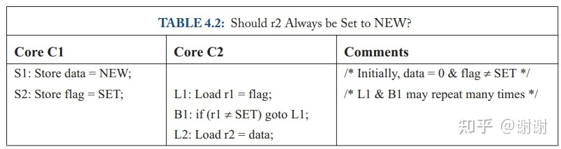

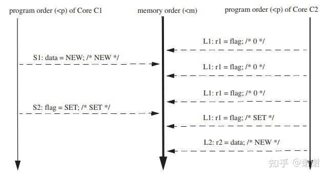

图4.1 表4.2的程序的一种TSO执行过程

一般来说，TSO表现行为和SC一致的情况是符合下面描述的常见编程习语：

- C1 对内存位置D1,...,Dn(通常为数据)进行的load和store操作
- C1 对F（**通常是一个同步标记**）进行store操作来指示上面的工作完成了
- C2 对F进行load操作以便观察上面的工作已经完成（有时会先进行自旋，通常使用一个读-改-写指令）
- C2 对内存位置D1,...,Dn的部分或所有进行load和store操作

> ⚠️：类比C++ memory order中的acquire - release语义，关键的环节就是中间的sync

但是TSO也允许一些非SC的执行过程（non-SC execution）。在TSO下，表4.1的程序（和上一章的表3.1相同）允许总共四种结果，如图4.2所示。在SC下，只有前三种是合法的输出（如上一章图3.2所描述）。<u>图4.2(d)的执行过程展示了遵守TSO但违背SC的执行过程（不遵守第四种组合约束 Store → Load）。</u>去掉第四种约束允许每个core使用一个write buffer。注意第三种约束意味着write buffer必须是FIFO，以便保持store-store顺序。

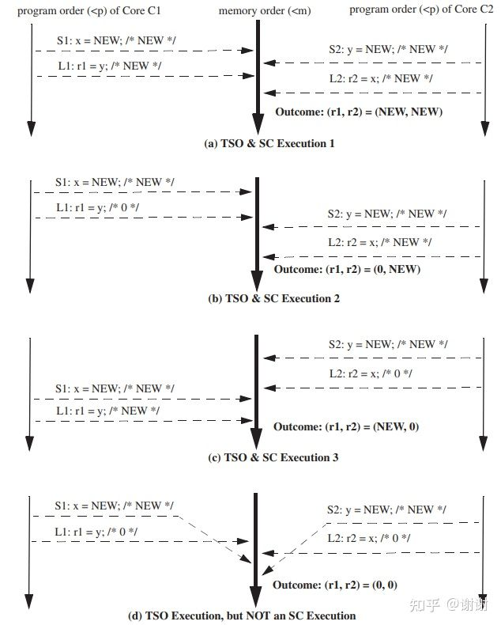

图4.2 表4.1程序四种可选的TSO执行流程

程序员（或编译器）能够避免图4.2(d)的执行过程，通过在core C1的S1和L1之间以及core C2的S2和L2之间插入一个[FENCE指令](https://zhuanlan.zhihu.com/p/139797515)来实现。在core Ci上执行一个FENCE保证了在FENCE前面（按程序顺序来看）的内存操作在内存顺序中一定排在FENCE之后的内存操作的前面。使用TSO的程序员很少使用FENCE（也叫做内存屏障memory barrier），因为TSO对于绝大多数的程序而言都“做了正确的事情”。不过，FENCE在下一章要讨论的松散模型中扮演者很重要的角色。

TSO确实允许一些违反直觉的执行结果。表4.3展示了一个稍作修改的表4.1的程序，core C1和C2保存了本地的x和y的拷贝。如果r2，r4的值都为0，许多程序员可能会觉得r1,r3也应该是0，因为store操作S1和S2必须在load操作L2和L4之后插入到内存顺序中。然而图4.3展示的一种执行过程表明r1和r3从每个core的write buffer中以旁路方式获取到了值NEW (因为S1和S2已经将各自Core旁路buffer中的值修改为NEW了)。<u>事实上，为了维持单线程顺序语义，每个core**必须**看到程序顺序中它自己的store操作所产生的效果，既是这个store操作还没有被其它core所观察到。</u>因此，所有TSO执行过程，本地拷贝r1和r3总是会被设置为NEW。

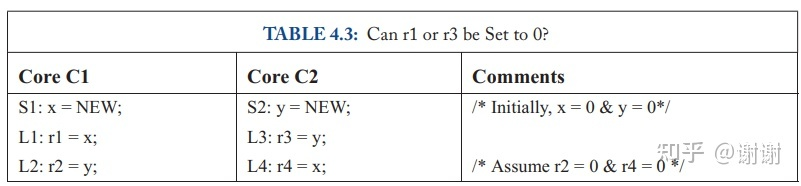

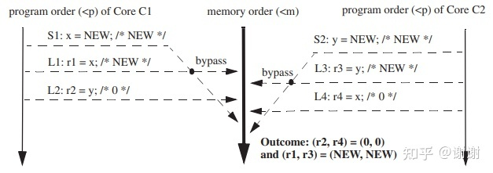

图4.3 表4.3程序的一种TSO执行过程（带“bypassing”）


## 4.3 一种小型TSO形式化表述以及一种关于x86的模型推测

本节我们更精确地定义TSO，该定义只需要对3.5节的SC定义做三处修改。
一个TSO execution需要：

所有核要考虑它们的程序顺序来将它们的load和store操作插入到内存顺序<m中，不管操作的地址是相同的还是不同的地址（即a == b或a != b）。有四种情况：

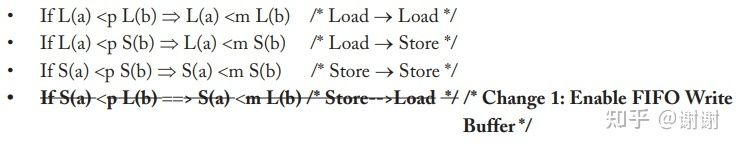

每个load操作获取的值来自其前面最后一次对相同地址的store操作结果

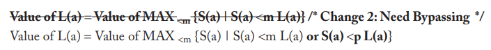

这个令人费解的等式意思是，load操作获取的值来自其前面最后一次对相同地址的store操作结果，store是（a）**内存顺序中在load之前** 或者 （b）**在程序顺序中在load之前（但可能在内存顺序中处于load之后）**，条件（b）优先（即write buffer 旁路功能覆盖内存系统的其它部分）。

定义（1）必须被加强用来定义FENCE: /*Change3: FENCEs Order Everything*/

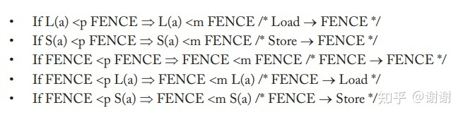

因为TSO除了 Store → Load 顺序外其它都已经做了要求，也可以选择只用下面这些顺序来定义TSO FENCE：

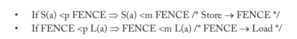

我们选择让TSO FENCE冗余地排序所有操作的原因是这样做不影响，并且让它们和下一章我们为更松散的模型定义的FENCE很相似。

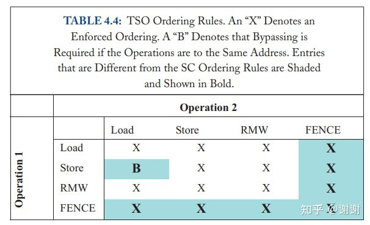

我们在表4.4中总结了TSO的顺序规则。这张表和SC所用的类似的表（表3.4）有两个重要的区别。第一，如果操作#1是一个store并且操作#2是一个load，交叉点对应表项是一个“B”而不是“X”；如果这两个操作是针对同一个地址的，load操作必须获得刚刚store的值，甚至在这两个操作不按程序顺序进入内存顺序时也是如此。第二，表格包含了FENCE，在SC中不是必需的；<u>一个SC的系统行为上看起来就好像是每个操作前后都带了一个FENCE</u>。

我们推测**x86内存模型和TSO是等价的**（针对普通的可缓存内存以及普通指令）。AMD和Intel公开地定义了x86的内存模型，使用了Sewell等人总结了一些例子和文章。所有例子都遵循TSO，并且所有文章看起来也和TSO保持一致。当然除非有公开的、正式的x86内存模型描述文档出现才能证明这个等价的推测。如果有显示x86执行有不被TSO允许，x86不允许的TSO执行，或两者都存在的反例，那么这个等价的推测就不成立。

我们的推测可以在Sewell等人近期的工作中得到支撑，这些工作总结在CACM里，更多细节可以在其它地方找到。特别的是，作者提出了x86-TSO模型。这个模型拥有两种形式，作者证明了这两种形式是等价的。第一种形式给出了一个抽象的机器，和下一节的图4.4(a)类似，会额外多一个单独的全局锁用于构造x86 Lock指令。第二种形式是标记迁移系统（labeled transition system）。第一种形式使得模型对从业者容易理解，第二种形式简化了形式化证明。一方面来说，x86-TSO看起来和x86规范里的非正式的规则以及“试金石”的测试保持一致。另一方面来说，在一些AMD和Intel平台上基于经验的测试项没有显示出和x86-TSO模型相违背的地方（但这并不能证明它们不能违背）。总结一下，就如Sewell等人的观点，我们迫切期望x86硬件和软件的创造者们能够采纳这个没有歧义的、容易理解的x86-TSO模型。

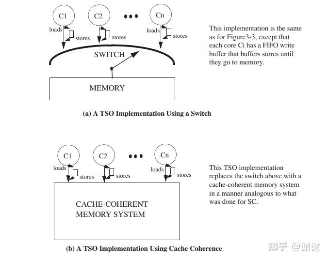

图4.4 两种TSO实现

## 4.4 实现TSO/x86

TSO/x86实现的过程描述类似于带有per-core FIFO write buffer的SC。图4.4(a)升级了图3.3的switch来适应TSO并且按照下面的方式运作：

- Load和store操作按照core的程序顺序<p发出
- Load操作要么从write buffer中旁路方式获取值，要么和之前一样等待switch
- Store操作进入FIFO write buffer的尾部，或在buffer满的时候拖住core
- 当switch选择了core Ci时，它要么执行紧接着的load操作，要么是write buffer头部的store操作

在3.7节，我们说对于SC，**switch能够被一个cache一致的内存系统所替代**，并且讨论了core能够是预测执行和（或）带多线程的，non-binding预取能被core，cache或软件所发起。

如图4.4(b)所示，对于**带一个夹在每个core和cache-coherent内存系统中间的FIFO write buffer的TSO系统**，也存在相同的论调。因此，除去write buffer，所有之前的SC实现讨论都能应用到TSO上，并且SC实现提供了创建TSO实现的一种方法。更甚者，许多现有的TSO实现方案看起来就只使用了上面的方案：**在SC实现基础上插入了write buffer**。由于这个原因，TSO实现方案这个小节比较简短。

至于write buffer，对预测执行的core如何具体实现write buffer的文献和产品超出了本章的讨论范围。举个例子，微架构能够在物理上将store queue（未提交的store操作）和write buffer（已提交的store操作）组合到一起，并且/或者物理上独立出load和store queue。

最后，多线程特性为TSO引入了一个小的write buffer问题。TSO write buffer逻辑上私有于每个线程上下文（虚拟core）。因此，在一个多线程core上，一个线程上下文永远不该从另外一个线程上下文的write buffer中以旁路方式取值。这种逻辑的区分能够通过使用基于每个线程上下文的write buffer来实现，或者更加常见的方式是通过使用共享的write buffer，此buffer是由带有线程上下文标识，旁路方式取值只能在标签匹配时才被允许的数据表项组成。


```
第一章问题4： 在一个多线程的TSO系统中，线程可以bypass write buffer输出的值，无论是哪个线程写入的值。对还是错？
答案：错！一个线程可以从它已经写过的值中以旁路方式获取，但其它线程在这个store被插入到内存顺序前不可以看到这个值。
```

## 4.5 带TSO系统的原子指令和FENCE

实现TSO的系统必须提供原子指令，就像SC系统那样，另外也要由FENCE指令。在这个小节里，我们讨论支持TSO的系统如何实现原子指令和FENCE。

### 4.5.1 原子指令

TSO中的原子指令在实现上的问题和SC中的原子指令所遇到的类似。最大的不同是TSO允许l**oad跳过（即顺序上在前面）它之前已经写入到write buffer的store操作**。对于RMW的冲击时这个写（即store）可以被写入到write buffer。

为了理解TSO中的原子RMW(test-and-set对应的底层原子指令)的实现，我们将RMW看成是一个load操作后紧跟一个store操作。根据TSO的顺序规则，RMW的load部分不能跳过更早的load操作。初看起来，RMW的load部分可能跳过在write buffer中更早的store操作，但这样并不合法。如果RMW的load部分跳过了一个更早的store操作，那么这个RMW的store操作也要跳过这个更早的store操作，因为RMW是一个原子操作对。但因为TSO中store操作不允许跳过store操作，RMW的load部分因此也不能跳过一个更早的store操作。

这些RMW的顺序约束影响了具体实现。由于RMW的load部分在先前的store操作都被排好顺序（即离开write buffer）前不能被执行，原子的RMW在执行RMW的load部分前，实际上会清空write buffer。<u>更进一步讲，为了保证在load部分之后store部分能够被立即排序，load部分需要read-write coherence权限，不是仅满足普通load操作的读权限。最后，为了保证RMW的原子性，**cache控制器不可以在load和store操作之间释放这个block的coherence权限**。</u>

更加优化的RMW实现也是可能的。例如，只要（a）已经在wreite buffer中的每个项都拥有了cache中的read-write权限并且直到RMW提交前都维持read-write权限（b）core执行MIPS R10000风格的load预测检查（3.8节），（a）和（b）都成立则write buffer就不需要被清空。

### 4.5.2 FENCE

支持TSO的系统没有提供用于一个store操作和后面的（按程序顺序）一个load操作之间的顺序约束，尽管系统确实要求load操作获取到先前的store操作的值。在一些程序员想要那些指令进行排序的场景中，**程序员必须通过把FENCE放到store（acquire）和load（release）之间来显式地指定顺序**。FENCE的语义指定了所有在程序顺序中处于FENCE前的指令必须被排到任何在程序顺序中处于FENCE之后的指令的前面执行。对于支持TSO的系统，FENCE因此禁止一个load跳过之前的store操作。表4.5中，我们重新来看表4.1的例子，不同的是我们加入了两个之前未出现的FENCE指令。没有这些FENCE的时候，这两个load操作(L1和L2)能够跳过两个store(S1和S2)操作结果，使得执行得到r1和r2都为0。加入的FENCE禁止了这种重排序并因此禁止了这种执行过程。

> 猜测这就是为什么C++11前memory order仅支持acquire - release语义的原因, 早期大部分的机器都是x86-TSO, 通过一个Fence就能使程序执行时和SC相同

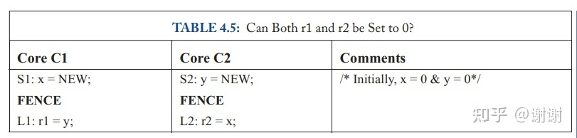

由于TSO仅允许一种重排序，FENCE使用并不频繁，FENCE指令的实现方式不是太关键。一种简单的实现方式（例如当FENCE执行时清空write buffer，并且直到前面的FENCE提交前，不允许后续的load操作执行）可以提供可接受的性能。然而，对于允许更多重排序的一致性模型（下面一章要讨论的），FENCE指令更加频繁地出现，它们的实现方法就会对性能造成很大的影响。

## 4.6 关于TSO的更多的阅读

Collier描述了其它的内存一致性模型，包括IBM System/370所使用的模型，这个模型里每个core有一个完整的内存备份，它的load操作从本地拷贝中读取值，它的store操作会根据一些定义模型限制来更新所有备份。如果这个模型定义了TSO，每个store操作会立即写入到自己core的内存备份中，然后可能在晚些时候一起更新其它所有的内存。

Goodman公开地讨论过处理器一致性（processor consistency，PC）的概念，这里一个core的store按照顺序到达其它core但不需要同时到达其它core。Gharachorloo等人更加精确地定义了PC。TSO和x86是一个PC的特例，每个core会立即看到自己的store操作，当其它core看到一个store操作时，所有剩下的core都会看到。这个属性是下一章（5.5节）所说的写原子性（write atomicity）。

就我们所知，TSO最初被Sindhu等人正式地定义。如我们在4.3节里讨论的，Sewell等人提出并形式化了x85-TSO模型，这个模型看起来和AMD和Intel的x86文档以及当前实现方案是一致的。


## 4.7 对比SC和TSO

现在我们已经看过了两种内存一致性模型了，我们来对比一下它们。SC，TSC以及其它类型的内存模型是怎么关联的？
Execution：SC执行过程是一个TSO执行的真子集；所有SC执行都是TSO执行，某些TSO执行是SC执行，某些TSO执行不是SC执行。见图4.5(a)的韦恩图。
Implementations：实现上的规则是相同的：SC实现方案是TSO的真子集。见图4.5(b)。

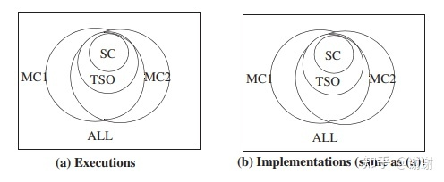

图4.5 对比内存一致性模型


一般来说，一个内存一致性模型Y相比于一个内存一致性模型X，严格意义上更加松散（releaxed或weaker）是指：所有X的执行同时也是Y的执行，但反过来不成立。如果Y比X更松散，那么它满足所有X的实现方案同时也是Y的实现方案。两个内存一致性模型也可能是无可比性的，因为它们都包含了被另外一方所排除的执行过程。

如图4.5描述，TSO相比于SC更加松散，但是没有MC1和MC2那么松散。下一章中，我们会看到MC1和MC2的候选者，包含一个IBM Power内存一致性模型的学习。

### 什么是一个好的内存一致性模型？

一个好的内存一致性模型应该由Sarita Adve的3P加上我们的第四个P：

- Programmability: 一个好的模型应该使得编写多线程程序（相对）简单。模型对大多数用户来讲应该是直观的，甚至是对于那些还没有阅读过细节的用户来说也是。它应该是精确的，这样专家们才能在它所允许的事情内挑战极限。
- Performance: 一个好的模型应该能在合理的功耗、成本等条件下实现高性能。它应该给予实现者多种可选项自由发挥。
- Portability: 一个好的模型会被广泛采纳，或者至少提供向后兼容性或能够在模型间进行转换的能力。
- Precision：一个好的模型应该是被精确定义的，通常使用数学方法。自然语言歧义太多，无法让专家发挥。

### SC和TSO有多好？

使用4P来看。

- Programmability: SC最直观，TSO比较接近好的标准，因为对于常见编程习语来说它和SC很像。但一些细碎的non-SC执行能咬得程序员和工具作者喊疼。
- Performance: 对简单的core来说，TSO能提供相比于SC更优的性能，但在带有预测时差异较小。
- Portability: SC被广泛地理解认识，TSO被广泛地采用。
- Precise: SC,TSO以及x86-TSO都被形式地定义了。

基本的论点是SC和TSO都很接近好的内存一致性模型，尤其是和下一章要介绍的更复杂和更松散的内存一致性模型对比而言。
