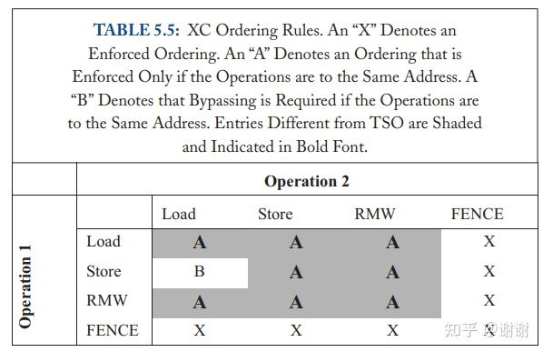
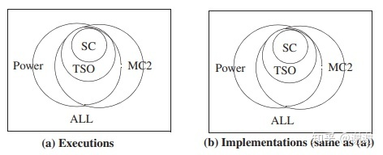

前两章探索了SC和TSO这两种内存一致性模型。SC很直观，TSO被广泛应用(例如x86)。两个模型有些时候被称作是强类型的（strong），因为每个模型的全局内存顺序通常维持的是每个线程的程序顺序。回忆一下SC为同一个线程维持两个内存操作顺序的四种load，store的组合方式:Load →Load, Load → Store, Store → Store, Store → Load,TSO维持了前三种，但不维持Store → Load的顺序。

本章会查看更加松散（弱）的内存一致性模型，这些模型只会维持程序员“要求”的顺序。这种方法的主要好处是强制要求的排序约束更少，允许更多的硬件和软件（编译器和运行时系统）优化，能够获得更高的性能。主要的缺点是松散的模型必须规定好什么时候排序是被“要求”的，还要提供给程序员或底层软件一些机制用于和实现沟通这种顺序，如果制造商在一个独立的松散模型上没有遵守这些规则，则会牺牲可移植性。

完整的探索全部松散一致性模型超出了本章的范围。本章作为一篇入门，试图提供基本的直觉并帮助读者意识到对这些模型的简单理解的局限性。特别地，我们提供了松散模型的原始驱动（5.1节），呈现并形式化一个松散一致性模型例子XC（5.2节），讨论XC的实现，包含原子指令和用于强制顺序的指令（5.3节），介绍用于无数据竞争（data-race-free）程序的顺序一致性，展示额外的松散模型概念（5.5节），展示一个IBM Power内存模型案例学习（5.6节），指出更多的阅读材料和其它商业模型（5.7节），对比多个模型（5.8节），简单看看高级语言内存模型(5.9节)。


## 5.1 原始驱动

我们马上会看到，掌握松散一致性模型比器理解SC和TSO来说要更具挑战。这些缺点会让人产生疑问：松散模型这么麻烦，为何还要关注？在本节中，我们引出松散模型，首先通过展示一些常见的场景，这些场景里程序员不关注指令顺序（5.1.1节），然后讨论在非强制非必要排序的情况下可以利用的一些优化手段（5.1.2节）。

### 5.1.1 重排内存操作的机会


来看表5.1中的例子。大多数程序员会期望r2的值总是NEW，因为S1在S3的前面并且S3在L1的动态实例之前，L1在L2之前取值SET。我们能表示为：

- S1 → S3 → L1 loads SET → L2

类似地，大多数程序员会期望r3的值总是NEW因为：

- S2 → S3 → L1 loads SET → L3

除了以上这两种期望的顺序之外，SC和TSO也要求S1->S2和L2->L3的顺序不能被破坏。保留这些额外的顺序限制了提升性能的优化实现措施，这些额外的顺序对于程序的正确操作却是不需要的。


表5.2描绘了使用同一把锁的两个临界区之间的更为通用的切换场景。假设硬件支持lock acquire(例如，带有test_and_set,执行read-modify-write操作，并且在成功前会一致循环)和lock release(例如，将锁的值设置为0)。Core C1获得了锁，临界区1里进行任意的load（L1i）和store（S1j）交织操作，然后释放锁。同样的，Core C2临界区2包含了 load（L2i）操作和store（S2j）操作的交织操作。

从临界区1切换到临界区2的合理操作依赖这些操作的顺序：

- All L1i, All S1j → R1 → A2 → All L2i, All S2j

这里逗号","分隔了那些顺序没有被指定的操作。

合理的操作不依赖于每个临界区内部的load和store操作的任意一种顺序---除非这些操作是到相同地址的（这种情况下为了维持顺序的处理器顺序需要进行排序）。也就是：

- 所有L1i和S1j能按照任意顺序进行，只要考虑好操作间的依赖关系即可
- 所有L2i和S2j能按照任意顺序进行，只要考虑好操作间的依赖关系即可

<u>如果合理的操作不依赖于多个load和store操作间的顺序，通过松散它们之间的顺序关系，我们就可能获得更高的性能，因为load和store操作相比于lock acquire和release，要频繁地多</u>。这就是松散（弱）模型做的事情。

### 5.1.2 利用重排序的机会

假设现在有一个松散的内存一致性模型，它允许我们重排序任何内存操作，除非这些操作间有一个FENCE。**这个松散的模型强制程序员来思考哪些操作需要被排序，这是个缺点，但这样也使得很多能够改善性能的优化变得可行**。我们会讨论几个常见且重要的优化，但深入这个话题超出本入门的范围了。

#### 5.1.2.1 Non-FIFO，Coalescing(联合) Write Buffer

> 这里的Coalescing Write Buffer可以简单理解为多个core共享一个write buffer，多个Core同时使用该buffer，一并完成对内存的写入

回忆一下TSO，TSO使得使用FIFO write buffer变得可行，通过隐藏部分或全部已提交的store操作的延迟来提升性能。尽管FIFO write buffer提升了性能，一个更加优化的设计会使用non-FIFO write buffer，这个buffer允许write操作的合并（**即两个在程序顺序中不连续的store操作能够被写到write buffer中相同的表项中**）。但是，non-FIFO coalescing write buffer破坏了TSO，因为TSO需要store操作按照程序顺序出现。我们的松散模型实例允许store操作合并到non-FIFO write buffer里，只要store操作没有被FENCE所分隔。

#### 5.1.2.2 支持Core的推测执行变得更加简单

> 简而言之，Relax能赋予cpu更多推测执行的自由

使用强类型一致性模型的系统，core可以在load操作准备好提交前，不按照程序顺序进行load操作的推测执行。回忆一下MIPS R10000 core（支持SC）是如何使用这种推测来获得比不进行推测的简单实现方案更高的性能的。但是这个方式下，推测执行的core不得不包含检查推测是否正确的机制，即便是错误推测的情况很罕见。R10000通过对比两种地址：被逐出的cache block的地址以及core已经推测执行了操作的但还没有提交的地址列表（即core的load queue里的内容）。这种机制增加了硬件的成本和复杂性，它会消耗额外的功耗，并且它代表了另一种可能限制指令级并行性的有限资源。在一个使用松散内存一致性模型的系统中，一个core能够不按程序顺序执行load操作，不用去对比这些load操作使用的地址和进入的coherence请求的地址。这些load操作对于松散一致性模型来说不是推测执行的（尽管它们本身对于分支预测或相同线程中对相同地址的更早的store操作来说可以是推测执行的）。

#### 5.1.2.3 耦合Consistency和Coherence

前面我们提倡解耦consistency和coherence以便管理复杂度。松散模型能够通过“打开coherence黑盒子”来提供比强类型模型更好的性能。举例来说，一个实现方案可以允许部分core加载到store操作的新值而余下的core仍然能加载到旧值，临时打破了coherence的单写者多读者（SWMR）不变性。<u>一种可能发生这种情况的例子是当两个线程上下文逻辑上共享了一个per-core write buffer或者两个core共享一个L1 data cache的时候</u>。然而“打开coherence黑盒子”引入相当多的智力和验证复杂度，想想希腊神话里的潘多拉魔盒吧。我们会在5.6节中进行讨论，IBM Power允许上述优化，但我们首先保持coherence黑盒紧紧关闭来讨论松散模型。

## 5.2 一个示例松散一致性模型（XC）

为了教学目的，本节介绍了一个eXample relaxed Consistency model（XC），这个模型抓住了松散内存一致性模型的基本理念和一些实现方案的潜质。XC假定一个全局内存顺序存在，就如强类型模型SC和TSO一样。

### 5.2.1 XC模型的基本理念

XC提供了一个FENCE指令，因此程序员能够在需要排序时进行指示；否则默认情况下load和store操作是无序的。**其它松散一致性模型称FENCE为barrier、memory barrier、membar或者sync**。core Ci执行一些load和（或）store操作Xi，接着有一个FENCE指令，然后是一些更多的load和（或）store操作Yi。FENCE确保了内存顺序中全部的Xi操作排在FENCE和所有Yi操作之前。FENCE指令不指定地址。相同core里的两个FENCE也保持先后顺序的。但是，**FENCE不会影响其它core里内存操作的顺序**（这也是为何“fence”比“barrier”名字更好的原因）。一些体系架构包含多种FENCE指令，这些指令带有不同的顺序属性；例如，一个体系架构可能包含一个FENCE指令用于强制排序除store->load之外的所有类型的操作。 在本章中我们只考虑FENCE会排序所有类型的操作。
XC的内存顺序会确保维持如下程序顺序：

- Load → FENCE
- Store → FENCE
- FENCE → FENCE
- FENCE → Load
- FENCE → Store

<u>XC只维护访问相同地址的两个操作间的TSO排序规则</u>：

- Load → Load to same address
- Load → Store to the same address
- Store → Store to the same address

这些规则强制实施了顺序处理器模型（即sequential core语义）要求，禁止了可能令程序员震惊的行为。例如，Store → Store规则阻止了一个临界区执行"A=1"然后"A=2"的时候，完成的时候A被设置成了1这种奇怪的结果。同样的，对于 Load → Load规则，如果B初始为0时，另一个线程执行了B=1，那么当前线程在执行“r1=B”和"r2=B"时，结果不能是r1为1并且r2为0，这种结果就像B的值从新值变成了旧值一样。

XC确保了load操作能立即看到它们自己的store操作的更新结果（就像TSO的write buffer bypassing一样）。规则维护了单线程的顺序性，也避免程序员惊掉下巴。


### 5.2.2 在XC下使用FENCE的例子


表格5.3展示了程序员或底层软件应该如何将FENCE插入到表格5.1中的程序里，好让它在XC下能够正确运行。这些FENCE会保证：

- S1, S2 → F1 → S3 → L1 loads SET → F2 → L2, L3

F1 FENCE，排序了store操作，对于大多数读者而言很容易理解，但部分读者对F2 FENCE排序load操作的必要性感到惊讶。但如果允许load操作乱序执行，它们会让按序执行的store操作看起来像是乱序执行的。例如，如果执行顺序按照 L2, S1, S2, S3, L1, L3这种方式执行，那么L2会获取到0.这种结果尤其是对于没有包含B1这个控制依赖的程序来讲可能性更大，如果没有B1，L1和L2是针对不同地址的load操作，重排序看起来是合理的，但实际情况并非如此。


表格5.4展示了程序员和底层软件如何插入FENCE到表格5.2的临界区程序中，好让它能在XC下正确地运作。这个FENCE插入策略（FENCE环绕着每个lock acquire和lock release）是为了展示目的的保守策略；我们后面会展示部分FENCE能够被移除掉。特别地，FENCE F13和F22确保了临界区之间的正确切换，因为：

- All L1i, All S1j → F13 → R11 → A21 → F22 → All L2i, All S2j

下面，我们形式化XC并且展示上面两个例子能工作的原因。


### 5.2.3 形式化XC

这里我们会按照前两章的符号和方法来形式化XC。再提一下，L(a)和S(a)分别表示一个load操作和一个store操作，操作的地址是a。顺序<p和<m分别定义了per-processor的程序顺序和全局内存顺序。程序顺序<p是一个单处理器的总顺序，这个总顺序是从每个core逻辑地（顺序地）执行内存操作中获取的。全局内存顺序<m是所有core的内存操作的总顺序。
更正式地来说，一个XC execution要求如下事项：

所有core分别插入它们的load，store和FENCE操作到<m中：


所有core分别插入它们到相同地址的load和store操作到<m中：


每个load操作从它之前的操作相同地址的store操作中获取值：


我们在表格5.5中总结了这些排序规则。这个表格与SC和TSO所用的表格有明显不同。这张表显示排序操作仅在操作是去往相同地址或FENCE被使用时才会强制执行。和TSO类似，如果operation 1是"store C"并且operation 2是"load C"，store操作能够在load之后进入到全局顺序中，但load必须已经看到了最新存储的值。
一种仅允许XC执行的实现方案是一个XC implementation。



### 5.2.4 展示XC正确运作的实例

通过上一节的形式化定义，我们能够揭示为何5.2.2节的两个例子能够正确工作。图5.1(a)展示了来自表格5.3的一个XC execution实例，这个例子中core C1的store操作S1和S2被重排序了，core C2的load操作L2,L3也是一样。无论哪种重排序都影响不了程序的结果。因此就程序员而言，这个XC execution和图5.1(b)中所描述的SC exectuion是等价的，5.1(b)里对应的两个操作对儿没有被重排序。


图5.1 表格5.3的程序两种等价的执行过程

类似地，图5.2(a)描绘了来自表格5.4的临界区实例的一种执行情况，core C1的load操作L1i和store操作S1j分别被重排序了，core C2的L2i和S2j也是一样。同样这些重排序不会影响层序的结果。因此就程序员而言，这种XC exectuion和图5.2(b)中描绘的SC execution是等价的，图5.1(b)中没有load或store被重排序。


图5.2 表格5.4的临界区程序两种等价的执行过程

## 5.3 实现XC

本节讨论XC的实现方式。我们会按照前两章里实现SC和TSO的类似方式来讲解，我们将core的操作重排序和cache coherence分隔开来看。回忆一下TSO系统里每个core通过一个FIFO write buffer和共享的内存分隔开来的场景。对于XC来说，`每个core通过一个更加通用的重排序单元（reorder unit）和内存分隔开，重排序单元能够重排序load和store操作`。


图5.3 两种XC实现

如图5.3(a)，XC按如下方式运作：

- Load，store操作以及FENCE按照Ci的程序顺序<p离开对应core，并且进入到Ci的重排序单元队尾。
- Ci的重排序单元将操作放到队列上并且最终将它们从队尾传递到队首，要么按照程序顺序，要么通过后文提到的规则进行重新排序。FENCE在到达重排序单元的队首时被丢弃。
- 当switch选择core Ci时，它执行Ci的重排序单元的队首的load或store操作。
- 重排序单元遵守针对(1)FENCE,(2）相同地址的操作，(3)bypassing的规则。

FENCE能够用几种不同的方式实现(见5.3.2)，但它们必须能强制先后顺序。具体来说，不管地址的情况下，重排序单元**不**可以重排序：

```
Load → FENCE
Store → FENCE
FENCE → FENCE
FENCE → Load
FENCE → Store
```

对于相同的地址，重排序单元不可以重排序：

Load → Load, Load → Store, Store → Store (to the same address)

重排序单元必须保证load操作能立即看到由它们自己的store操作的更新值。
不出意外，所有这些规则都和5.2.3节中提到的那些内容一致。

在前两章中，我们提到在SC和TSO实现方案中的switch和memory能够被替换成一个cache-coherent内存系统。相同的论调对于XC也适用，如图5.3(b)所示。因此，就如SC和TSO一样，XC的实现能够将core的（重）排序规则和cache coherence的实现分割开来。和以前一样，cache cohrence实现了全局内存顺序。不同的是内存顺序会更多地不遵守程序顺序，原因是有重排序单元的重排序操作。

那么从TSO转到一个松散模型如XC，究竟能带来多少性能呢？不幸的是，正确答案依赖于5.1.2节中讨论的因素，比如FIFO和colescing write buffer的对比，以及推测执行的支持等。

90年代后期，我们中有一人看到了推测执行的core的趋势，认为推测执行的core会使得松散模型（更好的性能）慢慢减少并且争论过让更简单的SC或TSO的接口回归。尽管我们仍然相信简单接口非常不错，但这种事情并没有发生。一方面是因为公司的推动。另外一方面是因为并非所有未来的core都会带高度推测功能，因为在嵌入式系统芯片或带有许多core（非对称的）的芯片中都有功耗限制要求。

### 5.3.1 XC的原子指令

有多种可行的方式来实现在支持XC的系统中的原子RMW指令。RMW的实现也依赖于系统如何实现XC；本节中，我们假设XC系统由以下几部分组成：动态调度的多个core，每个core通过一个non-FIFO calescing write buffer连接到了内存系统。

在这个XC系统模型中，一个简单可行的解决方案是借用一下我们在TSO实现方案中所用到的东西：<u>执行一条原子执行之前，core排空write buffer，获取要操作的block，使之带有read-write coherence权限，然后执行load部分的操作和store部分的操作</u>。因为block是read-write状态，store部分直接操作到了cache，不需要旁路到write buffer。在load部分执行到store部分执行的期间，如果这个窗口期存在的话，cache控制器绝对不会将此block逐出cache；如果一个进入的cocherence请求到达，它必须延迟，直到RMW的store部分执行完成。

借用TSO的解决方案来实现RMW是很简单，但它过于保守并且牺牲了部分性能。可以看到，由于XC允许RMW的load部分和store部分一起跨过之前的store操作，**因此不需要排空write buffer**。只要简单地获取到block的read-write coherence权限，然后执行load部分和store部分，这两个操作期间不释放block，这样做就足够了。

还有其它可能的RMW原子操作实现方式，但它们超出了本入门的讨论法范围。XC和TSO之间一个重要区别是原子RMW是如何被用来实现同步的。表格5.6中，我们描述了一个典型的临界区，包含lock acquire和lock release。使用TSO的时候，原子RMW用于尝试获取lock，并且使用一个store操作来释放lock。使用XC的时候，情况更加复杂。

对于acquire操作，XC默认情况下，不会强加限制临界区中后面的操作和RMW操作的重排序。为了避免这种情况，一个lock acquire后必须带一个FENCE。

类似的，lock release默认情况下，和临界区中前面的操作的重排序也不会受到限制。为了避免这种情况，一个lock release操作前必须带有一个FENCE。

> 以避免临界区代码被重排序换出临界区


### 5.3.2 XC的FENCE

如果core C1执行了一些内存操作Xi，紧跟一个FENCE，然后是其它内存操作Yi，XC实现上必须保证其顺序。特别地，XC实现必须按照Xi <m FENCE <m Yi的顺序。我们来看三种基本方式：

- 一种实现是实现SC并且视所有FENCE为空操作。这种方法没有在商用产品中实施，但学术界提出过，例如通过隐式事务内存来实现。
- 一种实现是等待所有内存操作Xi运行，Xi完成可视为FENCE也完成，随后开始内存操作Yi。这种“排空作用的FENCE”很通用，但它使得FENCE代价昂贵。
- 一种实现是不带排空（draining）特性，强制Xi <m FENCE <m Yi顺序，强力推进必要的操作。具体如何实现超出了本入门的范围。虽然这种方法对设计和验证来讲更复杂，但相比于排空操作，它能带来更好的性能。

所有情况里，FENCE的实现必须知道每个Xi操作何时完成（或至少知道什么时候被排序了）。对于一个旁路掉平时常用的cache coherence的store操作，要搞明白一个操作完成的时机可能会很棘手（例如，对一个I/O设备的store操作，或者是使用了一些复杂的写更新优化策略的store操作）。

### 5.3.3 一点警示

一个XC实现者可能会说“我正在实现的是松散模型，因此任何事情都可以做”。这是错误的。实现者必须遵守许多XC规则，比如, 操作相同地址的Load → Load的顺序（这个特殊的顺序实际上在一个乱序执行的core里是很重要的，一定要强制）。更甚者，对那些在每个指令对之间存在FENCE的程序，所有XC事项方案必须提供SC，因为这些FENCE要求内存顺序要按照程序顺序来进行。

## 5.4 用于无数据竞争（Data-Race-Free）程序的顺序一致性

小孩和计算机架构师都想“吃了蛋糕，蛋糕还在”（鱼和熊掌兼得）。对于内存一致性模型来说，这意味着让程序员一边讨论SC的（相对）直观的模型同时获得在一种松散模型上（如XC）执行所带来的性能提升。

幸运的是，对于无数据竞争（data-race-free）这类重要的程序而言，兼得两个目标是有可能的。非正式地说，<u>数据竞争发生在当两个线程访问相同的内存位置，且至少有一个访问是写操作，并且其间没有同步操作的时候</u>。数据竞争经常是（但不是总是）由于编程错误、以及许多程序员试图编写DRF（Data-Race-Free）程序所产生的。SC for DRF programs要求程序员确保程序本身是在SC下的DRF，并且要求实现者确保DRF程序的所有执行过程在松散模型下也要是SC execution。XC以及我们所知的所有商业松散内存一致性模型都支持SC for DRF programs。更甚者，此方法也是Java和C++高级语言（HLL）内存模型（5.9节）的基石。

让我们用两个例子来引出“SC for DRF”。表格5.7和表格5.8都描述了：core C1对两个地址进行了store操作（S1和S2），core C2对这两个地址按照相反的顺序进行了load操作（L1和L2）。两个例子的差别是core C2在表格5.7种没有做任何同步操作，但在表格5.8中对相同的锁进行了获取操作(acquire)。


表格5.7中，由于Core C2没有做同步操作，它的load操作能够和Core C1的store操作并发执行。由于XC允许Core C1重排序store操作S1和S2（或没有重排）以及Core C2重排序load操作L1和L2（或没有重排），有四种可能的结果： (r1, r2) = (0, 0), (0, NEW), (NEW, 0), or (NEW, NEW)。以结果(0,NEW)为例，load和store执行顺序为：S2,L1,L2,S1或者L2,S1,S2,L1。但是，这个例子包含了两个数据竞争（S1和L2，S2和L1），因为Core C2没有获取Core C1使用的锁。

表格5.8描述了：Core C2获取了Core C1用的同一把锁。这个场景中，Core C1的临界区会在Core C2的临界区前面执行完成，反之亦然。这样就会产生两种结果：(r1, r2) = (0, 0) or (NEW, NEW)。重要的是，这些结果不会受到Core C1重排序S1,S2或Core C2重排序的影响。“树林中倒下一棵树（重排序的store操作），但没人听见（没有并发的load操作）”。还有就是，XC的结果就和在SC下所允许的结果相同。“SC for DRF”从这两个例子中概括出：

- 要么执行过程带有数据竞争，暴露出了XC的load或store重排序行为
- 要么XC execution是无数据竞争的，并且和SC execution无法区分

更具体的“SC for DRF”的理解需要一些定义：

- 一些内存操作被标记为synchronization("同步操作")，剩下的操作被默认标记为data（“数据操作”）。同步操作包括lock acquire和release。
- 两个数据操作Di和Dj是冲突的（confict），是指如果它们来自不同core（线程）（即，没有按照程序顺序排序），访问相同的内存位置，并且至少有一个是store操作。
- 两个同步操作Si和Sj是冲突的（conflict）, 是指如果它们来自不同core（线程），访问相同的内存位置（例如，相同的lock），并且这两个同步操作不兼容（例如，一个spinlock的acquire和release操作不兼容，但是在一个reader-writer lock上的两个read_lock是兼容的）。
- 两个同步操作Si和Sj是传递式冲突的（transitively conflict），要么Si和Sj冲突了，或者是Si和某个同步操作Sk冲突，Sk <p Sk'(即Sk在core K的程序顺序中早于Sk‘），并且Sk'和Sj是 传递式冲突的。
- 两个数据操作Di和Dj是竞争的（race），如果它们是冲突的，并且在全局内存顺序中，它们之间没有夹杂相同的core（线程）i 和j的传递式冲突的同步操作对儿。换言之，一对冲突的数据操作Di <m Dj, <u>当且仅当存在一对传递式冲突同步操作Si和Sj，使得Di <m Si <m < Sj <m Dj时，Di和Dj就不是数据竞争的</u>。
- 一个SC execution，如果没有数据操作竞争，则是无数据竞争的（data-race-free ，即DRF）。
- 一个程序，如果它所有的SC execution都是DRF的，则程序是DRF的。
- 一个内存一致性模型支持“SC for DRF programs”，是指所有DRF程序的所有执行过程都是SC execution。这种支持通常需要做一些用于同步操作的特殊动作。

来看内存模型XC。需要程序员或底层软件确保所有同步操作前后都有FENCE，就像表格5.8里一样。

**同步操作带上FENCE后**，XC就支持了“SC for DRF programs”。虽然严格证明超出了本文范围，这种结论背后的直觉是根据上面讨论的表格5.7和表格5.8中的例子而来。

“SC for DRF programs”的支持使得许多程序员可以以SC的视角而不是更复杂的XC的规则来审视他们的程序，同时还能享受XC在SC之外带来的任何硬件性能提升或简化的好处。但要正确地将FENCE放到合适的地方很有挑战：


图5.4 FENCE放置的最佳位置是不可确定的

难以精确地确定哪些内存操作会引发竞争以便进一步标记为同步。图5.4描述了一种执行情况，其中只有在能够确定C1的代码的初始化部分不会停止的情况下（当然，这个事情难难以确定），core C2的store操作应该被标记为同步（决定了FENCE是否是需要的）。不可确定性可以通过在不确定是否FENCE需要的时候，加一个FENCE来避免。这样做总是对的，但可能降低性能。极限情况下，能对所有内存操作都用FENCE包裹起来以此确保任意程序都有SC行为。

最后，程序可能受到bug、非阻塞数据结构等等因素引发违背DRF的数据竞争。坏消息是在数据竞争发生后，执行过程不再遵守SC，因此强制程序员考虑底层的松散内存模型（如XC）的细节。好消息是至少直到第一个数据竞争前，所有执行都是SC的，这样就允许只考虑SC进行一些调试。

## 5.5 一些松散模型的概念

学术文献提供了许多可选的松散内存模型以及相关概念。在这里我们从海量文献中挑出一些来回顾部分松散内存概念，目的是给出一个基本理解，完整且正式的探索超出了本入门的范围。幸运的是，SC for DRF的使用者（大部分可能是程序员），不需要掌握这个困难的小节中所提及的概念。首次阅读的读者可以跳过本节。

### 5.5.1 Release Consistency

在ISCA 1990年会议中，Adve和Hill提出了“SC for DRF”，Gharachorloo等人在同一个会议中提出了release consistency（RC）。使用本章的术语来说，RC最重要的观察是对所有同步操作都用FENCE来前后包围的做法太过了。随着同步机制的深入理解，同步操作acquire只需要一个前置FENCE，同时同步操作release只需要一个后置FENCE。

对于表格5.4中的临界区例子，FENCE F11,F14,F21和F24可以被去掉。让我们聚焦于“R11: release(lock)”。FENCE F13很重要，因为它将临界区的load L1i和store S1j操作排序到了lock release前面。<u>FENCE F14可以被去掉是因为即便C1在释放R11之前，执行了后面的内存操作（表格里没有写任何操作，假设后面有操作）也没有问题。</u>

RC实际上允许这些后续的操作尽可能早地执行，就如临界区刚开始的部分一样，XC的FENCE相比之下不允许这种排序。RC提供了和FENCE类似的ACQUIRE和RELEASE操作，但只会在一个方向上排序内存访问，不像FENCE在两个方向上都起作用。一般来说，RC只要求：

- ACQUIRE → Load, Store (但不限制Load, Store → ACQUIRE) 
- Load, Store → RELEASE (但不限制RELEASE → Load, Store)
- 
ACQUIRE和RELEASE的SC顺序：

- ACQUIRE → ACQUIRE
- ACQUIRE → RELEASE 
- RELEASE → ACQUIRE
- RELEASE → RELEASE

### 5.5.2 因果关系和写原子性

这里我们展示两个松散模型的细节属性。第一个属性，因果关系(causality)，要求“**如果我看到了一个事情并且告诉了你，那么你也会看到这个事情**”。举例来说，表格5.9中，core C1进行了store操作S1来更新data1。让core C2处于自旋状态，直到它看到了S1的结果（r1 == NEW），执行FENCE F1，然后执行S2更新data2。类似地，core C3执行L3来观察store操作S1。如果core C3被保证一定能观察到S1完成（r3 == NEW），那么因果关系就成立。否则，如果r3为0，则因果关系被破坏。


第二个属性，写原子性(write atomicity也称store atomicity)，要求**一个core的store操作在逻辑上立刻能被其它所有core看到**。XC在定义上是写原子的，因为它的内存顺序(<m)指定了一个逻辑上的原子点，在这个点上，一个store操作对内存产生了效果。在这个点之前，没有其它core可以看到新值。在这个点之后，所有其它core都必须能看到新值或者是更后面的store操作的值，但不会是被这个store操作所破坏的值（比如操作进行了一半）。写原子性允许一个core在其它core看到之前，看到它自己的store的值，这正是XC所要求的，也使得一些人觉得“write atomicity”是一个烂名字。


一个对于write atomicity必要不充分的条件是正确处理Independent Read Independent Write (IRIW)。IRIW在表格5.10中表示，里面C1和C2各自进行store操作S1和S2。假设core C3的load操作L1观察到了S1（r1==NEW）并且core C4的L3观察到了S2（r3==NEW）。如果C3的L2加载了0（r2==0）同时C4的L4加载了0（r4==0），这意味着什么？前者暗示着core C3在看到S2之前先看到了S1，后者暗示着core C4在看到S1之前先看到了S2。这种情况下，S1和S2可不是“重排序”，而是store根本就没有顺序存在，这样的话write atomicity就被违反了。但反过来则不成立：正确处理IRIW并不能保证store atomicity。这里列举一些更多的事实（会让你头痛并且渴望SC,TSO或SC for DRF）：

Write atomicity可以推出causality。在表格5.9中，core C2观察到store操作S1，执行FENCE，然后进行store操作S2。带有write atomicity会确保C3会看到store操作S1完成。

Causality不能推出write atomicity。对于表格5.10，假设core C1和C3是一个多线程core的两个线程上下文，共享一个write buffer。假设对core C2和C4也是如此。C1将S1放到C1-C3的write buffer中的话，就只能被C3的L1所观察到。同样，C2将S2放到C2-C4的write buffer中的话，S2只能被C4的L3所观察到。在这两个store操作离开write buffer前，C3执行L2，C4执行L4的话，这种执行就违反了write atomicity。使用表格5.9中的例子对比来看，这种设计是提供了causality的。

最后，X**C内存模型是同时具有store atomic和维护了causality的。我们前面说到XC是store atomic**。XC维护了causality是因为store atomicity可以推出causality。


## 5.6 松散内存模型案例学习：IBM POWER

IBM Power实现了Power内存模型（注意看其Book II的第一章，4.4节以及附录B）。我们尝试给出Power内存模型的要点，但我们建议读者参阅Power手册作为权威指南，尤其针对Power下的编程相关的内容。我们不提供类似表格5.5中SC的顺序表格，因为我们没有自信能将所有项都写对。我们只讨论normal cachable memory("Memory Coherence"启用，"Write Through Required"禁用，以及“Caching Inhibited”禁用)，不涉及I/O空间等。PowerPC代表了当前Power模型的早期版本。首次阅读本入门时，读者可以略读或跳过本小节；这个内存模型相比于本入门目前所展示模型要复杂的多。

Power提供了一个表面上和XC相似的松散模型，但有很多重要的不同之处，如下文所述。

第一，Power中的store操作的执行会关注于其它core，不是memory。一个core C1的store操作会“考虑到”core C2来执行，当core C2发起相同地址的任意load操作时，loads操作会看到最新的值，或者看到一个更后面的store操作的结果，但不会是被store操作所破坏的值（clobbered）。Power会保证，如果core C1使用FENCE来将store操作S1排序在S2之前，S2排序在S3之前的话，这三个store操作对于其它每一个core Ci来讲是按照相同顺序执行的。但是在没有FENCE的情况下，core C1的store操作S1的执行过程可能考虑到了core C2，但可能还没有考虑到core C3。因此，Power不保证和XC创建出一样的总内存顺序(<m)。

第二，Power里的一些FENCE被定义为可累积的（cumulative）。若core C2执行一些内存访问X1,X2,...,FENCE，接着又是一些内存访问Y1,Y2,...，使集合X={Xi}，集合Y={Yi}。（Power的手册上称这两个集合为A和B）定义cumulative意味着三个事情：（a）被排序在FENCE前的其它core发起的内存访问，会加入到集合X（例如，如果core C1的store操作S1，S1的执行会关注core C2，并且S1在C2的FENCE前面，那么S1就加入到集合X）；(b)由于数据依赖，控制依赖或有其它FENCE，被排序到FENCE之后的其它core发起的内存访问，会加入到集合Y；(c)向前递归地应用(a)（例如，对于一些core，带有之前和core C1一起排序过的访问操作）并且向后递归地应用(b)。（XC里的FENCE也是cumulative的，但这些FENCE的可累积行为是自动地由XC的总内存顺序所提供，不是被FENCE自身所给出）。

第三，Power有三类FENCE（还有更多类型用于I/O内存），XC只有一种FENCE。

SYNC 或 HWSYNC（“HW”表示"heavy weight","SYNC"代表"synchronization"）排序所有X的访问到所有Y的访问之前并且是可累积的。

LWSYNC（“LW”意思是“light weight”）排序X中的load操作到Y中的load操作之前，排序X中的load操作到Y中的store操作之前，排序X里的store到Y里的store之前。LWSYNC是可累积的。注意LWSYNC不会排序X里的store操作到Y的load操作之前。

ISYNC（“I”意思是“instruction”）有时用于排序相同core的两个load操作，但它不是可累积的，而且，别被它的名字所迷惑，它并不是一个类似HWSYNC和LWSYNC的FENCE，因为它排序指令而不是内存访问。由于这些原因，我们不会在示例中使用ISYNC。

第四，Power在某些情况下，即使没有FENCE也会排序访问。例如，如果load L1获取到了一个值，这个值会被后续的load L2用来计算一个有效的地址，那么Power会排序load L1到load L2之前。同样的，如果load L1获取到了一个值，这个值会被后续的store S2用于计算一个有效的地址或数据值，那么Power会排序load L1到store S2之前。

表格5.11展示了实际运作的Power的LWSYNC。Core C1执行了LWSYNC来排序数据store操作S1和S2到S3之前。注意LWSYNC不会排序store操作S1和S2。一个LWSYNC在这里对于排序来说已经足够了，因为它将X里的store操作（S1和S2）排序到Y里的store操作（S3）之前。类似地，core C2在它的条件分支B1之后，执行了一个LWSYNC来保证load L1执行完成，r1被赋值为SET，随后才开始执行load L2和L3。不需要使用HWSYNC是因为没有哪个core需要将store排序到load之前。

表格5.12展示了实际运作的Power的HWSYNC，使用Dekker算法的关键部分。HWSYNC保证了core C1的store S1在load L1之前，core C2的store S2在load S2之前。这会避免执行结束的时候r1 = 0并且r2 = 0;使用LWSYNC不能阻止这种执行结果，因为LWSYNC不会将先前的store操作排序到后面的load操作之前。

如表格5.13里所描述的，Power的LWSYNC能够被用来使得表格5.9的causality例子行为合理（即r3总是被设置为NEW）。LWSYNC F1只在load L1看见了data1的新值之后才被执行，这意味着store S1是考虑到了core C2的情况下执行的。LWSYNC F1通过cumulative属性，将S1排序到了S2前面。LWSYNC F2只会在L2看到了data2的新值之后才会执行，这意味着store S2是关注到了core C3的情况下被执行的。culmulative属性同样保证了store S1会在S2之前执行（因为LWSYNC F1）。最后LWSYNC F2将L2排序到L3之前，确保r3能够获取值NEW。

如表格5.14中描述的，Power的HWSYNC能够被用来让表格5.10中的Independent Read Independent Write Example (IRIW)行为合理（即不允许r1==NEW,r2==0,r3==NEW,r4==0这种结果）。使用LWSYNC并不足够。举例来说，core C3的F1必须累积地（cumulatively）将core C1的store 操作S1排序到core C3的load操作L2之前。任何情况下，这都没有显示Power拥有5.5.2节里定义的write atomicity。
另外一种看待Power内存模型的可选方法是指定所需的FENCE来让Power行为看起来就像更强类型的内存模型。对于这个目的：

Power能够被限制为SC执行，通过在每个内存访问操作指令对之间插入一个HWSYNC来实现。

Power能够被限制为TSO执行，通过在每个内存访问操作执行对之间插入一个LWSYNC，并且替换每一个FENCE为HWSYNC来实现。

以上只是一个实验性质的想法，绝对不是推荐这么做，这样做不能在Power上获得良好的性能表现。


## 5.7 更多的阅读资料以及商用的松散内存模型
### 5.7.1 学术文献
以下是一些从海量松散内存一致性文献中摘取的要点。第一个开发的松散模型是Dubois等人开发的带弱顺序特性(weak ordering)的模型。Adve和Hill将weak ordering类推到了使用“SC for DRF”的程序员所严格要求的顺序中。Gharachorloo等人开发了release consistency和proper labeling(可以看作是“SC for DRF”的通用形式)，以及一个遵循TSO方式的，允许同步操作的模型（RCpc）。Adve和Gharachorloo写了一篇影响深远的内存模型教程，总结了1990年中期所有前沿技术。

就我们所知，Meixner和Sorin最先证明了松散模型的正确性，通过使用一个特定规则管理的重排序单元分割开core和cache-coherent内存系统来实现的。
规范和验证强（strong）和松散(relaxed)内存模型是相当困难的事情。为了实现这个目标，Alglave等人开发出了正式的规范，还有很重要的，可下载的diy工具用于生成随机运行于x86和Power上的用于验证的关键方法。和所有测试一样，diy能够发现bug，但不能证明硬件是正确的。

### 5.7.2 商用模型

除了Power，商用松散内存模型有Alpha，SPARC RMO以及ARM。

Alpha已经大规模退役了，但它本身和XC差不多，假设存在一个总内存顺序。由于Linux曾运行于Alpha之上，Alpha对Linux的同步机制有很大的影响，因此alpha仍有一定重要性（特别是去看12章和附录C）。McKenny指出Alpha并不排序两个load操作，即使是第一个load提供了第二个load的有效地址（effective address）的情况下。一般来讲，McKenny的在线书籍对于Linux同步机制以及其和内存一致性模型的互动的理解来说是很好的学习资源。
SPARC Relaxed Memory Order（RMO）也提供了一个类似于XC的总内存顺序。尽管SPARC允许操作系统来选择TSO，PSO和RMO中的一种内存模型，所有当前的SPARC实现方案在所有情况下都会运行TSO。TSO是PSO和RMO的一个合法的实现方案，因为它是严格意义上更强的模型。

ARM提供了一个核心思想接近于IBM Power的内存模型。和Power类似，它看起来并不保证有一个总内存顺序。和Power类似，ARM有多种风格的FENCE，包括一个数据内存barrier，能够排序所有内存访问或只排序store操作，一个和Power的ISYNC类似的指令同步barrier，还有其它的用于I/O操作的FENCE。

## 5.8 内存模型对比

### 5.8.1 松散内存模型相互之间，以及和TSO，SC之间是如何联系的

首先回顾一下，一个内存一致性模型Y相比于一个内存一致性模型X更加relexed(weaker)是指：如果所有X的执行（实现）同时也是Y的执行（实现），但反过来不成立。两种内存一致性模型也可能是不可比较的，因为他们都允许对方所排斥的执行（实现）。



图5.5 对比内存一致性模型


图5.5 重复了前一个章节的图，图中Power替换了前面未指定的MC1，MC2可以是Alpha，ARM,RMP或XC。如何比较它们？

- Power比TSO更加松散，TSO比SC更加松散。
- Alpha，ARM,RMP和XC比TSO更加松散，TSO比SC更加松散。
- 在某人能证明Power和Alpha，ARM,RMO和XC之间一个比另外一个更松散或两者是等价之前，Power被认为和这些模型间是不可比较的。

Mador-Haim等人开发出了一种用于比较内存一致性模型（包含SC,TSO和RMO）的自动化技术，但他们没有考虑ARM和Power。ARM和Power可能是等价的，但我们得等待严格证明出来。

### 5.8.2 松散模型好处有多少？

如上一章所讨论，一个好的内存一致性模型应该有Sarita Adve的3P外加我们的第四个P：

Programmability：松散模型可编程性对于使用“SC for DRF”的人来说是可接受的。深入理解松散模型是很有难度的（例如，用于编写编译器和运行时系统时需要深入理解）。

Performance：松散内存模型能够提供比TSO更好的性能，但对于许多core的微架构而言差异较小。

Portability：当保持在“SC for DRF”里时，移植过程是可管理的。突破松散模型的限制，尤其是那些不可比较的模型之间，移植过程非常困难。

Precise：许多松散模型都只是非正式地被定义。更甚者，正式定义松散模型往往会很蠢。

底线就是...没有简单的底线。


## 5.9 高级语言模型

前两章和本章目前为止都关注于硬件和底层软件之间的接口层面上来讨论内存一致性模型，我们讨论了(a)软件作者应该期望的,以及(b)硬件实现者可以做的。
定义高级语言（HLL）的内存模型同样很重要，这要规定好(a)HLL软件作者应该期望的,以及(b)编译器，运行时系统和硬件的实现者可以做的。图5.6 展示了(a)高层和(b)底层内存模型间的区别。


图5.6 (a)高级语言(HLL)和(b)硬件内存模型

由于许多HLL出现在大量单线程的世界里，它们的规范省略掉了内存模型（你有记得在Kernighan and Ritchie里看到过吗？）。Java可能是第一个拥有内存模型的主流语言，但最初的版本有一些问题。

但近年来，JAVA重新规范了内存模型，C++开始规范了内存模型。幸运的是，两个模型的基石是熟悉的“SC for DRF”，在Sarita Adve作为共同作者的全部三篇论文中有提供部分描述。为了允许同步竞争（synchronization races）而非数据竞争(data races),程序员必须将可能竞争的变量标记变量为synchronization，使用一些关键字如volatile和atomic，或者隐式地创建同步锁，使用Java的类监听器（monitor-like） synchronized方法。所有情况中，只要无数据竞争（data-race-free）程序遵守SC，实现上可以自由重排序引用(references)。


特别地，实现方案能重排序或终止同步访问之间的内存访问。表格5.15展示了一个例子。表格5.15(a)呈现了HLL代码，表格5.15(b)和(c)展示了core C1上的执行过程，一种是没有对变量分配寄存器，一种是变量A分配在寄存器r1中，load L3被重新排序并且和load L1合并了。这种重排序是正确的，因为，“SC for DRF”下没有其他线程能够看到（can be looking）。除了寄存器分配外，许多编译器和运行时优化措施（例如constant propagation,common subexpression elimination,loop fisshion/fusion,loop invariant code motion, software pipelining,instruction scheduling）都能重排序内存访问。因为“SC for DRF”允许这些优化措施，编译器和运行时系统能够产生出性能和单线程代码可比较的代码。

如果一个HLL程序意外地或故意地产生了数据竞争时会发生什么？这种情况下，另外一个线程可能观察到一个non-SC execution。对于表格5.15，core C2（没有写出来）能够更新A和C，core C1观察到了C的更新但没有观察到A的更新，这里A已经被分配了寄存器。这种执行在HLL级别违背了SC。

更一般地讲，在数据竞争时，线程能够观察的东西有哪些限制？以JAVA为例，JAVA要求为所有程序提供安全保证。基于这个原因，Java规定了所有情况下的行为都要满足如下目标：

- 对于高性能DRF程序，允许几乎所有优化机制
- 无歧义地指定好所有程序的允许的行为
- 让这个无歧义地规范很简单

就我们判断，2005版Java内存模型有了实质性进展，成功地实现了(1)和(2)，但没有(3)。幸运地是，绝大多数程序员能够使用“SC for DRF”，不用忍受Java内存模型里的“阴暗角落”带来的后果。然而编译器和运行时软件必须在某种程度上面对它们。来看一个必须被理解清楚的“阴暗角落”：不管优化动作如何，一个对地址A进行的load操作必须返回一个在某个时间点上存储到A的值（可能是在初始化的时候），这个值不能无中生有（译者注：对比C语言）。不幸地是，这个并不是唯一必须要面对的复杂性例子。

```
第一章问题5：程序员使用高级语言的consistency模型（如JAVA）编写了正确地带同步的代码，就不需要考虑体系架构的内存一致性模型了。对还是错？
答案：视情况而定。对于典型的应用程序编程者，答案是正确，因为他们的程序的行为和预期一致（预期是SC）。对于编译器和运行时系统编程者，答案是错误。
```

因此，HLL如Java和C++，采用了"SC for DRF"形式的松散模型方法。当这些HLL运行在硬件上时，硬件的内存模型是否也应该是松散的呢？一方面来说，(a)松散的硬件能够提供最大限度的性能,(b)编译器和运行时软件只需要转换HLL的同步操作到特殊硬件的底层同步操作和FENCE，以便提供必需的顺序。从另一方面来说，(a)SC和TSO能提供良好的性能，(b)编译器和运行时软件能够不使用无可比性的内存模型里的FENCE，生成可移植性更好的代码。尽管这个讨论没有定论，但清楚的是松散的HLL模型不需要松散模型的硬件。