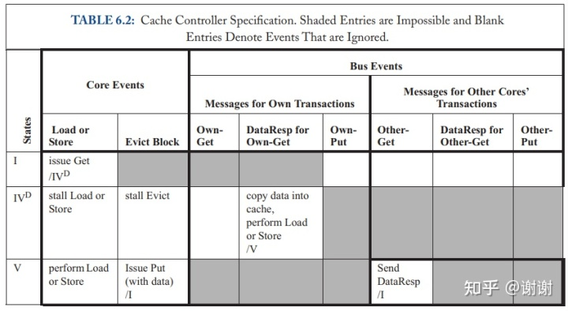

本章中，我们回到在第二章中介绍的cache cohrence主题。我们在第二章中定义了coherence，主要是为了理解其在支撑consistency里所扮演的角色，但我们没有深入讨论特定的coherence协议如何工作或者它们是如何实现的。本章会总体讨论coherence协议，后面两章会进入到特定的协议类型。在6.1节里，展示coherence协议工作原理的整体重点内容，然后在6.2节中展示如何规范协议。在6.3节，我们会展示一个简单的，具体的coherence协议的例子，在6.4节会探索协议设计空间。


## 6.1 整体观察

coherence协议的目标是维护cache coherence，通过实施2.3节中介绍的不变性来达成，这里再重复一下：

1. 单写者多读者(SWMR)不变性。对任意的内存位置A，任意给定的（逻辑）时间，只能存在一个core可以写A（也能读A）或者 多个core只可以读A。
2. 数值（Data-Value）不变性。某个内存位置在一个epoch开始时的值和这个内存位置在它上一次read-write epoch结束时候的值相同。

为实现这些不变性，我们对每个存储结构（每个cache和LLC/memory）关联一个有限状态机，称为coherence controller。这些coherence controller的集合构成了一个分布式系统，其中控制器之间交换信息来确保对于每个block，SWMR和data value不变性在所有时间都能正确维护。这些有限状态机之间的交互行为通过coherence协议来规范。


coherence控制器有多个职责。cache处使用的coherence控制器，我们称为cache controller，在图6.1中展示。cache控制器必须为来自两种源头的请求服务。

在"core side"，cache控制器和处理器core进行接口交互。这个控制器接收来自core的load和store操作，并且返回load的值给core。一个cache miss会使得控制器发起一个conherence事务(transaction)，通过对包含core所访问的地址的block发出一个coherence请求（coherence request，例如请求read-only权限）来实现。这个coherence请求跨越互联网络被发送到一个或多个cohernece控制器。一个事务由一个请求和其他一些为满足请求所交换的消息构成（例如，来自另外一个coherence控制器发送给请求者的数据响应消息）。作为事务的一部分，被发送事务和消息的类型取决于具体的coherence协议。

> 这里的interconnection network应该是指总线一类用于CPU和计算机其余组件通信的桥梁

在cache控制器的"network side"，cache控制器通过互联网络（interconnection network）来和系统中剩下的模块进行接口交互。控制器接收它必须处理的coherence请求和coherence响应。和core side情况差不多，对进入的coherence消息的处理过程取决于具体的coherence协议。


在LLC/memory处的coherence控制器，我们称为memory controller，如图6.2所示。内存控制器和cache控制器很相似，除了它通常只有一个network side外。这样的话，它不会发出coherence请求（代表load或store）或者接收coherence响应。其它实体(agent),如I/O设备，行为可能和cache控制器类似，可能和内存控制器类似，或者两者兼有，取决于它们自身具体的需求而定。

每个cohernece控制器实现了一组有限状态机（逻辑上是每个block有一个独立的，但相同的有限状态机）并且根据block的状态来接收和处理事件（如进入的coherence消息）。对于一个给block B的类型为E的事件（例如，来自core，发往cache控制器的store请求），coherence控制器会根据E的功能和B的状态（例如read-only）来采取行动。在采取了这些行动后，控制器可能改变了B的状态。

## 6.2 规范coherence协议

我们通过规范coherence控制器来规范一个coherence协议。我们可以通过任意方式来规范coherence控制器，但coherence控制器的特定行为可以借助于表格形式的规范来表达。如表格6.1所示，我们能以表格形式规范控制器行为，表格里的行对应着block状态，列对应事件。我们称表格中的一个state/event表项为一个transition，一个属于block B的event E，它的transition由 (a)当E发生时所采取的行动以及(b)block B的下一个状态 组成。我们以格式"动作/下个状态"来表达transistion，并且如果下个状态是当前状态的话，我们可能会去掉"下个状态"这个部分。以表格6.1中的一个transition的例子来说，如果从core收到一个对block B的store请求，并且block B的状态为read-only（RO）,表格显示控制器的transition会去执行动作""issue coherence request for read-write permission [to block B](发起coherence请求，申请read-write权限[到block B])"，并且改变block B的状态为RW。


表格6.1中的例子为了简化讨论，故意做成了不完整的，但它展示了表格化规范方法的能力，它捕捉到了coherence控制器的关键行为。要规范好一个cohernece协议，我们只要为cache控制器和内存控制器简单地填完这张表格即可。

各种coherence协议的不同之处来自控制器规范的不同之处。这些差异包括不同的block状态、事务、事件以及transition集合。6.4节中，我们通过探索这些方面中的每个方面的可选项，来描述coherence协议设计的空间，但首先我们会规范一个简单具体的协议。

## 6.3 一个简单的coherence协议实例


为了帮助理解coherence协议，我们现在展示一个简单的例子。我们的系统模型是来自2.1节的基线系统模型，但互联网络(interconnection network)限制为一个共享总线：总线拥有一组共享的信号线，在这些信号线上一个core能够触发一个消息，并且这个消息能够被所有core和LLC/memory所看到。

每个cache block处于两种coherence稳定状态中的一种：I(invalid)和V(valid)。LLC/memory的每个block也是处于两种cohrence状态中的一种：I和V。<u>在LCV/memory处，状态I表示所有cache都以I状态持有这个block，状态V表示有一个cache以V状态持有这个block</u>。还有一个单独的cache block的临时状态

， 后面会讨论。在**系统启动**的时候，所有cache block和LLC/memory block都处于**I状态**。每个core都能发起load和store请求到它自己的cache控制器；<u>cache控制器会在它需要为另一个block挪出空间的时候，隐式地生成一个**Evict Block**事件</u>。cache中**发生miss的load和store操作会发起coherence事务**，以此来获取这个cache block的合法拷贝，如后面讨论。就像本入门中所有的协议一样，我们假设使用的是writeback cache，即当store hit时，它仅把值写到（本地）cache，等到在对Evict Block事件进行响应时将整个block写回到LLC/memory。

有两种类型的coherence事务，这些事务使用三类总线消息：<u>Get 请求一个block，DataResp 传输block数据，Put 将block写回到内存控制器</u>。当发生load或store miss时，cache控制器发起一个Get事务，通过发送一个Get消息并且等待响应的DataResp消息。Get事务是原子的，在cache发送Get到总线上出现这个Get的DataResp之间，不可以有其它事务（无论是Get还是Put）使用总线。<u>当发生Evict Block事件时，cache控制器发送一个Put消息，消息带有整个cache block，此消息发送到内存控制器</u>。


图6.3 cache控制器的block稳定状态间的转换

我们在图6.3中展示了稳定的coherence状态间的转换过程。我们使用"Own"和"Other"来区分消息，<u>"Own"对应给定cache控制器所发起的事务产生的消息，"Other"对应其它cache控制器所发起的事务产生的消息</u>。需要注意的是如果给定的cache控制器有处于状态V的block，这时另外的cache通过Get消息（Other-Get）来请求这个block，则拥有block的cache必须带上block（使用DataResp消息，图中没有显示）响应，并且将状态变为I。




表格6.2和表格6.3更细节地规范了协议。表格中阴影的表项表示不可能的转换。举例来说，cache控制器应该永远不会在总线上看到它自身cache内的一个状态为V的block所对应的Own-Put（因为它应该已经将状态转换为I了）。

临时状态

是指一个正处于状态I的block在状态转换到V之前，正在等待数据（通过DataResp消息）。临时状态会在稳定状态之间转换过程并非原子的情况下发生。在这个简单的协议中，单独的消息发送和接收是原子的，但从内存控制器中获取一个block需要发送一个Get消息并且接收一个DataResp消息，这中间的间隔是不确定的。


状态指示了协议正在等待DataResp。我们会在6.4.1节中更深入地讨论临时状态。

这个coherence协议非常简单并且在很多方面来看都不高效，但呈现这个协议的目的是为了理解协议是如何指定的。整本书中，当要展示不同类型的coherence协议时，我们都会使用这种规范定义方法。


## 6.4 Coherence协议设计空间概览

如6.1节提到的，coherence协议设计者必须为系统中每种类型的coherence控制器来选择状态，事务，事件以及状态转换规则。稳定状态的选择相比于coherence协议中剩下的部分有很大的独立性。举例来说，有两种不同类型的coherence协议，s**nooping和directory，架构师可以使用相同的稳定状态集来设计一个snooping协议或一个directory协议**。我们在6.4.1节中讨论独立于协议的稳定状态。与此类似地，事务的选择同样对具体协议来讲有很大的独立性，我们会在6.4.2节里讨论事务。但是，不像稳定状态和事务的选择，事件、状态转换规则以及具体的临时状态高度依赖于coherence协议，并且不能分开讨论。因此在6.4.3节里，我们会讨论coherence协议中的一些主要设计决策。

### 6.4.1 状态

在一个只有单独actor（例如不带coherent DMA，单核处理器）的系统中，一个cache block的状态要么是valid或者是invalid。如果有需要区分dirty的block，那么可能会有两种可能的valid状态。一个dirty block的值，相比于这个block的其它拷贝来说是最近被写入的。举例来说，在一个两级cache层级里，有一个write-back的L1 cache，L1中的block可能相对于L2 cache里的老旧备份来说是drity的。

带有多个actor的系统也能只使用这两个或三个状态，如6.3节的情况，但我们通常想要在不同类型的valid状态之间进行区分。一个cache block有四种我们希望编码到它的状态中的特性：validity（合法性），dritiness（脏数据性），exclusivity（排他性）以及ownership（拥有者）。最后两个特性只适用于带有多个actor的系统。

> LLC Wiki: 共享的最高级别的高速缓存，在访问内存之前被调用，通常被称为最后一级高速缓存（LLC）。当LLC在多个内核之间共享时，还使用了其他技术来提高并行性水平，包括将其切成多个片断，这些片断在内存地址的某些范围内寻址，并可以独立访问。
> 
> Shared highest-level cache, which is called before accessing memory, is usually referred to as the last level cache (LLC). Additional techniques are used for increasing the level of parallelism when LLC is shared between multiple cores, including slicing it into multiple pieces which are addressing certain ranges of memory addresses, and can be accessed independently.

- Validity：一个valid的block含有这个block最新数据。block可以被读取，但它只有也是exclusive的时候才能被写入。
- Dirtiness：在一个单核处理器内，cache block是dirty的是指它的值是最新的，这个值和LLC/memory里的值不一样，并且cache控制器负责最终将LLC/memory更新为这个最新的值。clean这个词通常被用来表示dirty的反面。
- Exclusivity：cache block是exclusive的是指它是系统中这个block的仅有的私有cache备份（即这个block除了可能在共享的LLC里，没有被其它地方所cache）
- Ownership: 一个cache控制器（或内存控制器）如果负责响应给block的coherence请求，那么它就是这个block的owner，block被这个cahce控制器持有（owned）。大多数协议中，在所有时间里，一个给定的block的owner只有一个。在没有将ownership交给另一个coherence控制器的情况下，被持有的block不可以从cache里驱逐出去来为另外的block挪出空间（由于空间满了或冲突miss原因）。没有被拥有的block在某些协议中可以被悄无声息地（即无用发送任何消息）驱逐。[相当于内存池中没有被pin住的page]

本节中，我们首先讨论常用的稳定状态（stable states，描述不处于一个coherence事务中间状态的block），然后讨论临时状态（transient state）的用法，临时状态用来描述当前处于事务中间状态的block。

> 注意：本小节中术语exclusive，owned和cache coherence状态里的"Exclusive","Owned"需要区分开来，cache coherence状态（大写开头）描述内容里用到的小写的exlusive,owned代表本节里描述的意思，coherence状态（大写开头）是一些小写描述的单词的某种组合，用来描述MOESI状态。

#### 6.4.1.1 稳定状态

许多coherence协议使用经典的5状态MOESI模型的子集，这个模型最先由Sweazey和Smith提出。这些MOESI（通常读作"MO-sey"或者"mo-EE-see"）状态涉及cache中的block的状态，最基本的三种状态是MSI；O和E状态可能被使用，但它们没有那么基础。这些状态的每个状态存在前文所述的特性中的不同组合情况。

- M(Modified): **block是valid,exclusive,owned**，可能是dirty的。block可以被读或被写。cache唯一持有这个block的有效备份，cache必须响应这个block的请求，并且在LLC/memory的block的备份可能是老旧的。
- S(Shared): **block是valid但不是exclusive,不是drity并且不是owned**。cache拥有block的read-only备份。其它cache可以有block的valid、read-only备份。
- I(Invalid): **block是invalid的**。cache要么没有包含这个block，要么是包含了一个不可以读+写的老旧备份。本入门中，我们不区分这两种情况，尽管某些时候前一种情况可能被称为"Not Present"状态。

大部分基础的协议只使用MSI这三种状态，但为了优化部分场景，有必要加入O和E状态。我们会在后续章节中在讨论snooping和directory协议加上或者不加这些状态的时候，对这些优化进行讨论。现在我们在这里给出完整的MOESI状态的列表：

- M(Modified)
- O(Owned): **block是valid，owned并且可能是dirty的，但不是execlusive的**。cache拥有block的**read-only**备份，必须响应block的请求。其它cache可以拥有block的一个read-only备份。在LLC/memory里的block备份可能是老旧的。
- E(exclusive):**block是valid，exclusive，并且clean**。cache拥有这个block的read-only备份。没有其它cache拥有这个block的合法备份，并且在LLC/memory里的block的备份是最新的。本入门中，我们认为block处于Exclusive状态时block是**owned**，尽管实际中**存在一些协议在Exclusive状态时不被当做ownership状态**。后续章节中当我们呈现MESI snooping和directory协议时，我们会讨论涉及到是否让Exclusive的block有owner的问题。
- S(Shared)
- I(Invalid)


图6.4 MOESI状态

我们在图6.4中展示了MOESI状态的韦恩图。韦恩图展示了哪些状态会共享哪些特性。除了I的所有状态都是valid的。M，O和E是ownership状态。M和E都包含exclusivity，这种情况下没有其它cache拥有block的合法备份。M和O都指示block可能dirty。回到6.3节里的简单例子中，我们观察到协议将MOES状态压缩精简成了V状态。

MOESI状态尽管很常见，也不代表全部稳定状态集合。例如，F(Forward)状态和O状态类似，除了它是clean的（即LLC/memory里的备份是最新的）。有许多可能的coherence状态，但我们在本入门中会聚焦在大家所熟知的MOESI状态上。

#### 6.4.1.2 临时状态(Transient States)

目前为止我们只讨论了稳定状态，它们只会在block当前没有coherence活动的时候出现，当提到一个协议（例如，"一个带MESI协议的系统"）的时候也只会用到这些状态。然而，如我们在6.3节里的例子里，在从一种稳定状态转换到另一种稳定状态期间，可能存在一些临时状态。6.3节里，我们有

这个状态（处于I，要变为V，正在等待DataResp）。在更加复杂的协议中，我们很可能会碰到大量的临时状态。我们使用标记

来编码这些状态，

代表block正在从稳定状态X转换到稳定状态Y，并且在类型为Z的事件发生之前，转换过程不会结束。例如，在后续一个章节中的协议里，我们使用

表示一个block之前处于I，一旦一个D(data)消息发生就会变成M。

#### 6.4.1.3 LLC/Memory中的Block状态

目前我们所讨论的状态（稳定的和临时的）都属于在cache中的block。在LLC和memory中的block也有与之关联的状态，并且有两种常见的方法来命名LLC和memory中的block状态。命名规则的选择不影响功能或性能；这只是一个简单的规范问题，这个问题会对不熟悉规则的架构师造成困扰。

- Cache-centric：这种方法，我们相信是最常见的方法，在LLC和memory里的block状态是cache中的这个block的状态的汇总。举例来说，<u>如果block在所有cache里都是状态I，那么这个block的LLC/memory状态为I。如果一个block在一个或多个cache中为S，那么LLC/memory状态为S。如果一个block在一个单独的cache中为M，那么LLC/memory状态为M</u>。

- Memory-centric：这种方法里，**LLC/memory里的block状态对应着内存控制器里这个block的权限**（**不是cache的权限**）。举个例子，如果一个block在所有cache中为I，那么这个block的LLC/memory状态是O（不是和cache-centric方法里的I状态），因为LLC/memory的行为就像是block的owner。如果一个block在一个或多个cache中处于S，那么LLC/memory状态也是O，原因相同。**然而，如果一个block在一个单独的cache中处于M或O，那么LLC/memory状态是I，因为LLC/memory持有这个block的invalid备份**。

<u>本入门里的所有协议对于在LLC和memory中的block的状态，都使用cache-centric命名方法</u>。

#### 6.4.1.4 维护Block状态

系统的实现方案必须维护cache、LLC和memory中的block所关联的状态。对于cache和LLC，通常需要扩充per-block的cache状态，最多增加几个bit，因为稳定状态的数量通常很少（例如，MOESI协议的5种状态，每个block需要3 bits）。coherence协议可能有更多的临时状态，但只需要对存在待决（pending）事务的那些block维护这些状态。典型的实现会通过对miss状态处理寄存器（MSHRs），或类似的用于跟踪这些待决的事务的结构额外增加bit的方式来维护这些临时状态。

对于memory来说，大得多的容量看起来可能会是一个巨大的挑战。但是，许多现有的多核系统维护了一个**inclusive LLC**，这意味着LLC维护着在系统中任意地方被缓存的每个block的备份（甚至是"exclusive"的block）。使用inclusive LLC，memory不需要显式地表示coherence状态。如果一个block存在于LLC中，它在内存中的状态和它在LLC里的状态相同。如果这个block不在LLC中，它在内存中的状态隐含为Invalid，因为不在inclusive LLC里暗示着这个block也不在任何cache中。sidebar讨论了在带有inclusive LLC的多核系统出现前，内存状态是如何维护的。以上对于内存的讨论都假设我们使用的是一个单独的多核芯片的系统，和本入门大部分内容所做的假设一样。多个多核芯片的系统可以从逻辑上位于memory上的显式的coherence状态中获益。

### 6.4.2 事务（Transactions）


大多数协议都拥有一组相似的事务集，因为coherence控制器的基本目标是类似的。举例来说，几乎所有协议都有一个事务用于获取一个block的Shared（read-only）访问。表格6.4中，我们列举了一组常见的事务，对于每个事务，我们会描述发起事务的requestor的目标。这些事务全部都是由cache控制器发起，cache控制器响应来自它们关联的core的请求。表格6.5中，我们列举了一个core能够对它的cache控制器做出的请求，以及这些core的请求是如何引导cache控制器发起coherence事务的。


尽管大多数协议都使用一组相似的事务集，但在coherence控制器之间执行事务的交互方式上差异较大。我们将会在下一小节中看到，在一些协议里（如snooping协议），一个cache控制器通过广播一个GetS请求到系统中所有的coherence控制器来发起一个GetS请求，并且
无论哪个控制器当前是block的owner，该控制器要适用一条消息来响应requestor，消息含有期望的数据。反过来，在另外一些协议中（如directory协议），一个cache控制器通过发送一个单播的GetS消息到一个具体的、预定义的coherence控制器（这个控制器要么直接响应，要么转发请求到另一个会响应requestor的coherence控制器）来发起一个GetS事务。

```
Sidebar：多核之前：在内存处维护coherence状态
为了维护每个内存block的coherence状态，传统的、多核前的snooping协议需要被使用，它们不能使用LLC，原因如6.4.1.4节中所解释。我们简短地讨论几种维护这个状态的方法，以及相关的工程权衡取舍。
对每个内存block使用State Bits参数。最常见的实现方法是对每个内存block都增加额外的bit来维护coherence状态。如果memory存在N种可能的状态，那么每个block需要log2N个额外的bit。尽管这种设计完全通用并且概念上很直接，但它有一些缺点。首先，额外的bit会在两方面增加成本。增加两个或三个额外的bit，对于现代的block为基础的DRAM芯片来说很困难，这些芯片典型的都至少有4-bits宽，更常见的比这个还要宽。在memory内附加上任何改变排除了使用商用的DRAM模块（例如DIMM）的可能，这样会显著增加成本。幸运的是，对于每个block状态只需要少量bit的协议来讲，可以使用一个修改的ECC码来存储这些信息。通过维护更大粒度（例如，512bits而不是64bits）的ECC，在使用商用的DRAM模块时，可以挤出足够的编码空间来"隐藏"额外的bit。第二个缺点是将状态bit存储在DRAM中意味着获取这些状态会引入完整的DRAM延迟，甚至是在block最新的数据存储在某个其它cache的场景下也是如此。在某些场景中，这样会增加cache-to-cache coherence传输的延迟。最后，将状态存储在DRAM中意味着所有的状态改变需要DRAM read-modify-write周期，这样会对功耗和DRAM带宽都造成冲击。
在内存上对每个block增加单独的状态bit。被Synapse使用的一种设计选项，使用一个单独的bit来区分两种稳定状态（I和V），这个bit和memory中的每个block都关联。很少有block会处于临时状态，这些状态能够使用一个小的精心设计的结构来维护。这个设计方案是更完整的第一个设计的子集，有最小的存储代价。
0-bit逻辑或（OR）。为了避免不得不去对memory进行改动，我们能够让cache按需重构内存状态。一个block的memory状态是每个cache中的block的状态的一个函数，因此，如果所有cache聚合它们的状态，它们能够决定memory状态。系统能够推断出memory是否是block的owner，通过让所有core发送一个"IsOwned?【1】"信号到一个逻辑OR门（或OR门的树型结构）来实现，这个门带有和cache数量相等的输入信号。如果这个OR门输出高电平，则表示cache是owner；如果输出为low，则表示memory是owner。这种方案避免了在内存中维护任何状态。但是，实现一个快速的OR，带逻辑门或者线与（wired-OR）的方式，会很困难。
【1】这个IsOwned信号不要和Owned cache状态搞混了。IsOwned信号被一个处于ownership状态的cache所设置（assert），包含了Owned，Modified和Exclusive等cache状态。
```

### 6.4.3 主要协议设计选择

有很多不同的设计coherence协议的方法。即使是针对相同的状态集和事务，也有许多不同的可能的协议。协议的设计决定了在每个coherence控制器上有哪些可能的事件和状态转换；不像状态和事务所使用的方法，没有办法独立于协议呈现出一个含有可能出现的事件和状态转换列表。

即便对于coherence协议来说有大量的设计空间，但有两种最主要的设计考量，它们会对协议的剩余部分造成巨大的影响，我们接下来讨论一下它们。

#### 6.4.3.1 Snooping vs. Directory

coherence协议有两种主要的类型：snooping和directory。我们现在先简短地给出这两个协议的概览，在第七章和第八章中我们会深入讨论它们。

- Snooping protocol：<u>一个cache控制器通过广播一个请求消息到所有其它的coherence控制器来发起一个block的请求。</u>coherence控制器共同"做正确的事情"，例如，如果控制器是owner，就发送响应回另一个core的请求。<u>Snooping依赖于互联网络来按照一个针对所有core的一致的顺序传递广播消息</u>。绝大多数snooping协议假设请求按照一个总顺序（total order）到来，例如，通过一个共享线路（shared-wire）总线，但更加先进的互联网络和松散顺序是有可能的。
- Directory protocol：一个cache控制器发起一个block的请求是**通过单播的方式发送请求到memory控制器**的方式，**这个memory控制器是block的"家(home)"**。<u>每个memory控制器维护着一个目录（directory），目录记录了在LLC/memory中的每个block的状态信息，例如当前拥有者（owner）的ID或当前共享者们（sharers）的多个ID</u>。当一个block的请求到达了home的时候，memory控制器检查这个block的目录状态。举个例子，如果请求是GetS，memory控制器检查目录状态来确定owner是谁。<u>如果LLC/memory是owner，则memory控制器通过发送数据响应到请求者（requestor）来完成此事务。如果cache控制器是owner，memory控制器转发请求到owner cache；当owner cache接收到这个转发的请求时，它通过发送一个响应响应到请求者来完成此事务。</u>

snooping和directory的选择涉及利弊权衡。<u>snooping协议逻辑上很简单，但它们不适用于有大量core的系统，因为**广播方式不具伸缩性**</u>。directory协议由于是**单播的原因具有伸缩性**，但因为当home不是owner的时，它们需要发送一个额外的消息，因此很多事务会花费更多的时间。另外，协议的选择还会影响互联网络（例如，经典的snooping协议需要一个请求消息的总顺序（total order））。

#### 6.4.3.2 Invalidate vs. Update

另一个重要的coherence协议要考虑的点是要决定在一个core写数据到block时要做什么事情。**这个决策是独立的，无论协议是snooping还是directory**。有两种选择。

- Invalidate protocol：<u>当一个core想要写一个block时，它发起一个coherence事务，用于无效化（invalidate）所有其它core的拷贝。</u>一旦这些拷贝被无效化，requestor就能写block了，这样就排除了其它core读到block的旧值的可能性。<u>如果另外一个core在它的block拷贝被无效化之后想要读取这个block，它要发起一个新的coherence事务来获取这个block，并且它将从写入block的core那里获取拷贝</u>，因此保证了coherence。
- Update protocol：<u>当一个core想要写一个block时，它会发起一个coherence事务来更新所有其它core的备份，以此来反映出它写入block的新值。</u>

再一次，做这个决策涉及权衡利弊。Update协议对于一个core要读取新写入的block的情况下的减少了延迟，因为core不需要发起并且等到GetS事务完成。但是，update协议相比于invalidate协议，通常会消耗掉更多实际带宽，因为update消息相比于invalidate消息来说更大（前者带有地址和新值，后者只有地址）。还有，update协议极大地增加了许多内存一致性模型的实现复杂度。举例来说，当多个cache必须对一个block的多份拷贝应用多次更新时，保持write atomicity（5.5节）变得更加困难。由于update协议的复杂性，它们很少被实现；本入门中，我们重点关注应用广泛的多的invalidate协议。

#### 6.4.3.3 混合（Hybrid）设计

对于这些重要的设计决策，有一种方式是开发一个混合（hybrid）的形式。有一些协议组合了snooping和directory协议的一些方面，有一些协议组合了invalidate和update协议的一些方面。设计空间是很丰富的，架构师没有被限制到一种特定的设计风格中。